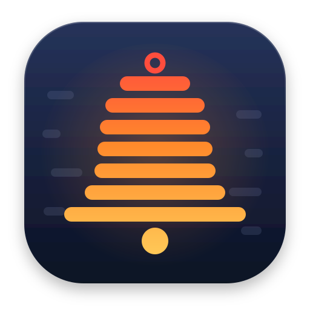
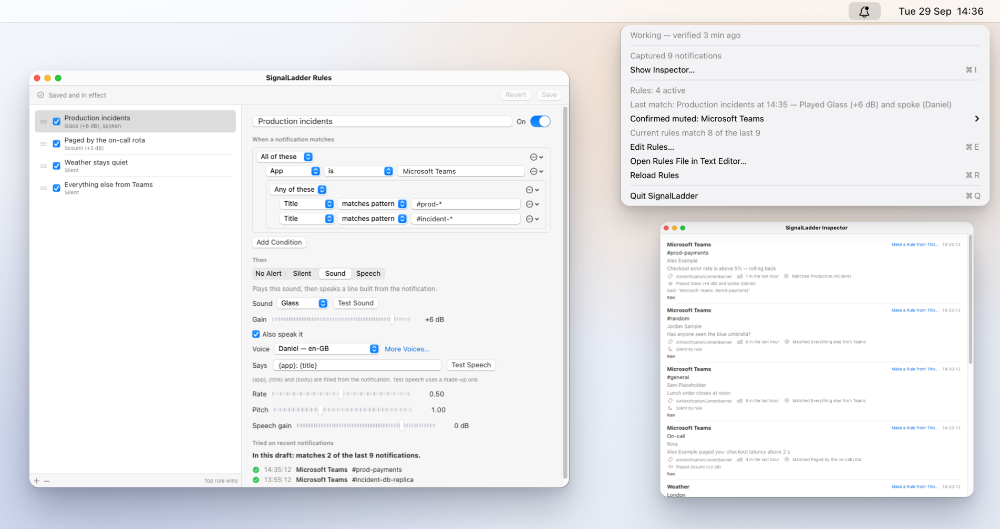
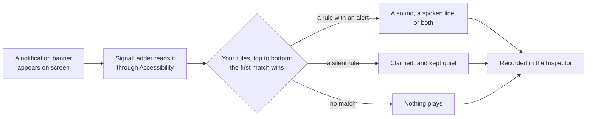
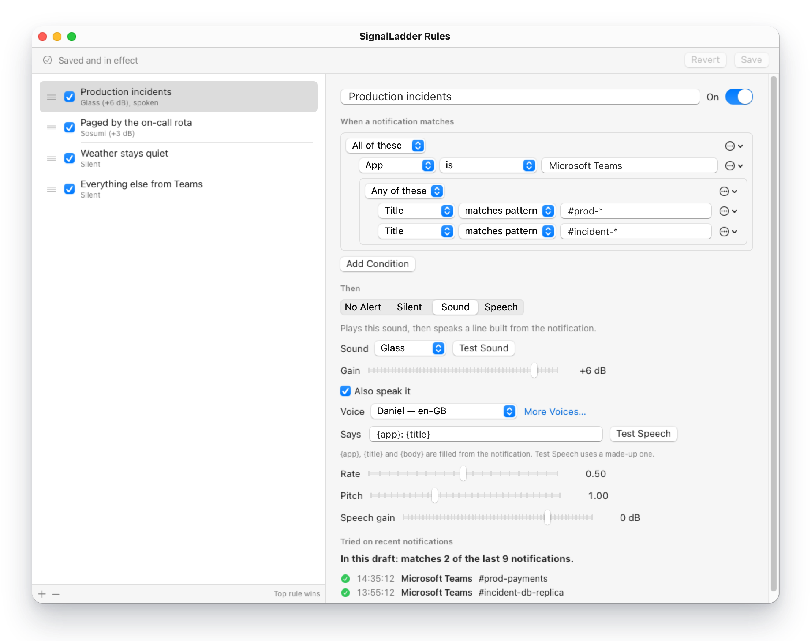

<p align="center">
  
</p>

<h1 align="center">SignalLadder</h1>

<p align="center">
  <strong>Hear the one alert that matters.</strong><br>
  A macOS menu-bar app that reads your notifications and sounds, or speaks, only for the ones your rules pick out,<br>
  so the page you are waiting for never drowns in channel chatter.
</p>

<p align="center">
  <a href="https://github.com/JWhite212/SignalLadder/actions/workflows/ci.yml"></a>
  
  
  <a href="LICENSE"></a>
  
</p>

<p align="center">
  <a href="#getting-started">Get started</a> ·
  <a href="docs/rules-format.md">Write rules</a> ·
  <a href="docs/privacy.md">Privacy</a> ·
  <a href="docs/troubleshooting.md">Troubleshooting</a> ·
  <a href="#roadmap">Roadmap</a>
</p>

<picture>
  <source media="(prefers-color-scheme: dark)" srcset="docs/assets/hero-dark.png">
  
</picture>

> [!NOTE]
> SignalLadder is pre-release. There is no signed build yet, so you [build it from source](#getting-started). Everything described on this page works on the `main` branch today. Anything that doesn't is marked as planned.

## Why SignalLadder

If you are on call, you have probably missed a page because it sounded exactly like the forty channel messages before it. Chatty apps teach you to tune their sound out, and the one alert that matters gets tuned out with the rest.

SignalLadder gives that one alert a voice of its own. It watches the notification banners macOS shows, checks each against your rules, and plays a distinct sound or speaks a line only when a rule matches. Everything else stays quiet.

It **replaces** an app's sound rather than adding another one. You switch off the chatty app's own notification sound in System Settings, and SignalLadder becomes its only voice: silent by default, and heard only when one of your rules earns it. Adding a louder sound on top of a firehose would only make the problem worse.

Every feature is judged by one question: **does it help you not miss the critical one?**

## How it works



1. **It reads banners.** SignalLadder reads the text of each banner from Notification Centre through the macOS Accessibility API. It only reads. It never clicks, dismisses or replies.
2. **Your rules decide.** A rule matches on the app, title, subtitle, body or the banner's whole text, using _is_, _is not_, _contains_ or a pattern with `*` and `?`, combined with _all of_, _any of_ and _not_. Rules are checked in order and the first enabled match wins.
3. **The alert plays.** The alert can be one of the 14 macOS sounds or your own file, level-matched so every sound peaks at the same level at the same setting. It can also speak a line such as _"Microsoft Teams: #prod-payments"_ in a voice you choose. A silent rule claims a notification so that no broader rule below it can sound.
4. **It checks itself.** Every 30 minutes SignalLadder sends itself a silent test banner and makes sure it can read it back. The menu always says how recently that worked. If capture has stopped, it tells you in three separate ways.

## Features

**Rules you can prove before you trust them**
- Choose **Make a Rule from This…** on any notification in the Inspector to start a rule from what the app actually sent.
- As you edit, every rule is tried against the notifications SignalLadder is holding, up to the last 50: _In this draft: matches 2 of the last 9 notifications._
- It shows which rule higher in the list would take a notification first, and offers to move yours above it.
- Nothing takes effect until you save, and the editor says so in words.

**Alerts you can tell apart**
- Sounds: the 14 macOS sounds, or your own AIFF, WAV, CAF, MP3 or M4A files up to 30 seconds long.
- Level matching brings every sound to the same peak level at 0 dB, so the sound you pick doesn't decide how loud the alert is. A very quiet file is boosted by 24 dB at most. Gain runs from −40 to +12 dB, with a limiter so nothing clips.
- Spoken alerts come from a template built with `{app}`, `{title}` and `{body}`, in any installed voice, with its own rate, pitch and gain. They can play on their own or after a sound.
- **Test Sound** and **Test Speech** let you hear an alert before it happens for real. Test Speech reads a made-up notification, never a real one.
- One alert plays at a time, so two alarms never sound over each other.

**Quiet on purpose**
- A `"silent"` rule claims matching notifications, so a catch-all such as _everything else from Teams_ stays quiet while the narrow rules above it still sound.
- A menu walkthrough takes you to each chatty app's notification settings so you can switch its own sound off.

**Honest about its own health**
- A real round-trip self-test, not a guess. The menu reads _Working — verified 3 min ago_, _Cannot verify itself_ or _NOT capturing notifications_.
- Stale evidence is never presented as current.
- If capture stops, you get a changed menu-bar icon, a beep and, when banners can be shown, a notification. That is three channels, so no single fault can silence all of them.

**Loud about broken rules, never silent**
- A misspelt sound, a missing voice or an unknown key is reported when the rules load, by rule name, not discovered at 3 a.m.
- One broken rule never switches the others off.

**Careful with your data and your rules file**
- SignalLadder's own code makes no network connections, and the app has no third-party dependencies.
- Notification text stays in memory and is gone when you quit. The one exception is text you choose to put in a rule. [Details](docs/privacy.md).
- Rules live in a readable JSON file. Saves are atomic and keep the previous version, and SignalLadder never silently overwrites a file you changed by hand: it asks first, and if you save anyway it keeps your edited file as a dated copy.

**Small and native**
- Swift and SwiftUI, about 2 MB, and event-driven. Nothing polls except the self-test: half-hourly, plus a few one-off checks after a launch, after a failure or while one is blocked.

## Screenshots

<table>
  <tr>
    <td width="58%" valign="top">
      <a href="docs/assets/screenshots/inspector.png"><picture>
        <source media="(prefers-color-scheme: dark)" srcset="docs/assets/screenshots/inspector-dark.png">
        
      </picture></a>
    </td>
    <td width="42%" valign="top">
      <a href="docs/assets/screenshots/menu.png"><picture>
        <source media="(prefers-color-scheme: dark)" srcset="docs/assets/screenshots/menu-dark.png">
        
      </picture></a>
    </td>
  </tr>
  <tr>
    <td><strong>The Inspector.</strong> The last 50 notifications, what each field holds, which rule matched and what played.</td>
    <td><strong>The menu.</strong> Health first, then the rules in effect and the last thing that sounded.</td>
  </tr>
  <tr>
    <td colspan="2">
      <a href="docs/assets/screenshots/rule-editor.png"><picture>
        <source media="(prefers-color-scheme: dark)" srcset="docs/assets/screenshots/rule-editor-dark.png">
        
      </picture></a>
    </td>
  </tr>
  <tr>
    <td colspan="2"><strong>The rule editor.</strong> Conditions, the alert and a live dry-run against real traffic, before anything is saved.</td>
  </tr>
</table>

<sub>Screenshots show made-up notifications.</sub>

## Getting started

**You need** a Mac running macOS 14 Sonoma or later, Xcode with its Swift 6 toolchain, and a code-signing identity. SignalLadder is developed and tested on macOS 26. macOS 14 and 15 are supported targets but have not yet been checked on a real Mac.

```bash
git clone https://github.com/JWhite212/SignalLadder.git
cd SignalLadder
security find-identity -v -p codesigning        # copy the 40-character SHA-1 of an identity
SIGNALLADDER_IDENTITY=<that SHA-1> ./Scripts/make-app.sh release
open build/SignalLadder.app
```

A real signing identity is required because macOS ties the Accessibility permission to the app's signature. An ad-hoc signature changes on every build, so macOS would forget the permission each time. An Apple Development certificate, which Xcode creates for any Apple ID, should do. [Getting started](docs/getting-started.md) has the details.

Then:

1. **Grant Accessibility** when asked, in System Settings › Privacy & Security › Accessibility, and **allow notifications**. SignalLadder needs its own banners to test itself.
2. **Open the Inspector** from the bell in the menu bar (**Show Inspector…**) and let a few notifications arrive.
3. **Make a rule** with **Make a Rule from This…**. Watch the dry-run, pick a sound, switch the rule **On** and **Save**.
4. **Mute the source app.** The menu's walkthrough opens its notification settings. Turn its sound off there so SignalLadder is its only voice.
5. **Check Focus.** Banners are not drawn during Do Not Disturb or a Focus, so nothing can be read while one is on.

The full walkthrough is in **[docs/getting-started.md](docs/getting-started.md)**.

## Rules in a file

Most people build rules in the editor. Underneath, they are plain JSON that you can read, diff and edit by hand:

```json
{
  "version": 3,
  "rules": [
    {
      "name": "Production incidents",
      "condition": {
        "and": [
          { "field": "app", "op": "equals", "value": "Microsoft Teams" },
          { "or": [
              { "field": "title", "op": "matches", "value": "#prod-*" },
              { "field": "title", "op": "matches", "value": "#incident-*" }
          ] }
        ]
      },
      "alert": {
        "sound": "Glass",
        "gainDB": 6,
        "speak": { "voice": "com.apple.voice.compact.en-GB.Daniel", "template": "{app}: {title}" }
      }
    },
    {
      "name": "Everything else from Teams",
      "condition": { "field": "app", "op": "equals", "value": "Microsoft Teams" },
      "alert": "silent"
    }
  ]
}
```

Every key, operator, alert and error message is explained in **[docs/rules-format.md](docs/rules-format.md)**.

## Privacy

- SignalLadder reads banners from Notification Centre and nothing else, and it only reads.
- Its own code has no networking, telemetry, analytics or update checks, and the app has no third-party dependencies.
- It keeps the last 50 notifications in memory, never writes their text to disk or to its logs, and forgets them when you quit. The exception is text you put into a rule condition yourself, which is saved in your rules file.
- It needs two permissions: Accessibility, to read banners, and Notifications, to test itself. It does not use the microphone, camera, screen recording or full disk access.

The full account, including what is stored where and how to remove it all, is in **[docs/privacy.md](docs/privacy.md)**.

## What it can't do (yet)

SignalLadder is honest about its limits, because an on-call tool that overstates itself is worse than none.

- **It can only read banners that macOS draws.** During Do Not Disturb or a Focus, or for an app whose banners are switched off, there is nothing to read. Check whether a Focus turns on when your screen locks.
- **Health can be up to about 30 minutes old.** If capture stops between self-tests, the menu still shows the last success until the next test runs. That is why it always says how long ago the last one was.
- **Opening Notification Centre can replay very recent notifications.** Items less than a minute old can be read as new and sound again.
- **It can't check that you muted the source app.** macOS doesn't let other apps read notification settings, so the walkthrough records your word and says so.
- **Alerts sound once.** Alerts that keep going until you acknowledge them are the next milestone.

More symptoms and fixes are in **[docs/troubleshooting.md](docs/troubleshooting.md)**.

## Roadmap

**Working today**
- [x] Capture of notification banners through Accessibility, with a self-testing health monitor and three alarm channels
- [x] The Inspector: the last 50 notifications, what matched and what played
- [x] Rules with nested conditions, glob patterns, first-match-wins order and silent rules
- [x] The rule editor, with a live dry-run, **Make a Rule from This…** and safe saving
- [x] Level-matched sounds, custom sounds and spoken alerts
- [x] The mute walkthrough and output-muted warnings

**Next: alerts that keep going until acknowledged** (planned)
- [ ] A persistent on-screen panel for a matched alert
- [ ] A repeating sound, with a cap on repeats
- [ ] Running a Shortcut you choose as a last resort, for example to reach your phone
- [ ] Acknowledging from the menu or a global shortcut

**Release**
- [ ] Signed, notarised builds, sold directly, with building from source still free

**Later** (ideas, not yet planned in detail)
- [ ] Conditions on time of day, an on-call switch, screen lock and how often an app is sending
- [ ] Snooze
- [ ] A Settings window, including launch at login
- [ ] A guided first-run setup

The [changelog](CHANGELOG.md) records what has shipped. Design notes and milestone plans live in [`docs/dev/`](docs/dev/).

## FAQ

<details>
<summary><strong>Why isn't it on the Mac App Store?</strong></summary>

Apps on the Mac App Store must run in Apple's sandbox, and the sandbox blocks the Accessibility API that SignalLadder uses to read banners. The plan is to sell signed, notarised builds directly from this project instead.
</details>

<details>
<summary><strong>Does it send my notifications anywhere?</strong></summary>

No. SignalLadder's own code contains no networking at all, and it has no third-party dependencies that could add any. You can check this in the source. [docs/privacy.md](docs/privacy.md) covers what it keeps and where.
</details>

<details>
<summary><strong>Why does it need Accessibility access?</strong></summary>

It is the only way for one app to read another app's notification banners on macOS. The permission itself is broad. SignalLadder uses it only to read Notification Centre's banners, and the code that does so is in [`Sources/NotificationCapture`](Sources/NotificationCapture) for anyone who wants to audit it.
</details>

<details>
<summary><strong>Why do I see a "SignalLadder self-test" banner?</strong></summary>

That is how SignalLadder proves it can still read notifications. It posts a silent banner to itself, checks that it captured it, and removes it. This happens at launch, again two minutes later, and then every 30 minutes, with retries sooner if one fails. If you switch SignalLadder's own banners off, it can no longer verify itself and says so.
</details>

<details>
<summary><strong>Which apps does it work with?</strong></summary>

Any app whose notifications appear as banners. It was built for Microsoft Teams, where busy channels bury the messages that matter, but rules can match any app. Open the Inspector to see exactly what an app sends before you write a rule for it.
</details>

<details>
<summary><strong>Will it read my messages aloud?</strong></summary>

Only if you give a rule a spoken alert. The default line is the app and the title, such as _"Microsoft Teams: #prod-payments"_. The message body is left out unless you add `{body}`, and a spoken line is capped at 240 characters. The menu never shows notification text.
</details>

<details>
<summary><strong>Is it free?</strong></summary>

Yes, if you build it yourself. The source code is free software under the GNU General Public License v3.0, and the plan is to keep it that way. You can build it, read and change the code, and share it under the same licence.

Once SignalLadder is released, the plan is to sell ready-to-run builds, signed and notarised, directly from this project. A bought build saves you installing Xcode and setting up a signing identity, and the money funds the work. There is no paid build yet.
</details>

## Contributing

Bug reports, ideas and pull requests are welcome. Please read **[CONTRIBUTING.md](CONTRIBUTING.md)** first. It covers setting up, the conventions the code follows and the one question every change is judged by. [docs/architecture.md](docs/architecture.md) explains how the pieces fit together. Pull requests will also need a contributor licence agreement, which is not published yet, so none can be merged until it is.

When you report a bug, replace any names, channels and message text with placeholders. Notifications carry other people's words.

Have a question rather than a bug? **[SUPPORT.md](SUPPORT.md)** says where to look first.

Found a security problem? Please report it privately, as described in **[SECURITY.md](SECURITY.md)**.

Everyone taking part is expected to follow the **[Code of Conduct](CODE_OF_CONDUCT.md)**.

## Licence

SignalLadder is free software, released under the **[GNU General Public License v3.0](LICENSE)**. You may use, study, change and share it. If you distribute it, changed or not, you must do so under the same licence and make its source available.

Contributions will need a contributor licence agreement, which lets the maintainer offer SignalLadder on other terms as well as the GPL. It is not published yet. [CONTRIBUTING.md](CONTRIBUTING.md#licensing-of-your-contribution) explains what it will cover and why.

Copyright © 2026 Jamie White.
