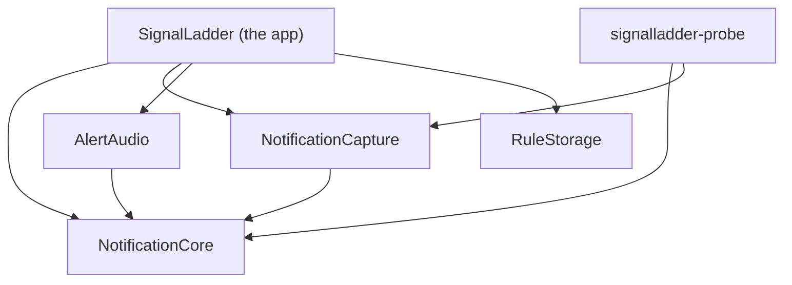
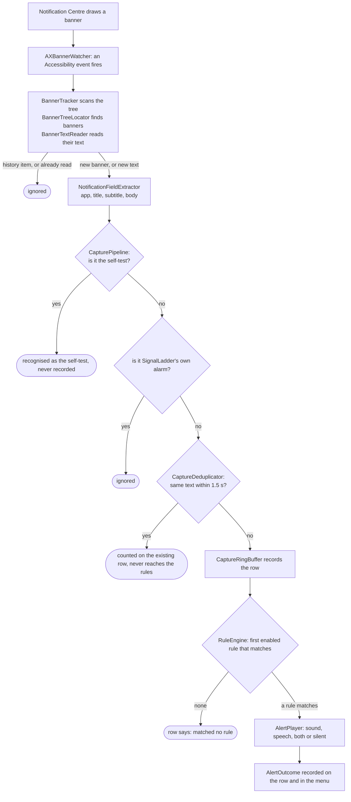

# How SignalLadder works

This page is for people who want to change SignalLadder, review it, or understand why it behaves as it does. It describes the code as it is on `main`, names the types you will meet, and says why the awkward parts are awkward. It does not describe planned work as if it were built. Where something is not implemented, it says so.

If you only want to use the app, start with [getting started](getting-started.md) and the [rules format](rules-format.md). If you want to contribute, read [CONTRIBUTING.md](../CONTRIBUTING.md) first; this page is the map it points to.

- [Principles that shape the code](#principles-that-shape-the-code)
- [Module map](#module-map)
- [From banner to sound](#from-banner-to-sound)
- [Knowing it still works](#knowing-it-still-works)
- [Rules](#rules)
- [Audio](#audio)
- [Testing](#testing)
- [Tools](#tools)
- [Where to read more](#where-to-read-more)

## Principles that shape the code

Six ideas explain most of the design. Each has a reason, and the reason is usually an incident.

### Decisions live in pure, tested code; the app is glue

Everything that decides something is in `NotificationCore`: what a banner says, whether it is a repeat, which rule matches, what health is, what the menu says about it. That module imports Foundation and CryptoKit and nothing else. It cannot touch Accessibility, notifications, audio, the file system or the network, so every decision can be tested without a permission, a speaker or a real notification.

The app target, `SignalLadder`, connects those decisions to the operating system and has no tests of its own. So it holds as little as possible. Its own comments say what each piece is for: `CaptureController` "connects the Accessibility observer to the capture pipeline, and nothing more", and `RuleStore` "only connects" the decoder and the file layer.

_Why._ The capture pipeline used to be a closure inside the app target. Two reviews in a row named it the riskiest untested path in the app, and it is where the rule engine attaches. It moved into `CapturePipeline` so it could be tested before anything more was added to it. The same reasoning put the rules file in its own target, `RuleStorage`: it is the one place a bug destroys the user's rules.

`PurityTests` enforces the boundary for `NotificationCore` only. It is a plain text search of that module's source files for forbidden imports (`ApplicationServices`, `AppKit`, `Cocoa`, `Carbon`, `UserNotifications`, `AVFoundation`, `Speech`, `SwiftUI`, `Combine`) and for `FileManager`, `FileHandle`, `URLSession`, `Data(contentsOf` and `write(to`. Nothing enforces the rest of the split. That is convention, kept by review.

### Notification content is never logged or persisted by the app

Notification text is held in memory, in the last 50 captures, until newer ones replace it or you quit. There is no time-based expiry and no clear-history command; quitting is the only way to drop it. SignalLadder does not write it to disk or to logs.

Two things do reach disk, and both are deliberate:

- Text you put into a rule condition is saved in `rules.json`, and in the backups made when you save. The rule editor says so where you add it.
- The mute checklist stores a SHA-256 hash of each app name you confirmed in the app's preferences. It stores hashes, not names, because a name comes from a banner and a badly parsed banner can hand it a fragment of a message.

A few short-lived copies sit beside that buffer: the deduplicator's keys, the last alert outcome (which includes a spoken line) and the copies the Inspector and rule editor display. All are in memory, and quitting drops them.

The app has two loggers. The speech logger records how long a spoken alert took to start, and two fixed lines when speech produced no audio or did not finish in time. None of its messages has a parameter a sentence could pass through. The watcher's logs a process id, a subrole, an error code or a count. Its function takes a free-form message, so the rule that it is never given a notification's text is held by convention.

_Why._ The app reads other people's messages. Nothing about reading them requires keeping them, so it does not.

Where this is enforced by a test, and where it is not:

| Claim | Enforced by |
| ----- | ----------- |
| `NotificationCore` opens no file and no URL, and imports no permission-bearing framework | `PurityTests` |
| Nothing outside `NotificationCore` logs, writes or sends notification text | Convention. The comment on the watcher's log function says the `%{public}` format is safe only because no text ever passes through it |
| The app has no networking | Not test-enforced. A search of `Sources/` finds no networking API |

The developer tool `signalladder-probe` prints text only when you pass `--show-content`. See [privacy](privacy.md) for the user-facing statement of all this.

### Say no more than was established

The app is an on-call tool, so the worst thing it can do is reassure you falsely. Wording is held to what was actually observed:

- _Played_ is not _heard_. An alert outcome records what the app did. When the Mac's output reported itself muted or at zero volume, the outcome says that too. When the output state cannot be read, it is not called silent.
- _Verified_ carries its age. The menu says _Working — verified 3 min ago_, and once the evidence is stale it says _Unverified — last verified 34 min ago_. A success from half an hour ago is not a statement about now.
- Muting is your word. Nothing can read another app's notification settings, so the walkthrough says _confirmed muted_, never _muted_.
- A preview is not a match. Re-checking old rows against new rules never rewrites what happened when they arrived, and never plays anything.
- _No rules loaded_ is not _matched no rule_. A row that was never evaluated is not shown as one that was.
- The filter for the app's own banners requires our name and our wording. Name alone would silently drop a real notification from any app that shares it.

_Why._ Each of these was a real bug. On 2026-09-25 capture went blind about 80 seconds after a self-test passed, and health went on saying _verified_, with nothing to show it had aged, for up to half an hour.

### Failures are surfaced, never silent

A rule that should have made a noise and did not is the failure this app exists to prevent, so every path that can produce one reports it:

- One bad rule never silences the others. The rules file is decoded one rule at a time. A rule that cannot be used is left out and listed by position and name; the rest run.
- Problems are found when the rules load, not at the incident. A sound that is missing, unreadable, silent or too long, and a voice that is not installed, are reported by rule name when the file loads.
- A failed alert never throws at the moment it matters. `AlertPlayer` returns an outcome (_Could not play: …_), which is recorded on the row and held in the menu until a later sound plays. Reloading rules does not clear it.
- Unknown keys are errors. A misspelt `"alrt"` would otherwise leave a rule quietly silent.
- Nothing can forget to connect playback. The pipeline's playback closures have no default values, and neither does the sound and voice check the loader runs.
- A rules problem or an alert that could not sound changes the menu-bar icon to the same warning state as a capture fault. A tool whose rules did not load is as silent as one that cannot see banners.

### Event-driven, near-zero idle cost

The Accessibility observer, the watcher on the Notification Centre process and the audio engine all do nothing until something happens. The audio engine runs only while an alert plays, because a running engine keeps the output device awake.

The one deliberate polling exception is the health self-test, on a 30-minute timer. Silence proves nothing, so health has to be asked for. A few one-shot timers hang off it: a follow-up two minutes after a self-test at launch, retries after a failure, and a one-minute recheck while a self-test is blocked. See [Knowing it still works](#knowing-it-still-works).

Idle cost was last measured during milestone M2: 0.00% CPU over ten seconds and about 60 MB resident, and 0.00% over fifteen seconds and about 77 MB with the Inspector open, before alerts, speech and the rule editor existed. It has not been re-measured since. `Scripts/verify-live.sh` samples idle CPU over ten seconds and fails above 2%.

### No third-party dependencies

`Package.swift` has no `dependencies` at all. Every framework the code imports is Apple's.

_Why._ The app holds an Accessibility grant and reads other people's notifications. Everything it links runs with that access, so the code that does so should be the code in this repository, small enough to read.

## Module map

`Package.swift` declares nine targets: six for the app, its libraries and its tool, and three for tests. It has no third-party dependencies, and its platform floor is macOS 14.

| Target | Kind | Depends on | What it is for |
| ------ | ---- | ---------- | -------------- |
| `NotificationCore` | library | nothing | Every decision, as pure code. Banner location and text reading (`BannerTreeLocator`, `BannerTextReader`, `BannerTracker`), parsing (`NotificationFieldExtractor`), `CapturePipeline`, `CaptureDeduplicator`, the 50-row `CaptureRingBuffer`, the rule model, engine, glob and codec (`Rule`, `RuleEngine`, `Glob`, `RuleSetCodec`), health (`HealthEvaluator`, `SelfTestPlan`), the editor's dry-run, the mute checklist, and the wording the app shows (`HealthTitle`, `AlertMenuText`, `InspectorRowText`, `EditorText`, `MuteWalkthroughText`) |
| `NotificationCapture` | library | `NotificationCore` | The parts that touch Accessibility and notifications. `AXBannerWatcher` (the only `AXObserver`), `AXElementNode` (adapts `AXUIElement` to Core's `AccessibilityNode`), `CanaryService` (the self-test), `DeliveryStatusProbe` |
| `AlertAudio` | library | `NotificationCore` | Playback. `AlertPlayer` (the audio graph, gain, speech), `SoundLibrary`, `OutputState`, `SpeechConverter` |
| `RuleStorage` | library | nothing | `RulesFile`: fingerprinted reads and safe writes of `rules.json`. It handles bytes; what they mean is `NotificationCore`'s job |
| `SignalLadder` | executable (the app) | all four libraries | Thin glue. `AppDelegate`, `CaptureController`, `RuleStore`, the rule editor's model, SwiftUI views hosted in AppKit windows, `HealthAlarm`, the menus. No tests |
| `signalladder-probe` | executable | `NotificationCore`, `NotificationCapture` | A developer tool that prints banners as they are captured. Not part of the app bundle |
| `NotificationCoreTests` | tests | `NotificationCore` | Pure unit tests. The largest suite |
| `AlertAudioTests` | tests | `AlertAudio` | Renders the real audio graph offline and measures it |
| `RuleStorageTests` | tests | `RuleStorage` | Real temporary folders, symlinks, injected write failures |



An arrow means "depends on". `RuleStorage` and `NotificationCore` depend on nothing in the package, which is why either can be tested on its own.

## From banner to sound

macOS gives no interface for reading other apps' notifications. SignalLadder reads the banner Notification Centre draws, through the Accessibility API. That is an observation of another process's interface, not a contract, so the code is built to notice when it stops working.



The steps, in order:

1. **A banner appears.** Notification Centre (`com.apple.notificationcenterui`) draws it. `AXBannerWatcher` owns the only `AXObserver` in the program. It is attached to that process's id, because the system-wide element cannot observe notifications. It registers for window created and window moved (required), and for element destroyed and layout changed (optional, and both matter; see below). If a required registration fails, it discards the observer and retries rather than run half-deaf. The observer's run-loop source is on the main run loop.
2. **The watcher follows the process.** Notification Centre restarts. The watcher watches its process id directly and re-attaches with a capped, doubling delay (at most 30 seconds). Each successful attach asks for a self-test, because a fresh process is exactly when capture most needs proving again.
3. **The windows are read.** The event carries no payload, and one banner sends many events, about twenty as Notification Centre opens. So the watcher reads once per burst: 50 milliseconds after the first event, it reads every window Notification Centre has, whole, and passes each to `BannerTracker.scan`. It reads whole windows because only the whole window shows whether it is Notification Centre's list. The scan works through the `AccessibilityNode` protocol; in the app, `AXElementNode` adapts `AXUIElement` to it, with a 0.2 second timeout on every read. `BannerTreeLocator` finds banners by subrole (`AXNotificationCenterBanner`, `AXNotificationCenterBannerStack`, `AXNotificationCenterAlert`, `AXNotificationCenterAlertStack`, `AlertStack`), never by position. The search goes at most 12 levels deep and visits at most 256 nodes. It is depth-first and the deepest match wins, so a stack that holds banners yields them, not itself. `BannerTextReader` reads the banner's direct children, whose values hold the title, subtitle and body separately.
4. **The tracker decides what is new.** See [When a banner replaces another](#when-a-banner-replaces-another) and [When Notification Centre is opened](#when-notification-centre-is-opened). New banners leave the watcher as a `RawCapture` plus their text children. A banner with neither description nor children is logged by subrole, as possible partial blindness, and not remembered.
5. **`CaptureController` hands it on.** It forwards each banner to `CapturePipeline.process`, and rebuilds the menu when the outcome changes what you can see.
6. **`NotificationFieldExtractor` parses it** into a `CapturedNotification`. The app name is the first comma-separated segment of the banner's description, a heuristic, which is why the rules guide calls it "recovered heuristically". Title, subtitle and body come from the text children (one child is a title, two are title and body, three are title, subtitle and body, and from the third onwards any more are joined into the body). With no children it falls back to splitting the description at commas, which is lossy: a comma inside a field looks like a boundary.
7. **The pipeline filters, in this order:**
   1. The self-test. `CanaryService.noteCapture` recognises its own marker. This comes before deduplication, so the self-test's text never enters the dedupe window and cannot suppress a real notification that happens to match it.
   2. The app's own notifications. `SelfNotification.isOwnNotification` requires our app name and one of three titles (_SignalLadder is not capturing_, _SignalLadder cannot verify itself_, _SignalLadder self-test_). It is a backstop for our alarms, and for a self-test whose marker match failed.
   3. `CaptureDeduplicator`. macOS fires several events as one banner animates. A repeat within 1.5 seconds of the first sighting is counted on the row it duplicates and never reaches the rules, or one banner could sound its alert several times. The window is anchored to the first sighting and is not refreshed by a hit, so a fast-repeating source cannot suppress itself indefinitely. Suppressed repeats are shown in the Inspector, not dropped silently.
8. **`CaptureRingBuffer` records the row.** It keeps the last 50, with a `ContextSnapshot` of the time and how many notifications from the same app the buffer holds from the last hour.
9. **`RuleEngine.firstMatch` picks the rule.** Rules are tried in file order and the first enabled match wins, so a notification matches at most one rule. The result is stored as the row's annotation. With no rules loaded there is no annotation, which is different from _matched no rule_.
10. **`CapturePipeline` acts.** It is the only place an alert is set off, and it is reached only from a live match on a newly recorded row: never from a preview, a repeat or the app's own traffic. It calls a playback closure the app injected. `AppDelegate` connects those closures to `AlertPlayer`.
11. **`AlertPlayer` plays.** It looks up the sound, gets it decoded and level-matched, and schedules it on the audio graph. Speech is rendered through the same graph. See [Audio](#audio).
12. **The outcome is recorded.** `AlertPlayer` returns an `AlertOutcome`: _Played_, _Spoke_, _Silent by rule_, _Could not play: …_ and so on. The pipeline writes it on the row and keeps it as the last match. A failure is also held as unresolved until a later sound plays.

Everything from the observer callback to the sound runs on the main thread. `CapturePipeline`, `CanaryService`, `AlertPlayer` and the app's delegate are `@MainActor`, and the compiler holds callers to it, so there are no locks to reason about.

Saving or reloading rules re-checks every row still in the buffer against the new rules. `CapturePipeline.setRules` writes each result as a preview on the row, never as its annotation, and never plays a sound. That preview is what the blue line in the Inspector and the rule editor's dry-run show.

### When a banner replaces another

Measured on macOS 26.7 on 2026-09-29: banners do not stack. A second banner that arrives while the first is on screen replaces it inside the same window. It fires layout-changed events and the destruction of the old banner's elements. It fires no window-created and no window-moved. Capture used to listen only for the window events, so every such banner was missed, and a burst of alerts sounded only the first.

The fix has two halves. The watcher also registers for layout changes. Then `BannerTracker` makes sure a banner is not captured twice, because layout changes also fire again for a banner already read, at 1.6 and 2.2 seconds in the measured run, past the dedupe window. So the tracker keys on the element, not the text:

- A banner element it has not read before is new. A replacement is a new element.
- An element it has read is new again only if a re-read finds text it did not have before. A poorer re-read, where a timeout lost a child or the description, is not new and does not replace what was remembered.
- It remembers hashes of each banner's text, never the text, and forgets an element once macOS reports it destroyed. A failed or timed-out read proves nothing, so it does not forget on one. At most 16 elements are held, apart from any still on screen.

A banner from one app replacing a banner from another was not tested. The measurements used test banners that all came from one app.

Persistent alerts behave differently, measured the same day with Script Editor set to persistent alerts. A second persistent alert from the same app, arriving while the first is still up, joins it in an `AXNotificationCenterAlertStack` that carries the newest alert's text. That subrole was missing from the allowlist, so every alert after the first in a stack was missed. Teams alerts are persistent, so this was the second of any two Teams alerts close together. Now each alert that joins a stack is captured once.

### When Notification Centre is opened

Opening Notification Centre shows its history in the same window, under the same subroles, as a live banner. It opens either as a new window, or by turning the window of a banner still on screen into its list. A notification that arrives while it is open appears at the top of the same list. Before this was handled, every opening captured the history again, and a rule that matched an old notification sounded again.

Nothing about a row reliably says it is old. A row under a minute old shows no time at all, and older rows' time labels (_1m ago_, _10m ago_) come and go between reads. So the window decides. This was measured on macOS 26.7 on 2026-09-29:

- **`NotificationCentreHistory.isPanel` recognises the list.** The window has keyboard focus, and its scroll area holds the list's own menu button as a direct child. A window showing only banners had neither. Focus alone is not enough, because it was seen to stay on after the list closed.
- **When a window becomes the list, everything in it is history,** remembered by element. Its text is not read.
- **A row that appears after that is history** if it ends with a time label, as a row scrolled into view does, or if it replaces a captured banner with the same text destroyed in the last 2 seconds, which is a stack laid out again. That text match is used once, so a genuine repeat, such as a second _Build failed_, is still captured.
- **Any other new row has arrived while the list is open.** It is captured once a second read, at least 250 milliseconds after the first, still finds no sign that it is old. The gap is past a measured 220 ms flicker of the time label.
- **Outside the list nothing is set aside.** A live calendar reminder can end in something that looks like a time.

When it is unsure, it captures: a replay is the lesser error, and the other would miss an alert. Known gaps:

- A notification that arrives at the very moment the list opens is part of what the list holds when it opens, so it is taken for history and missed.
- Once, not reproduced, a stack of seven persistent alerts from one app was laid out again as new elements when another alert arrived while the list was open, and three old alerts were captured again. A stack of two did not do this.
- The list's structure was measured on macOS 26.7 only. On a macOS where it differs, the list is not recognised, and its history is captured again when it opens.
- The time labels it recognises are English ones only. They matter only for rows that appear after the list opens.

## Knowing it still works

Absence of notifications proves nothing. A quiet Mac and a blind app look identical. Capture stopped working on the maintainer's Mac twice (2026-09-11 and 2026-09-25) while banners were still being drawn. The second time the health line still said _verified_, and a plain relaunch cleared it. The cause is not settled; the findings are in [docs/dev/notes](dev/notes). So the app does not treat silence as good news. It sends itself a notification and checks that it arrives.

### Health states

`CaptureHealth` has four states, and the top line of the menu shows one of them through `HealthTitle`:

| State | Menu line | Means |
| ----- | --------- | ----- |
| `verified` | _Working — verified 3 min ago_ | A self-test round-tripped recently. The only state that is positive evidence |
| `unknown`, never verified | _Checking…_ | Nothing is known yet: at launch, before the first self-test |
| `unknown`, evidence is stale | _Unverified — last verified 34 min ago_ | A self-test should have run and has not. This is missing evidence, not a fault, so it never sounds the alarm |
| `degraded` | _Cannot verify itself_ | Capture may be fine, but something stops the app proving it |
| `blind` | _NOT capturing notifications_ | Nothing can be captured, or repeated self-tests failed |

Each `degraded` and `blind` state carries causes, most likely first, and each cause has advice that says what to do, not only what is wrong.

### Evaluation order

`HealthEvaluator.evaluate` is a pure function of a handful of plain values, so every combination is testable. It answers in this order:

1. Accessibility is not granted: `blind`. Nothing can be read, whatever a self-test says.
2. The observer is not attached: `blind`. It is usually restarting and recovers within seconds.
3. Notifications are not permitted, or the app's own banners would not be drawn: `degraded`. Delivery is judged before a failed self-test is blamed on capture. If the banner never appeared, capture was never exercised, and calling the app blind would send you to re-grant Accessibility for nothing.
4. A self-test failed, and it is read carefully:
   - If real notifications have been captured since, capture demonstrably works, so the fault is that the app's own alerts are not being shown: `degraded`.
   - If no banner activity at all was seen during the self-test, the result is deliberately ambiguous: `degraded`, naming both possibilities. Either the banner was never drawn (Do Not Disturb, a Focus, banners switched off) or it was drawn and the app did not see it. The evidence for both is the same, nothing. An earlier version guessed "suppressed", and told a user their notifications were muted when the app was in fact blind.
5. Otherwise it counts failures. None yet is `unknown`. Zero failures is `verified`, or `unknown` if the last success is older than the self-test interval plus a 60 second grace. One failure is `degraded`. Two or more is `blind`.

The menu re-evaluates health synchronously each time you open it, from the last delivery status it read, so a fixed problem stops being reported at once. It then re-reads delivery settings in the background without spending a self-test.

### The self-test

`CanaryService` posts a real notification through `UNUserNotificationCenter`, titled _SignalLadder self-test_, with a random marker in its body. It sets no sound, so it is silent. The app's delegate asks for it to be shown as a banner. Then it waits up to five seconds for the marker to arrive through the capture pipeline, and removes the notification. The result is yes if the marker arrived and no if it did not.

A self-test that could not run is not a failure. If one is already in progress, or posting failed, the result is "did not run", and it never moves health toward `blind`.

`DeliveryStatusProbe` answers a separate question first: would the app's own banner actually appear? It reads notification authorisation, the alert style, whether Notification Centre delivery is enabled and whether Scheduled Summary is holding notifications back. This is why a Desktop-banners-off setting is reported as a delivery problem, not a capture one.

`SelfTestPlan` decides whether a self-test can run at all. It needs Accessibility, an attached observer, and the app's own banners to be displayable. When blocked, it looks again every 60 seconds, and runs one as soon as it sees the block clear. Nothing waits for the next half-hour.

| When | What runs |
| ---- | --------- |
| At launch, and after every attach to Notification Centre | A self-test |
| Two minutes after a passing self-test at launch, at attach or when capture starts | A follow-up self-test. Both recorded outages began within minutes of a relaunch |
| Every 30 minutes | A self-test. The one polling timer in the app |
| After a failed self-test | A retry after 60 seconds, doubling up to 30 minutes |
| While a self-test is blocked | A recheck every 60 seconds, running one as soon as the block clears |

The 5-minute cadence the original design describes for an on-call mode is not built. There is only the 30-minute interval.

### The three alarm channels

When health becomes `degraded` or `blind`, `HealthAlarm` reports it through three independent channels:

1. **The menu-bar icon.** It changes from `bell.badge` to `bell.slash.fill`. This is pure AppKit, and always visible. A rules problem or an alert that could not sound changes it too.
2. **A beep** (`NSSound.beep()`). Also pure AppKit.
3. **A notification banner**, but only when delivery is confirmed working.

_Why three._ The self-test posts through `UNUserNotificationCenter`. If the alarm did too, revoking notification permission would break the self-test and silence the alarm about it in one step. Channels 1 and 2 depend on neither the notification system nor Accessibility, so a fault in either cannot silence them. Channel 3 is richer and clickable, but useless when delivery is the fault, so it is skipped then. The alarm fires only when health changes, so it does not nag. The app's own alarm banners are recognised on their way back through capture and never counted.

## Rules

The user-facing description is the [rules format](rules-format.md). This section is about how the code holds it.

### The model

A `Rule` is a name, a condition, an enabled flag and an optional alert. A condition (`RuleCondition`) is exactly one of `and`, `or`, `not` or a field comparison. The fields are `app`, `title`, `subtitle`, `body`, `raw` and `subrole`. The operators are `equals`, `notEquals`, `contains` and `matches`. `CapturedNotification.value(of:)` is the one place a field becomes a string, so the Inspector, the engine and the editor cannot disagree about what `app` means.

- **Comparison ignores case and accents.** `equals` and `notEquals` compare with case- and diacritic-insensitive options, and `contains` uses `localizedStandardContains`. A rule written as `microsoft teams` must match _Microsoft Teams_. The alternative is a rule that looks right and never fires.
- **`matches` is a glob**, not a regular expression. `*` is any run of characters and `?` is exactly one. The pattern covers the whole field, and both sides are folded the same way. `Glob` is a linear two-pointer match with a single backtrack point, so the worst case is bounded. _Why glob:_ a rule is evaluated against every notification on the main thread, and a pattern that could hang would hang capture with it. A `regex` operator is not built. It needs a save-time lint, a length cap and a time budget first. A wildcard never splits a character: `?` matches one whole character, so `s?` does not match `ß`, even though `ß` folds to `ss`. Getting that right took three review rounds.
- **First enabled match wins.** `RuleEngine.firstMatch` walks the array in order.
- **An alert is one of four things**, or absent: a sound with a gain, speech, a sound then speech, or `silent`. `nil` means no alert was set and `silent` means the author chose quiet. The Inspector says which.
- **Empty groups keep their mathematical meaning** in the evaluator (`and([])` is true, `or([])` is false), and the loader rejects them, so a half-written rule cannot match everything.

### The codec

`RuleSetCodec` reads and writes the file: `{"version": N, "rules": [...]}`. It is pure, bytes in and rules out.

- **Versions 1, 2 and 3.** Version 2 added alerts and version 3 added speech. A file is written at the lowest version that can hold its rules. A rule with an alert in a version 1 file is refused, and so is a spoken alert in a file below version 3. A build that predates alerts would read that file and silently drop every alert in it. The version number is what makes an older build refuse the file instead of misreading it. A version newer than the app knows loads nothing.
- **The version is read before any rule.** A future format may shape rules differently. Decoding it with today's rules would report a list of misleading per-rule errors instead of the one true fact: the file is newer than the app.
- **Hand-written coding, strict keys.** The default coding would render a field condition as `{"field":{"_0":"title","_1":"contains","_2":"x"}}`, which is unreadable and breaks silently if the enum is reordered. Any key the codec does not expect is an error, not ignored. One thing cannot be caught: a key written twice in one object, because the JSON reader keeps the last one without saying so.
- **One rule at a time.** Each entry is decoded separately. A rule that cannot be decoded, or that decodes and has problems, becomes a `Problem` with its position, its name where recoverable, and a reason. The others load. Only a file that cannot be understood at all (not JSON, the wrong shape, a newer version) loads nothing, and the menu says so.
- **Checked when the file loads.** `SoundCheck` asks whether each named sound exists, decodes, is audible and is at most 30 seconds long, and whether each named voice is installed. Its `voices` parameter has no default, so no caller can forget it. The loader and the rule editor use one function to judge a rule, so the menu and the editor can never disagree.
- `RuleStoreStatus` turns the whole outcome into what the menu says, and whether the icon warns.

### Storage

`RulesFile` in `RuleStorage` is the only code that writes the rules file. The app writes it in exactly two cases: creating an example when there is none and you ask to open it in a text editor, and when you press **Save** in the rule editor. Never on load, never to tidy it, never to replace a file it could not read.

Three guarantees, each tested:

- **Nothing is lost.** Before a write, the bytes on disk are copied to `rules.previous.json`. The original is copied, not moved, and the last step is the only one that touches `rules.json`. A failure at any point leaves the old file whole.
- **Nothing is half-written.** The new file is written atomically: a temporary file, then a rename.
- **Nothing is overwritten unseen.** A read returns a snapshot whose fingerprint is the SHA-256 of the bytes, or "no file" as a state of its own. A save states the fingerprint it was made from, re-reads, and refuses with the file's current contents if it differs. A hand edit made while the editor was open is never replaced silently. The editor then offers **Reload from Disk**, **Save Anyway** or **Cancel**, and says what changed.

Details worth knowing:

- **Save Anyway** keeps the version it replaces as `rules.replaced-yyyy-MM-dd-HHmmss.json`, with a `-2`, `-3` suffix if two fall in the same second. It never uses the rotating `rules.previous.json` slot, where the next ordinary save would overwrite it.
- **Symlinks** are written through to their target, so a synced or versioned copy stays linked. A link whose target cannot be found is refused, not treated as "no file". Otherwise a save would replace the link with a new file holding only the new rules.
- **Creating** the file uses an operating-system guarantee (`.withoutOverwriting`), so a file that appears in between is never replaced.
- **The documented gap.** A write that lands in the milliseconds between the re-read and the rename is not detected. Closing it would need file coordination, which text editors do not take part in.
- **The editor opens read-only** for a file it cannot represent in full: unreadable, from a newer version, or holding entries that do not decode. Saving would have to drop what it could not read. `RulesDocument` decides this, in `NotificationCore`.

A save, **Reload Rules** and **Open Rules File in Text Editor…** all end in the same place, `AppDelegate.reloadRules`. `RuleStore.reload` prepares every sound and voice, `CapturePipeline.setRules` previews the new rules on the rows already held, and the menu is rebuilt.

## Audio

`AlertPlayer` in `AlertAudio` is one `AVAudioEngine` with a graph that is wired once:

```
sound player  → EQ ────────┐
                           ├→ alert mixer → PeakLimiter → main mixer
speech player → speech EQ ─┘
```

- **One format.** Every sound is converted to 48 kHz stereo float when it is first loaded, so a new sound never re-plumbs the graph mid-alert. Speech is float32, 22.05 kHz, mono, which is what Apple's voices render; Eloquence voices render at 16 kHz and `SpeechConverter` brings them to it.
- **Sounds are prepared when rules load**, not when an alert fires. Each is looked up (`SoundLibrary`: the macOS sounds and your own `Sounds` folder, yours winning on a clash), decoded whole, converted and measured. A file that cannot play is a rule problem reported at load. Decoding then also happens off the capture path. Sounds are refused above 30 seconds before they are decoded, because they are held in memory whole.
- **Level matching is to a peak of −1 dBFS.** At `gainDB` 0 every sound's peak lands at −1 dBFS, however loud or quiet its file. A quiet file is raised by at most 24 dB, so it does not turn into its own hiss, and a file whose peak is below −60 dBFS is refused as silent. Playing it and reporting _Played_ would claim an alert nobody could hear. This is peak normalisation, not loudness normalisation. It removes the largest measured inconsistency, a 10 dB spread between the macOS sounds, and does not claim more.
- **Gain and the limiter.** A rule's `gainDB` runs from −40 to +12 and is checked by the codec, because the EQ stage applies whatever it is given (+40 was measured working despite a documented ceiling), so the bound has to be ours. Sound and speech each keep their own gain and meet ahead of one Apple `PeakLimiter`, so there is one safety net and one place gain can go wrong.
- **One alert at a time.** A new alert cuts off the last, on every node it used, because two alarms at once is noise. A sound-and-speech alert claims the graph once, not once per part; two claims would have the second cut off the first. A generation counter makes the late completion of an interrupted alert harmless: it can neither stop the engine under its replacement nor declare it finished. **Test Sound** and **Test Speech** are refused while a real alert plays, and are never recorded.
- **The engine runs only while an alert plays.** It starts on demand, which costs a few milliseconds, and stops when the last part finishes. A change of output device resets the player to the state between alerts.
- **Speech goes through the same graph.** `AVSpeechSynthesizer.write` renders to buffers, which are scheduled on the speech player as they arrive, instead of being spoken directly. So speech shares the gain stage, the level matching and the limiter, and can be rendered offline in tests. The sound never waits for the speech.
- **The synthesiser is held.** One `AVSpeechSynthesizer` lives for the app's lifetime once a rule speaks. Starting one per alert can take seconds. A held one started speaking within about 130 ms in the recorded trials (median 48 ms, after 5 to 30 minutes idle, five trials). Nothing longer than 30 minutes idle was measured. A stall watchdog ends a spoken part after 15 seconds if the synthesiser stops calling back, so the engine is never left running. Lines are capped at 240 characters.
- **Each voice is measured once.** When a rule that uses a voice loads, a second private synthesiser renders a fixed phrase silently and records the voice's peak, in the background, so an alert never waits behind a measurement. Until it is in, a voice is treated as if it peaked at full scale: quieter than it will be, never louder.
- **The output state is checked.** `OutputState` reads the default output device's mute and volume through CoreAudio, which needs no permission. It reports the output as silent only when the device positively says so: muted, or volume below 0.02. An unknown state is not called silent. It is read when an alert plays and on every menu rebuild, never cached, and it is why the outcome can say _Played Glass — but the Mac's sound output was muted or at zero volume_.

The app does not choose an output device. It plays through the Mac's default output at its volume.

## Testing

`swift test` needs no certificate and no permission prompt. At the time of writing it runs 507 tests with none failing or skipped, on a Mac with the en-GB voices the speech tests use installed:

| Target | Tests | What they are |
| ------ | ----- | ------------- |
| `NotificationCoreTests` | 421 | Pure unit tests over the rule engine, glob (including Unicode folding), codec, health evaluator, pipeline, ring buffer, dry-run, mute walkthrough, and the wording. `FakeNode` is an in-memory `AccessibilityNode`, so banner location, tracking and text reading are tested on hand-built trees. `PurityTests` guards the module's boundary |
| `AlertAudioTests` | 67 | `AlertPlayer` has an offline mode that renders the real graph into memory, so nothing reaches a speaker. The tests measure the result: every macOS sound peaks at −1 dBFS to within half a decibel at gain 0, and no sample passes full scale at +12 dB |
| `RuleStorageTests` | 19 | Real temporary folders, including symlinks, same-second backups and an injected failing writer to prove what a failed write leaves behind |

The tests use XCTest only. The `Test run with 0 tests` lines at the end of a run are the newer Swift Testing library reporting that there are none. The XCTest lines above them, `Executed N tests`, are the counts to read.

Three things depend on the Mac they run on. Sixteen of the 20 tests in `SpeechSynthesisTests` skip themselves when the voice they speak with is not installed: `com.apple.voice.compact.en-GB.Daniel` for most, and `com.apple.eloquence.en-GB.Eddy` for two. `AlertPlayerTests` expects at least ten macOS system sounds to exist. And `OutputStateTests` expects the Mac to report a real output device, so it can fail on a machine with none.

Continuous integration (`.github/workflows/ci.yml`) builds with warnings as errors and runs the suite on macOS 15 and macOS 26, for pushes to `main` and for pull requests, except those that change only documentation. Two practices are not automated. The plans gate each change on a passing suite at the expected count; CI checks that the suite passes, but nothing checks the count. And new logic is broken on purpose to check that a test notices. The plans call it mutation-checking, and it is done by hand, with no tooling for it in the repository.

### What is not unit-tested

`NotificationCapture`, the app target and the probe have no test target. That is `AXBannerWatcher`, `AXElementNode`, `CanaryService`, `DeliveryStatusProbe`, `AppDelegate`, `HealthAlarm`, the views and the menus. They need a real Notification Centre, a real permission and a real screen, and a unit test cannot supply those.

Two things cover them:

- **`Scripts/verify-live.sh`** runs against a running, signed app. See [Tools](#tools).
- **Live checks recorded in [docs/dev/notes](dev/notes).** Findings are logged with a date and what was observed, and a check that failed is recorded as a failure. These are how the replaced-banner and history behaviour above were found.

Every recorded live check was on macOS 26.7, on one Apple silicon Mac. macOS 14 is the declared minimum. The app has not been checked live on macOS 14 or macOS 15; CI runs only the unit tests on macOS 15, and nothing runs on macOS 14.

## Tools

### `signalladder-probe`

A developer command-line tool that prints each banner as it is captured: the app name, title, subtitle, body, subrole, the number of text children and the raw text. It uses the same `AXBannerWatcher` as the app, so it shows what the app would see. It is how you find out what a new app's banners look like.

```
swift run signalladder-probe
swift run signalladder-probe --show-content
```

Text is hidden unless you pass `--show-content`, and shown only as a character count (`<12 characters>`). _Why:_ a terminal gets scrolled back, pasted into bug reports and redirected to files, so printing every notification by default would make it the one place content routinely left memory without anyone deciding it should. App names and subroles are metadata and are always shown. The terminal you run it from needs Accessibility. It is not in the app bundle, and it does not run rules or self-tests.

### `Scripts/make-app.sh`

Builds the app bundle. There is no Xcode project by design: `Package.swift` is the single source of truth, and this script is the only thing that knows the bundle layout.

```
SIGNALLADDER_IDENTITY=<40-character SHA-1> ./Scripts/make-app.sh [debug|release]
```

It builds, assembles `build/SignalLadder.app` in a staging path, copies `Resources/Info.plist`, signs with the Hardened Runtime and a fixed identifier, verifies the signature, and only then replaces the old bundle, so a failure never leaves a broken app behind. The app is not sandboxed, which the Accessibility API requires, and there is no entitlements file.

- **Ad-hoc signing is refused on purpose.** The identity must be the 40-character SHA-1 of a code-signing identity, so ad-hoc (`-`) and name-based identities fail at once. Ad-hoc signing drops the fixed identifier and ties the code's identity to a hash of each build, and macOS then forgets the Accessibility grant on every rebuild. A build that fails loudly costs seconds. One signed wrongly costs a re-grant each time until someone works out why. That is the maintainer's measurement.
- **The script's default identity is the maintainer's own**, which does not exist in your keychain, so you set your own. List candidates with `security find-identity -v -p codesigning`. [Getting started](getting-started.md) covers this.
- **Debug builds are signed without a secure timestamp.** Apple's timestamp service failed about half the time on 2026-09-25, and only notarisation needs the timestamp. The signing identity and identifier, which decide whether macOS keeps the grant, are unchanged. Release builds ask for a timestamp and fail loudly without one.
- It builds for the architecture of the Mac it runs on. It does not make a universal binary, and it does not notarise, package or publish anything. Nothing in the repository does yet.

### `Scripts/verify-live.sh`

A live check of a running, signed `build/SignalLadder.app`. The app's state is visible only through its menu, but the menu can be read through Accessibility and notifications can be posted from the shell, so most of a human checklist can be automated. It exits 0 if every check passed, 1 if one failed and 2 if it could not run.

| Group | What it checks |
| ----- | -------------- |
| Process | The app is running. Idle CPU over ten seconds is at or below 2%, with resident memory reported |
| Menu | The health line is not stale, degraded or blind. **Show Inspector…**, **Reload Rules** and the rules status line are present and the rules are healthy |
| Alerts | No _Could not play_ or _Could not speak_ line. The output is not muted. The mute walkthrough is offered whenever an enabled rule that alerts aloud names an app |
| Delivery | Do Not Disturb, read from the system log, is not suppressing banners |
| Capture | One test banner raises the capture count. Two banners 2 seconds apart are each captured exactly once, compared against what macOS logged as presented. Health does not contradict a capture that demonstrably worked |
| Windows | **Show Inspector…** opens the Inspector. **Edit Rules…** opens the rule editor, and opening and closing it leaves `rules.json` byte-for-byte unchanged |

It cannot grant or revoke Accessibility, switch banners off for the app, or toggle Do Not Disturb. Those are system security settings and stay manual, and the script ends by listing them.

Things to know before you run it:

- The process running it needs Accessibility, because it drives System Events to read the menu.
- It posts three real banners on your screen, titled _SignalLadder Test_.
- It prints no captured text. It reads the menu's health line and capture count, and it reads the rules file only to count rules and compare its hash.
- It matches English menu and health wording. If you change that wording, edit the script too. Nothing enforces it.

## Where to read more

- **[docs/dev/specs](dev/specs)** is the original design. It predates the code and describes features that are not built: escalation, snooze, an on-call mode, time and frequency conditions, a text rule language and a Settings window. Code comments cite it by section number, such as `§5.16`. Where the spec and the code disagree, the code is right.
- **[docs/dev/plans](dev/plans)** holds one plan per milestone, from the capture skeleton (M1) to speech (M3d). The M4 plan, alerts that keep going until acknowledged, is a plan and nothing more. It has no code behind it.
- **[docs/dev/notes](dev/notes)** is the running log of live findings: what was measured, on which macOS, what surprised the author, and what is still open.
- **[docs/dev/spikes](dev/spikes)** holds single-file experiments run before a feature was built, such as audio headroom, speech latency, the alert panel and App Nap timers. They are outside the Swift package and are not built with it.
- **[Rules format](rules-format.md)**, **[privacy](privacy.md)** and **[troubleshooting](troubleshooting.md)** are the user-facing pages that describe the same behaviour from the outside.
