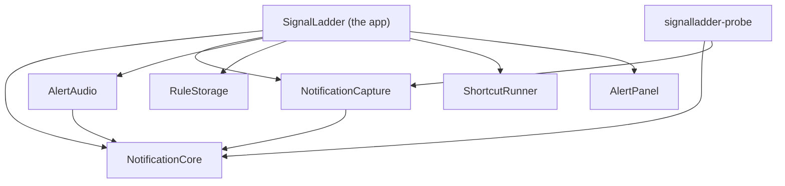
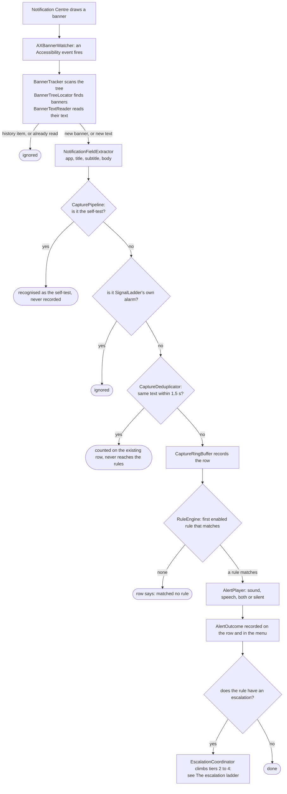

# How SignalLadder works

This page is for people who want to change SignalLadder, review it, or understand why it behaves as it does. It describes the code as it is on `main`, names the types you will meet, and says why the awkward parts are awkward. It does not describe planned work as if it were built. Where something is not implemented, it says so.

If you only want to use the app, start with [getting started](getting-started.md) and the [rules format](rules-format.md). If you want to contribute, read [CONTRIBUTING.md](../CONTRIBUTING.md) first; this page is the map it points to.

- [Principles that shape the code](#principles-that-shape-the-code)
- [Module map](#module-map)
- [From banner to sound](#from-banner-to-sound)
- [The escalation ladder](#the-escalation-ladder)
- [Knowing it still works](#knowing-it-still-works)
- [Rules](#rules)
- [Audio](#audio)
- [Testing](#testing)
- [Tools](#tools)
- [Where to read more](#where-to-read-more)

## Principles that shape the code

Six ideas explain most of the design. Each has a reason, and the reason is usually an incident.

### Decisions live in pure, tested code; the app is glue

Everything that decides something is in `NotificationCore`: what a banner says, whether it is a repeat, which rule matches, when an escalation's next tier is due, what health is, what the menu says about it. That module imports Foundation and CryptoKit and nothing else. It cannot touch Accessibility, notifications, audio, the file system or the network, so every decision can be tested without a permission, a speaker or a real notification.

The app target, `SignalLadder`, connects those decisions to the operating system and has no tests of its own. So it holds as little as possible. Its own comments say what each piece is for: `CaptureController` "connects the Accessibility observer to the capture pipeline, and nothing more", and `RuleStore` "only connects" the decoder and the file layer.

_Why._ The capture pipeline used to be a closure inside the app target. Two reviews in a row named it the riskiest untested path in the app, and it is where the rule engine attaches. It moved into `CapturePipeline` so it could be tested before anything more was added to it. The same reasoning put the rules file in its own target, `RuleStorage`: it is the one place a bug destroys the user's rules. The same reasoning put the Shortcut's input file in `ShortcutRunner` and the escalation panel in `AlertPanel`, so that each is tested outside the app target.

`PurityTests` enforces the boundary for `NotificationCore` only. It is a plain text search of that module's source files for forbidden imports (`ApplicationServices`, `AppKit`, `Cocoa`, `Carbon`, `UserNotifications`, `AVFoundation`, `Speech`, `SwiftUI`, `Combine`) and for `FileManager`, `FileHandle`, `URLSession`, `Data(contentsOf` and `write(to`. Nothing enforces the rest of the split. That is convention, kept by review.

### Notification content is never logged, and reaches disk in one place

Notification text is held in memory, in the last 50 captures, until newer ones replace it or you quit. There is no time-based expiry and no clear-history command; quitting is the only way to drop it. SignalLadder does not write it to logs. Apart from text you choose to save in a rule, it writes it to disk in one case only: the input file of a Shortcut, below.

Three things do reach disk, and all are deliberate:

- Text you put into a rule condition is saved in `rules.json`, and in the backups made when you save. The rule editor says so where you add it.
- The mute checklist stores a SHA-256 hash of each app name you confirmed in the app's preferences. It stores hashes, not names, because a name comes from a banner and a badly parsed banner can hand it a fragment of a message.
- A Shortcut's input file. When the last tier of an escalation runs a Shortcut, `ShortcutRunner` writes four fields of the notification to `input.json`: `appNameGuess`, `title`, `subtitle` and `body`, never the raw text, the time or the subrole. It sits in a folder of its own (mode `0700`) inside `com.jamiewhite.signalladder.shortcut-input` in the system temporary directory, and the file itself is `0600`. It is deleted the moment the Shortcut's process ends, however long that takes. The app reports what happened within a second at most and does not wait for the end, so the file can outlive that report. Anything a crash or a quit left behind is removed at launch and at quit. This is the one place the app writes notification text you did not put there yourself, and only for a rule that names a Shortcut. What the Shortcut then does with the text is up to the Shortcut you wrote.

A few short-lived copies sit beside that buffer: the deduplicator's keys, the last alert outcome (which includes a spoken line) and the copies the Inspector and rule editor display. A live escalation keeps a copy of its notification too, for spoken repeats and for a Shortcut's four fields, and the row it began from holds the outcome of its latest repeat and of its final alert, either of which can include a spoken line. The escalation keeps its copy until it is finished with: acknowledged, and any Shortcut it started has reported. That can be longer than its row stays among the last 50, because a busy channel can push the row out while the ladder still runs. All of these are in memory, and quitting drops them.

The app has three loggers. The speech logger records how long a spoken alert took to start, and two fixed lines when speech produced no audio or did not finish in time. None of its messages has a parameter a sentence could pass through. The watcher's logs a process id, a subrole, an error code or a count. Its function takes a free-form message, so the rule that it is never given a notification's text is held by convention. The hotkey's logs a status code when the hotkey could not be installed or registered, and nothing else.

_Why._ The app reads other people's messages. Nothing about reading them requires keeping them, so it does not. The one exception is there so that a Shortcut you wrote can act on what arrived. It is kept as small as it can be: four fields, an owner-only folder and file, gone when the Shortcut's process ends.

Where this is enforced by a test, and where it is not:

| Claim | Enforced by |
| ----- | ----------- |
| `NotificationCore` opens no file and no URL, and imports no permission-bearing framework | `PurityTests` |
| Nothing logs notification text, and the only notification text the app writes for itself is a Shortcut's input file | Convention. The comment on the watcher's log function says the `%{public}` format is safe only because no text ever passes through it |
| A Shortcut's input file holds those four fields and no more, is owner-only, and is deleted when the Shortcut's process ends, whether that is inside the one-second launch check or long after | `ShortcutRunnerTests`, against real folders: the exact fields, both modes read back from the file system, and deletion when the process ends after a success, after a failure, and after that second has already passed |
| Whatever a crash or a quit left in that folder is removed at launch and at quit | `ShortcutRunnerTests` for `sweep()`, including that it leaves anything outside its own folder alone. Calling it at launch and at quit is in `AppDelegate`, which has no tests |
| A Shortcut's own output is never logged, kept or shown | Partly. `ShortcutRunnerTests` show that a failure is worded from the exit code and never from the output. That the real process's standard output goes nowhere, and that its standard error is read only to tell "not installed" from any other failure, is in code no test starts a process to exercise |
| The panel and the menu never show what a notification said, and the Inspector's escalation line never repeats what a spoken alert said | `EscalationPanelTextTests` and `EscalationWiringTests` test the wording. `AlertPanel` also has no dependency that could name a notification, so it is only ever given finished lines |
| The app has no networking | Not test-enforced. A search of `Sources/` finds no networking API |
| The only other program the app runs is `/usr/bin/shortcuts`, and only for a rule that names a Shortcut | Not test-enforced. A search of `Sources/` finds `Process` only in `ShortcutRunner`. That Shortcuts are listed only when a rule names one, and once per load, is tested in `EscalationFormatTests` |

The developer tool `signalladder-probe` prints text only when you pass `--show-content`. See [privacy](privacy.md) for the user-facing statement of all this.

### Say no more than was established

The app is an on-call tool, so the worst thing it can do is reassure you falsely. Wording is held to what was actually observed:

- _Played_ is not _heard_. An alert outcome records what the app did. When the Mac's output reported itself muted or at zero volume, the outcome says that too. When the output state cannot be read, it is not called silent.
- _Verified_ carries its age. The menu says _Working — verified 3 min ago_, and once the evidence is stale it says _Unverified — last verified 34 min ago_. A success from half an hour ago is not a statement about now.
- Muting is your word. Nothing can read another app's notification settings, so the walkthrough says _confirmed muted_, never _muted_.
- A preview is not a match. Re-checking old rows against new rules never rewrites what happened when they arrived, and never plays anything.
- _No rules loaded_ is not _matched no rule_. A row that was never evaluated is not shown as one that was.
- The filter for the app's own banners requires our name and our wording. Name alone would silently drop a real notification from any app that shares it.

_Why._ Each of these was a real bug. On 2026-09-25 capture went blind about 80 seconds after a self-test passed, and health went on saying _verified_, with nothing to show it had aged, for up to half an hour.

### Failures are surfaced, never silent

A rule that should have made a noise and did not is the failure this app exists to prevent, so every path that can produce one reports it:

- One bad rule never silences the others. The rules file is decoded one rule at a time. A rule that cannot be used is left out and listed by position and name; the rest run.
- Problems are found when the rules load, not at the incident. A sound that is missing, unreadable, silent or too long, a voice that is not installed, and a Shortcut the Shortcuts app does not list are reported by rule name when the file loads. If the Shortcuts cannot be listed within a second, that one check is skipped, and the name is found out by running it.
- A failed alert never throws at the moment it matters. `AlertPlayer` returns an outcome (_Could not play: …_), which is recorded on the row and held in the menu until a later sound plays. Reloading rules does not clear it. A repeat or a final alert that fails is held the same way. A Shortcut that did not run is held on its own, until a later Shortcut launches: folded in with the sounds, the next repeat playing would clear it, and it may have been the alert meant to reach someone away from the Mac.
- Unknown keys are errors. A misspelt `"alrt"` would otherwise leave a rule quietly silent.
- Nothing can forget to connect playback. The playback closures of the pipeline and of the escalation coordinator have no default values, and neither does the sound, voice and Shortcut check the loader runs.
- A rules problem, an alert that could not sound or a Shortcut that did not run changes the menu-bar icon to the same warning state as a capture fault. A tool whose rules did not load is as silent as one that cannot see banners.
- A sleep does not turn into stale alarms, or into silence. An escalation the Mac slept through is not resumed on waking. It ends as _missed while asleep_ and stays on the menu until you acknowledge it. This rests on the awake time stopping while the Mac sleeps, which Apple documents and which has not yet been measured on a Mac that sleeps. See [The escalation ladder](#the-escalation-ladder).

### Event-driven, near-zero idle cost

The Accessibility observer, the watcher on the Notification Centre process and the audio engine all do nothing until something happens. The audio engine runs only while an alert plays, because a running engine keeps the output device awake.

The one deliberate polling exception is the health self-test, on a 30-minute timer. Silence proves nothing, so health has to be asked for. A few one-shot timers hang off it: a follow-up two minutes after a self-test at launch, retries after a failure, and a one-minute recheck while a self-test is blocked. See [Knowing it still works](#knowing-it-still-works).

The escalation ladder is event-driven, and nothing polls for a tier that is due. A match starts it, and each tier still to come has one one-shot timer, counted from the match. `RunLoopEscalationScheduler` adds each `Timer` to `RunLoop.main` in `.common` mode, so a tier still fires while the menu is open. Each timer has zero tolerance, so macOS adds no slack to when it fires. While anything is escalating, one more timer repeats every 0.8 seconds to alternate the menu-bar icon, and it goes the moment nothing is. While a tier is still to fire, the app also holds an activity assertion that asks macOS not to let the Mac idle-sleep, and it lets go as soon as no tier is. With nothing escalating, none of these exists. See [The escalation ladder](#the-escalation-ladder).

Idle cost was last measured during milestone M2: 0.00% CPU over ten seconds and about 60 MB resident, and 0.00% over fifteen seconds and about 77 MB with the Inspector open, before alerts, speech, the rule editor and escalation existed. It has not been re-measured since. `Scripts/verify-live.sh` samples idle CPU over ten seconds and fails above 2%.

### No third-party dependencies

`Package.swift` has no `dependencies` at all. Every framework the code imports is Apple's.

_Why._ The app holds an Accessibility grant and reads other people's notifications. Everything it links runs with that access, so the code that does so should be the code in this repository, small enough to read.

## Module map

`Package.swift` declares thirteen targets: eight for the app, its libraries and its tool, and five for tests. It has no third-party dependencies, and its platform floor is macOS 14. SignalLadder supports Apple silicon only, but a package manifest cannot say so, and the package does not enforce it: `make-app.sh` builds for whichever Mac runs it, and [`release.sh`](#scriptsreleasesh) refuses anything but arm64.

| Target | Kind | Depends on | What it is for |
| ------ | ---- | ---------- | -------------- |
| `NotificationCore` | library | nothing | Every decision, as pure code. Banner location and text reading (`BannerTreeLocator`, `BannerTextReader`, `BannerTracker`), parsing (`NotificationFieldExtractor`), `CapturePipeline`, `CaptureDeduplicator`, the 50-row `CaptureRingBuffer`, the rule model, engine, glob and codec (`Rule`, `RuleEngine`, `Glob`, `RuleSetCodec`), the escalation ladder (`Escalation`, `EscalationCoordinator`, `EscalationScheduler`, and `AlertActionRunner`, the one path every tier's alert takes), health (`HealthEvaluator`, `SelfTestPlan`), the editor's dry-run, the mute checklist, and the wording the app shows (`HealthTitle`, `AlertMenuText`, `InspectorRowText`, `EscalationPanelText`, `EditorText`, `MuteWalkthroughText`) |
| `NotificationCapture` | library | `NotificationCore` | The parts that touch Accessibility and notifications. `AXBannerWatcher` (the only `AXObserver`), `AXElementNode` (adapts `AXUIElement` to Core's `AccessibilityNode`), `CanaryService` (the self-test), `DeliveryStatusProbe` |
| `AlertAudio` | library | `NotificationCore` | Playback. `AlertPlayer` (the audio graph, gain, speech), `SoundLibrary`, `OutputState`, `SpeechConverter` |
| `RuleStorage` | library | nothing | `RulesFile`: fingerprinted reads and safe writes of `rules.json`. It handles bytes; what they mean is `NotificationCore`'s job |
| `ShortcutRunner` | library | nothing | `ShortcutRunner`: runs a Shortcut for an escalation's last tier, and lists the ones installed. It writes the Shortcut's input file, launches `/usr/bin/shortcuts` without waiting for it, deletes the file when the process ends, and sweeps what a crash or a quit left. Its own target because it is the one place notification text reaches disk, so it is tested against real folders, outside the app target, which has no tests. It has no dependencies, so it cannot take a `CapturedNotification`: the app hands it four strings (`ShortcutRunner.Fields`) |
| `AlertPanel` | library (AppKit) | nothing | `AlertPanelController`: the borderless panel that stays over every app and every Space until each escalation on it is acknowledged. Its own target, on `AlertAudio`'s precedent, so that the window it builds is tested. It has no dependencies, and is given rows already written as text, so it has no way to name what a notification said |
| `SignalLadder` | executable (the app) | all six libraries | Thin glue. `AppDelegate`, `CaptureController`, `RuleStore`, the rule editor's model, SwiftUI views hosted in AppKit windows, `HealthAlarm`, the menus. For escalation, the real parts the tested core may not hold: `RunLoopEscalationScheduler` (the real timers and clocks), `HotKeyController` (the global hotkey, through Carbon) and `PowerAssertion`. No tests |
| `signalladder-probe` | executable | `NotificationCore`, `NotificationCapture` | A developer tool that prints banners as they are captured. Not part of the app bundle |
| `NotificationCoreTests` | tests | `NotificationCore` | Pure unit tests. The largest suite |
| `AlertAudioTests` | tests | `AlertAudio` | Renders the real audio graph offline and measures it |
| `RuleStorageTests` | tests | `RuleStorage` | Real temporary folders, symlinks, injected write failures |
| `ShortcutRunnerTests` | tests | `ShortcutRunner` | Real temporary folders, with a fake launcher and a fake grace timer, so no test starts `/usr/bin/shortcuts` or waits on a clock |
| `AlertPanelTests` | tests | `AlertPanel` | Builds the real `NSPanel` and reads its properties and what it draws back. Showing and hiding are checked on a panel that records being ordered in and out. Never puts a window on screen |



An arrow means "depends on". `NotificationCore`, `RuleStorage`, `ShortcutRunner` and `AlertPanel` depend on nothing in the package, which is why each can be tested on its own.

## From banner to sound

macOS gives no interface for reading other apps' notifications. SignalLadder reads the banner Notification Centre draws, through the Accessibility API. That is an observation of another process's interface, not a contract, so the code is built to notice when it stops working.



The steps, in order:

1. **A banner appears.** Notification Centre (`com.apple.notificationcenterui`) draws it. `AXBannerWatcher` owns the only `AXObserver` in the program. It is attached to that process's id, because the system-wide element cannot observe notifications. It registers for window created and window moved (required), and for element destroyed and layout changed (optional, and both matter; see below). If a required registration fails, it discards the observer and retries rather than run half-deaf. The observer's run-loop source is on the main run loop.
2. **The watcher follows the process.** Notification Centre restarts. The watcher watches its process id directly and re-attaches with a capped, doubling delay (at most 30 seconds). Each successful attach asks for a self-test, because a fresh process is exactly when capture most needs proving again.
3. **The windows are read.** The event carries no payload, and events come in bursts, twenty or so as Notification Centre opens. So the watcher reads once per burst: 50 milliseconds after the first event, it reads every window Notification Centre has, whole, and passes each to `BannerTracker.scan`. It reads whole windows because only the whole window shows whether it is Notification Centre's list. The scan works through the `AccessibilityNode` protocol; in the app, `AXElementNode` adapts `AXUIElement` to it, with a 0.2 second timeout on every read. `BannerTreeLocator` finds banners by subrole (`AXNotificationCenterBanner`, `AXNotificationCenterBannerStack`, `AXNotificationCenterAlert`, `AXNotificationCenterAlertStack`, `AlertStack`), never by position. The search goes at most 12 levels deep and visits at most 256 nodes. It is depth-first and the deepest match wins, so a stack that holds banners yields them, not itself. `BannerTextReader` reads the banner's direct children, whose values hold the title, subtitle and body separately.
4. **The tracker decides what is new.** See [When a banner replaces another](#when-a-banner-replaces-another) and [When Notification Centre is opened](#when-notification-centre-is-opened). New banners leave the watcher as a `RawCapture` plus their text children. A banner with neither description nor children is logged by subrole, as possible partial blindness, and not remembered.
5. **`CaptureController` hands it on.** It forwards each banner to `CapturePipeline.process`, and rebuilds the menu when the outcome changes what you can see.
6. **`NotificationFieldExtractor` parses it** into a `CapturedNotification`. The app name is the first comma-separated segment of the banner's description, a heuristic, which is why the rules guide calls it "recovered heuristically". Title, subtitle and body come from the text children (one child is a title, two are title and body, three are title, subtitle and body, and from the third onwards any more are joined into the body). With no children it falls back to splitting the description at commas, which is lossy: a comma inside a field looks like a boundary.
7. **The pipeline filters, in this order:**
   1. The self-test. `CanaryService.noteCapture` recognises its own marker. This comes before deduplication, so the self-test's text never enters the dedupe window and cannot suppress a real notification that happens to match it.
   2. The app's own notifications. `SelfNotification.isOwnNotification` requires our app name and one of three titles (_SignalLadder is not capturing_, _SignalLadder cannot verify itself_, _SignalLadder self-test_). It is a backstop for our alarms, and for a self-test whose marker match failed.
   3. `CaptureDeduplicator`. macOS fires several events as one banner animates. A repeat within 1.5 seconds of the first sighting is counted on the row it duplicates and never reaches the rules, or one banner could sound its alert several times. The window is anchored to the first sighting and is not refreshed by a hit, so a fast-repeating source cannot suppress itself indefinitely. Suppressed repeats are shown in the Inspector, not dropped silently.
8. **`CaptureRingBuffer` records the row.** It keeps the last 50, with a `ContextSnapshot` of the time and how many notifications from the same app the buffer holds from the last hour.
9. **`RuleEngine.firstMatch` picks the rule.** Rules are tried in file order and the first enabled match wins, so a notification matches at most one rule. The result is stored as the row's annotation. With no rules loaded there is no annotation, which is different from _matched no rule_.
10. **`CapturePipeline` acts.** It is the only place a rule's first alert is set off, and it is reached only from a live match on a newly recorded row: never from a preview, a repeat or the app's own traffic. It calls a playback closure the app injected. `AppDelegate` connects those closures to `AlertPlayer`. Later tiers are set off by `EscalationCoordinator`, which the pipeline starts and nothing else does. See [The escalation ladder](#the-escalation-ladder).
11. **`AlertPlayer` plays.** It looks up the sound, gets it decoded and level-matched, and schedules it on the audio graph. Speech is rendered through the same graph. See [Audio](#audio).
12. **The outcome is recorded.** `AlertPlayer` returns an `AlertOutcome`: _Played_, _Spoke_, _Silent by rule_, _Could not play: …_ and so on. The pipeline writes it on the row and keeps it as the last match. A failure is also held as unresolved until a later sound plays. If the rule has an escalation, the pipeline then calls `beginEscalation`, so the row, the last match and the menu icon are complete before the ladder starts.

Everything from the observer callback to the sound runs on the main thread. `CapturePipeline`, `EscalationCoordinator`, `CanaryService`, `AlertPlayer` and the app's delegate are `@MainActor`, and the compiler holds callers to it, so there are no locks to reason about.

Saving or reloading rules re-checks every row still in the buffer against the new rules. `CapturePipeline.setRules` writes each result as a preview on the row, never as its annotation, and never plays a sound or starts an escalation. That preview is what the blue line in the Inspector and the rule editor's dry-run show.

### When a banner replaces another

Measured on macOS 26.7 on 2026-09-29: banners do not stack. A second banner that arrives while the first is on screen replaces it inside the same window. It fires layout-changed events and the destruction of the old banner's elements. It fires no window-created and no window-moved. Capture used to listen only for the window events, so every such banner was missed, and a burst of alerts sounded only the first.

The fix has two halves. The watcher also registers for layout changes. Then `BannerTracker` makes sure a banner is not captured twice, because layout changes also fire again for a banner already read, at 1.6 and 2.2 seconds in the measured run, past the dedupe window. So the tracker keys on the element, not the text:

- A banner element it has not read before is new. A replacement is a new element.
- An element it has read is new again only if a re-read finds text it did not have before. A poorer re-read, where a timeout lost a child or the description, is not new and does not replace what was remembered.
- It remembers hashes of each banner's text, never the text, and forgets an element once macOS reports it destroyed. A failed or timed-out read proves nothing, so it does not forget on one. At most 16 elements are held, apart from any still on screen.

A banner from one app replacing a banner from another was not tested. The measurements used test banners that all came from one app.

Persistent alerts behave differently, measured the same day with Script Editor set to persistent alerts. A second persistent alert from the same app, arriving while the first is still up, joins it in an `AXNotificationCenterAlertStack` that carries the newest alert's text. That subrole was missing from the allowlist, so every alert after the first in a stack was missed. Teams alerts are persistent when Teams is set to Alert, so the second of any two Teams alerts on screen together would have been missed. Now each alert that joins a stack is captured once.

### When Notification Centre is opened

Opening Notification Centre shows its history in the same window, under the same subroles, as a live banner. It opens either as a new window, or by turning the window of a banner still on screen into its list. A notification that arrives while it is open appears at the top of the same list. Before this was handled, every opening captured the history again, and a rule that matched an old notification sounded again.

Nothing about a row reliably says it is old. A row under a minute old shows no time at all, and older rows' time labels (_1m ago_, _10m ago_) come and go between reads. So the window decides. This was measured on macOS 26.7 on 2026-09-29:

- **`NotificationCentreHistory.isPanel` recognises the list.** The window has keyboard focus, and its scroll area holds the list's own menu button as a direct child. A window showing only banners had neither. Focus alone is not enough, because it was seen to stay on after the list closed.
- **When a window becomes the list, everything in it is history,** remembered by element. Its text is not read.
- **A row that appears after that is history** if it ends with a time label, as a row scrolled into view does, or if it replaces a captured banner with the same text destroyed in the last 2 seconds, which is a stack laid out again. That text match is used once, so a genuine repeat, such as a second _Build failed_, is still captured, unless it arrives within those 2 seconds.
- **Any other new row has arrived while the list is open.** It is captured once a second read, at least 250 milliseconds after the first, still finds no sign that it is old. The gap is past a measured 220 ms flicker of the time label.
- **Outside the list nothing is set aside.** A live calendar reminder can end in something that looks like a time.

When it is unsure, it captures: a replay is the lesser error, and the other would miss an alert. Known gaps:

- A notification that arrives at the very moment the list opens is part of what the list holds when it opens, so it is taken for history and not captured while the list is open. Whether it is captured once the list closes, if its banner is still on screen, has not been checked.
- A genuine repeat that arrives while the list is open, within 2 seconds of a captured banner with the same text going, is taken for a stack laid out again and missed.
- A notification that arrives while the list is open is taken for history if its last line reads like a time label that its description does not hold.
- Once, during a test run on 2026-09-29, a persistent Outlook alert was not captured, and nothing was logged. One read on screen the next day arrived as an `AXNotificationCenterAlertStack`, alone, in a window that had keyboard focus, and the current build captured it. The builds of 29 September before #17's fixes could lose exactly that shape, by not recognising the stack or by taking a focused window with a button in it for the list. Which build was running was not recorded, so that is the likely cause, not a proven one.
- Once, not reproduced, a stack of seven persistent alerts from one app was laid out again as new elements when another alert arrived while the list was open, and three old alerts were captured again. A stack of two did not do this.
- The list's structure was measured on macOS 26.7 only. On a macOS where it differs, the list is not recognised, and its history is captured again when it opens.
- The time wording it recognises, such as _1m ago_ or _yesterday_, is English only. Numeric times such as _12:04_ are recognised in any language. Labels matter only for rows that appear after the list opens.

## The escalation ladder

A rule's alert is tier 1. A rule can also carry an `escalation`: up to three more tiers, each optional, that you stop by acknowledging. Tier 2 shows a panel, tier 3 repeats an alert, and tier 4 plays a last alert or runs a Shortcut. The [rules format](rules-format.md) says how to write one. This section is about how the code climbs it.

Nothing polls for it. A match starts a ladder, and everything after that runs on timers.

### How a match starts it

`CapturePipeline.process` plays tier 1 as it always did and records the outcome on the row. Then, if the rule has an escalation, it calls the `beginEscalation` closure the app gave it, with the rule, the notification and the row's id, and `AppDelegate` connects that to `EscalationCoordinator.begin`. The order matters: the row, the last match and the menu icon are complete before the ladder starts, and the ladder records and redraws as it begins. A preview, a suppressed repeat and the app's own notifications return before that call, so none of them can start one (`EscalationWiringTests`).

Capture errs towards reading a notification twice, and a second read that the deduplicator lets through and a rule matches climbs its own ladder. So one alert can start two escalations. That is why each row on the panel says when it began.

Two calls come back the other way:

- `CapturePipeline.recordEscalation` is called on every change. It writes the escalation's summary onto the Inspector row (`CaptureRingBuffer.setEscalation`, the one record of what the app did that is rewritten as it goes: `alertOutcome` is still written once). It also folds a later tier's failure into the failures that tier 1's already follow. A failed repeat or final alert is held until a sound plays. A failed Shortcut is held on its own, until a later one launches. Each repeat and the final outcome are folded once, because a summary is recorded again on a cap or an acknowledgement, and would otherwise set a failure that a later repeat had cleared.
- `CapturePipeline.escalationRetired` is called when the coordinator forgets an escalation, so what was folded from its row is forgotten too.

### What runs it

`EscalationCoordinator` runs every escalation's tiers 2 to 4. It is a `@MainActor` class, not an actor. Everything else that touches alerts is main-actor isolated, and the timers fire on the main run loop, so there is one queue and no race for an actor to guard. It lives in `NotificationCore`, so it touches nothing real: it gets its clocks and timers from an injected `EscalationScheduler` (`RunLoopEscalationScheduler` in the app), and its sounds, panel, Shortcut, recording and power through closures with no defaults. The tests give it a `ManualScheduler`, which advances both clocks by hand, so twenty repeats over ten minutes are proven without waiting for any of them.

- **Tiers are independent.** Tier 2, tier 3's first repeat and tier 4 each get their own timer, all counted from the match and not from each other. Tier 4 does not wait for tier 3 to finish, and an uncapped tier 3 cannot hold it back. Each repeat arms the next. An escalation keeps the ladder it began with, so saving or reloading rules changes later matches, not one already running.
- **Caps are decided by the schedule.** Repeats stop at whichever of `maxRepeats` and `maxDurationSeconds` is reached first. Whether repeat _n_ fits is worked out from the interval, not from the time measured, because real timers are a little late, and comparing the time measured gave nineteen of the default twenty repeats in ten minutes. A capped escalation is not finished: it stays listed until acknowledged, and tier 4 still fires if it has not.
- **Timers are ticketed.** Each carries a ticket, and its work does nothing unless its escalation is still going and it is the timer that escalation is waiting on. A timer already on its way when you acknowledge, or delivered twice, does nothing.
- **It can be called back into.** Playing a sound, recording a summary or reporting a Shortcut can lead to an acknowledgement. So the coordinator writes every change back before it calls out, and reads its state again after. An acknowledgement made inside a repeat's own sound sticks.
- **Sleep is measured, not guessed.** The code does not assume its timers are reliable across a sleep. The coordinator works out how long the Mac slept as the wall-clock time since its last check, minus the awake time since then (`ProcessInfo.systemUptime`, in the app). It checks when an escalation begins, before any tier acts, and when the system wakes (`NSWorkspace.didWakeNotification`, not the display waking: a display can sleep and wake while the system stays up). If the Mac slept for more than 300 seconds, every escalation still going ends as _missed while asleep_. Its timers are cancelled, nothing stale fires, and it stays on the menu until you acknowledge it, and on the panel too if its tier 2 had already shown. A shorter sleep resumes the ladder where it was. A stalled main thread moves both clocks together, so it converts nothing. Apple documents that `systemUptime` stops while the Mac sleeps. That has not yet been measured on a Mac that sleeps, so this rule is proven with injected clocks, whose `sleep(for:)` moves the wall clock alone, and has not been observed across a real sleep.
- **Power is held only while a tier is pending.** While any escalation has a tier still to fire, the coordinator asks the app to hold a `ProcessInfo.beginActivity` user-initiated activity (`PowerAssertion`), which is there to keep the Mac from idle-sleeping, and to let go as soon as none has. A capped escalation that is still listed but has nothing left to fire does not hold it. It does not ask for the display to be kept awake. Whether it keeps a Mac that can sleep awake mid-escalation has not been checked on one.
- **An escalation retires** once nobody can see or act on it: it has been acknowledged (or, if it was missed, seen), and any Shortcut it started has reported. Until then the coordinator holds its own copy of the notification, for spoken repeats and for the Shortcut's fields. A Shortcut that reports after its escalation was acknowledged is still recorded on the row.

**Every tier's alert takes one path.** `AlertActionRunner.run` turns an alert into a sound, speech or both through the three playback closures, and returns an `AlertOutcome`. Tier 1 (through `CapturePipeline`), a tier 3 repeat and a tier 4 final alert all call it, and the closures all reach the one `AlertPlayer`. So a new alert cutting off the last, described under [Audio](#audio), holds across escalations with nothing new, and the coordinator tracks nothing about who is playing. Several escalations due at once are heard as one sound cutting off the next, never mixed, and nothing staggers them. A Shortcut is not an alert. Tier 4 is either an alert or a Shortcut (`FinalAction`), and `.shortcut` is deliberately not a case of `AlertAction`, so it can never reach `AlertPlayer` or tier 1.

### The Shortcut, the panel and the hotkey

**The Shortcut.** `ShortcutRunner` runs `/usr/bin/shortcuts run --input-path <file> -- <name>`. The name is one argument after `--`, never passed through a shell, so a name that starts with a dash is not read as an option. It writes the input file first, and if it cannot, the Shortcut is not run and the failure is reported: running it bare would quietly do something else. It never waits for the Shortcut. It reports once, whichever comes first: the process exits, or one second passes with it still running. A missing Shortcut exits well inside that second (about 0.06 to 0.15 seconds in the measurements), so it is reported as failed, in the app's own words (not installed, or an exit code) and never the Shortcut's output, which can echo its input. One still running after a second counts as launched, and a failure after that is not reported again. The file is deleted when the process ends, not when the report is made. The launcher and the timer are injected, so the tests never start a real process.

**The panel.** `AlertPanelController` is one borderless `NSPanel` over every app and every Space, full-screen apps included, that does not take focus. It has one row per escalation, newest first, each with its own Acknowledge button. It lists only escalations whose tier 2 has shown, so a rule with no tier 2 is on the menu and never on the panel. `EscalationPanelText` writes every line (the rule's name, when it began, and where the ladder is) before the panel sees it, and the panel is given only identifiers and finished strings. It shows at most six rows and counts the rest on a last line, so the oldest never sit below the screen's edge. A row that stays listed keeps its views, and an update changes its words in place, so a button is never rebuilt under a press. The order of two settings matters: setting `isFloatingPanel` resets the level, so it comes first, and `AlertPanelTests` reads both back so that a reordering fails. That the panel shows over a full-screen app was measured in a spike, on macOS 26.7, and has not yet been checked in the app itself.

**The hotkey.** `HotKeyController` registers Control-Option-Command-A once at launch, through Carbon's `RegisterEventHotKey`, which is why the app imports Carbon. Pressing it calls `acknowledgeAll()`, as the menu's item does. Carbon calls back through a C function with no actor of its own, on the main thread, so the controller takes the main actor with `MainActor.assumeIsolated` and not through a hop that an acknowledgement could arrive behind. It is best effort and never the only way: a failed registration logs its status code and is otherwise ignored, and the menu and the panel's buttons need no permission. On macOS 26.7 it needed no permission prompt. Whether other versions differ is not known.

### Acknowledging

A panel row's button calls `acknowledge(id)`. The menu's Acknowledge item and the hotkey call `acknowledgeAll()`, which does nothing when nothing is listed. Each cancels every tier the escalation still has to come, and marks it acknowledged. A missed escalation is only marked seen.

Sound already playing is harder, because `AlertPlayer` knows that something is playing and not whose it is. So acknowledging one of several live escalations stops no sound: the one in flight plays out. Acknowledging the last live one, or every one, calls `silenceIfIdle`, which the app wires to `AlertPlayer.silence()`. The app's closure calls `silence()` only if the latest alert to reach the player was an escalation's: a tier 3 or tier 4 alert, or the tier 1 of a rule that has a ladder. `PlayerOwnership`, in `NotificationCore`, decides that from each alert's outcome, not from what it asked for: a repeat whose sound could not be found never reached the player, so it leaves an ordinary alert that is still playing as the thing acknowledging must not stop. A rule with no ladder plays through the same player without the coordinator seeing it, and acknowledging must never cut off its alert. For the same reason, a stray press of the hotkey with nothing listed cuts off nothing.

### What you see

While anything is listed, the status menu opens with an Acknowledge item ("Acknowledge" for one, "Acknowledge All (N)" for more), then a line for a Shortcut that did not run, how many alerts are escalating and how many were missed while asleep. The Shortcut's line stays until a later Shortcut launches, even when nothing else is listed. `AlertMenuText` writes them, and none carries what arrived. The menu-bar icon alternates between `bell.and.waves.left.and.right` and its filled form while anything is escalating, capped escalations included. `bell.slash.fill`, the warning state, takes precedence, and a live ladder is never counted as a fault, so a working ladder cannot look like a broken pipeline. Quitting while anything is listed asks first, because quitting ends every escalation, and a Shortcut not yet run is never run. An Inspector row whose rule escalated gains a line for where its ladder got to (`InspectorRowText.escalation`), which never repeats what a spoken alert said.

### What is not built

The rule editor does not show or edit a ladder yet. It keeps one you wrote by hand in `rules.json` when you save, and shows its load problems. You write the ladder in the file and choose **Reload Rules**. `Scripts/verify-live.sh` has no `--escalation` check either. Snooze and an on-call mode are still ideas.

## Knowing it still works

Absence of notifications proves nothing. A quiet Mac and a blind app look identical. Capture stopped working on the maintainer's Mac twice (2026-09-11 and 2026-09-25) while banners were still being drawn. The second time the health line still said _verified_, and a plain relaunch cleared it. The cause is not settled; the findings are in [docs/dev/notes](dev/notes). So the app does not treat silence as good news. It sends itself a notification and checks that it arrives.

### Health states

`CaptureHealth` has four states, and the menu's health line, which is its top line unless an alert is waiting, shows one of them through `HealthTitle`:

| State | Menu line | Means |
| ----- | --------- | ----- |
| `verified` | _Working — verified 3 min ago_ | A self-test round-tripped recently. The only state that is positive evidence |
| `unknown`, never verified | _Checking…_ | Nothing is known yet: at launch, before the first self-test |
| `unknown`, evidence is stale | _Unverified — last verified 34 min ago_ | A self-test should have run and has not. This is missing evidence, not a fault, so it never sounds the alarm |
| `degraded` | _Cannot verify itself_ | Capture may be fine, but something stops the app proving it |
| `blind` | _NOT capturing notifications_ | Nothing can be captured, or repeated self-tests failed |

Each `degraded` and `blind` state carries causes, most likely first, and each cause has advice that says what to do, not only what is wrong.

### Evaluation order

`HealthEvaluator.evaluate` is a pure function of a handful of plain values, so every combination is testable. It answers in this order:

1. Accessibility is not granted: `blind`. Nothing can be read, whatever a self-test says.
2. The observer is not attached: `blind`. It is usually restarting and recovers within seconds.
3. Notifications are not permitted, or the app's own banners would not be drawn: `degraded`. Delivery is judged before a failed self-test is blamed on capture. If the banner never appeared, capture was never exercised, and calling the app blind would send you to re-grant Accessibility for nothing.
4. A self-test failed, and it is read carefully:
   - If real notifications have been captured since, capture demonstrably works, so the fault is that the app's own alerts are not being shown: `degraded`.
   - If no banner activity at all was seen during the self-test, the result is deliberately ambiguous: `degraded`, naming both possibilities. Either the banner was never drawn (Do Not Disturb, a Focus, banners switched off) or it was drawn and the app did not see it. The evidence for both is the same, nothing. An earlier version guessed "suppressed", and told a user their notifications were muted when the app was in fact blind.
5. Otherwise it counts failures. None yet is `unknown`. Zero failures is `verified`, or `unknown` if the last success is older than the self-test interval plus a 60 second grace. One failure is `degraded`. Two or more is `blind`.

The menu re-evaluates health synchronously each time you open it, from the last delivery status it read, so a fixed problem stops being reported at once. It then re-reads delivery settings in the background without spending a self-test.

### The self-test

`CanaryService` posts a real notification through `UNUserNotificationCenter`, titled _SignalLadder self-test_, with a random marker in its body. It sets no sound, so it is silent. The app's delegate asks for it to be shown as a banner. Then it waits up to five seconds for the marker to arrive through the capture pipeline, and removes the notification. The result is yes if the marker arrived and no if it did not.

A self-test that could not run is not a failure. If one is already in progress, or posting failed, the result is "did not run", and it never moves health toward `blind`.

`DeliveryStatusProbe` answers a separate question first: would the app's own banner actually appear? It reads notification authorisation, the alert style, whether Notification Centre delivery is enabled and whether Scheduled Summary is holding notifications back. This is why a Desktop-banners-off setting is reported as a delivery problem, not a capture one.

`SelfTestPlan` decides whether a self-test can run at all. It needs Accessibility, an attached observer, and the app's own banners to be displayable. When blocked, it looks again every 60 seconds, and runs one as soon as it sees the block clear. Nothing waits for the next half-hour.

| When | What runs |
| ---- | --------- |
| At launch, and after every attach to Notification Centre | A self-test |
| Two minutes after a passing self-test at launch, at attach or when capture starts | A follow-up self-test. Both recorded outages began within minutes of a relaunch |
| Every 30 minutes | A self-test. The one polling timer in the app |
| After a failed self-test | A retry after 60 seconds, doubling up to 30 minutes |
| While a self-test is blocked | A recheck every 60 seconds, running one as soon as the block clears |

The 5-minute cadence the original design describes for an on-call mode is not built. There is only the 30-minute interval.

### The three alarm channels

When health becomes `degraded` or `blind`, `HealthAlarm` reports it through three independent channels:

1. **The menu-bar icon.** It changes from `bell.badge` to `bell.slash.fill`. This is pure AppKit, and always visible. A rules problem, an alert that could not sound or a Shortcut that did not run changes it too. A live escalation gives it a different symbol, but never in place of this one.
2. **A beep** (`NSSound.beep()`). Also pure AppKit.
3. **A notification banner**, but only when delivery is confirmed working.

_Why three._ The self-test posts through `UNUserNotificationCenter`. If the alarm did too, revoking notification permission would break the self-test and silence the alarm about it in one step. Channels 1 and 2 depend on neither the notification system nor Accessibility, so a fault in either cannot silence them. Channel 3 is richer and clickable, but useless when delivery is the fault, so it is skipped then. The alarm fires only when health changes, so it does not nag. The app's own alarm banners are recognised on their way back through capture and never counted.

## Rules

The user-facing description is the [rules format](rules-format.md). This section is about how the code holds it.

### The model

A `Rule` is a name, a condition, an enabled flag, an optional alert and an optional escalation, which holds tiers 2 to 4 while tier 1 stays the alert. A condition (`RuleCondition`) is exactly one of `and`, `or`, `not` or a field comparison. The fields are `app`, `title`, `subtitle`, `body`, `raw` and `subrole`. The operators are `equals`, `notEquals`, `contains` and `matches`. `CapturedNotification.value(of:)` is the one place a field becomes a string, so the Inspector, the engine and the editor cannot disagree about what `app` means.

- **Comparison ignores case and accents.** `equals` and `notEquals` compare with case- and diacritic-insensitive options, and `contains` uses `localizedStandardContains`. A rule written as `microsoft teams` must match _Microsoft Teams_. The alternative is a rule that looks right and never fires.
- **`matches` is a glob**, not a regular expression. `*` is any run of characters and `?` is exactly one. The pattern covers the whole field, and both sides are folded the same way. `Glob` is a linear two-pointer match with a single backtrack point, so the worst case is bounded. _Why glob:_ a rule is evaluated against every notification on the main thread, and a pattern that could hang would hang capture with it. A `regex` operator is not built. It needs a save-time lint, a length cap and a time budget first. A wildcard never splits a character: `?` matches one whole character, so `s?` does not match `ß`, even though `ß` folds to `ss`. Getting that right took three review rounds.
- **First enabled match wins.** `RuleEngine.firstMatch` walks the array in order.
- **An alert is one of four things**, or absent: a sound with a gain, speech, a sound then speech, or `silent`. `nil` means no alert was set and `silent` means the author chose quiet. The Inspector says which.
- **Empty groups keep their mathematical meaning** in the evaluator (`and([])` is true, `or([])` is false), and the loader rejects them, so a half-written rule cannot match everything.

### The codec

`RuleSetCodec` reads and writes the file: `{"version": N, "rules": [...]}`. It is pure, bytes in and rules out.

- **Versions 1 to 4.** Version 2 added alerts, version 3 speech and version 4 escalation. A file is written at the lowest version that can hold its rules. A rule with an alert in a version 1 file is refused, and so is a spoken alert in a file below version 3, and an escalation in a file below version 4. A build that predates alerts would read that file and silently drop every alert in it. The version number is what makes an older build refuse the file instead of misreading it. A version newer than the app knows loads nothing.
- **The version is read before any rule.** A future format may shape rules differently. Decoding it with today's rules would report a list of misleading per-rule errors instead of the one true fact: the file is newer than the app.
- **Hand-written coding, strict keys.** The default coding would render a field condition as `{"field":{"_0":"title","_1":"contains","_2":"x"}}`, which is unreadable and breaks silently if the enum is reordered. Any key the codec does not expect is an error, not ignored. One thing cannot be caught: a key written twice in one object, because the JSON reader keeps the last one without saying so.
- **A ladder is read as strictly as an alert.** `Escalation` rejects unknown keys at every level, so a tier 2 delay written as `afterSeconds` is caught. A cap left out is the default cap, never no limit: only `null` means no limit. `decodeIfPresent` reads a missing key and `null` alike, so the codec tells them apart itself, and it writes every key back, `null` included, so a file the app writes never leans on a default. A rule with an escalation and no alert of its own, an escalation with no tiers, and a silent tier 3 or tier 4 alert are each reported as problems.
- **One rule at a time.** Each entry is decoded separately. A rule that cannot be decoded, or that decodes and has problems, becomes a `Problem` with its position, its name where recoverable, and a reason. The others load. Only a file that cannot be understood at all (not JSON, the wrong shape, a newer version) loads nothing, and the menu says so.
- **Checked when the file loads.** `SoundCheck` asks whether each named sound exists, decodes, is audible and is at most 30 seconds long, and whether each named voice is installed. It does this for every tier's alert, not only tier 1's. For a rule whose tier 4 names a Shortcut, it also checks that the Shortcuts app has one of that name, matched exactly, capitals included. `ShortcutRunner.installedShortcuts` lists them with `/usr/bin/shortcuts list`, only when a rule names one, at most once per load, and bounded to a second. When the list cannot be read the check is skipped, and the list is never logged. The `voices` and `shortcuts` parameters have no default, so no caller can forget them. The loader and the rule editor use one function to judge a rule, so the menu and the editor can never disagree.
- `RuleStoreStatus` turns the whole outcome into what the menu says, and whether the icon warns.

### Storage

`RulesFile` in `RuleStorage` is the only code that writes the rules file. The app writes it in exactly two cases: creating an example when there is none and you ask to open it in a text editor, and when you press **Save** in the rule editor. Never on load, never to tidy it, never to replace a file it could not read.

Three guarantees, each tested:

- **Nothing is lost.** Before a write, the bytes on disk are copied to `rules.previous.json`. The original is copied, not moved, and the last step is the only one that touches `rules.json`. A failure at any point leaves the old file whole.
- **Nothing is half-written.** The new file is written atomically: a temporary file, then a rename.
- **Nothing is overwritten unseen.** A read returns a snapshot whose fingerprint is the SHA-256 of the bytes, or "no file" as a state of its own. A save states the fingerprint it was made from, re-reads, and refuses with the file's current contents if it differs. A hand edit made while the editor was open is never replaced silently. The editor then offers **Reload from Disk**, **Save Anyway** or **Cancel**, and says what changed.

Details worth knowing:

- **Save Anyway** keeps the version it replaces as `rules.replaced-yyyy-MM-dd-HHmmss.json`, with a `-2`, `-3` suffix if two fall in the same second. It never uses the rotating `rules.previous.json` slot, where the next ordinary save would overwrite it.
- **Symlinks** are written through to their target, so a synced or versioned copy stays linked. A link whose target cannot be found is refused, not treated as "no file". Otherwise a save would replace the link with a new file holding only the new rules.
- **Creating** the file uses an operating-system guarantee (`.withoutOverwriting`), so a file that appears in between is never replaced.
- **The documented gap.** A write that lands in the milliseconds between the re-read and the rename is not detected. Closing it would need file coordination, which text editors do not take part in.
- **The editor opens read-only** for a file it cannot represent in full: unreadable, from a newer version, or holding entries that do not decode. Saving would have to drop what it could not read. `RulesDocument` decides this, in `NotificationCore`.

A save, **Reload Rules** and **Open Rules File in Text Editor…** all end in the same place, `AppDelegate.reloadRules`. `RuleStore.reload` prepares every sound and voice, `CapturePipeline.setRules` previews the new rules on the rows already held, and the menu is rebuilt.

## Audio

`AlertPlayer` in `AlertAudio` is one `AVAudioEngine` with a graph that is wired once:

```
sound player  → EQ ────────┐
                           ├→ alert mixer → PeakLimiter → main mixer
speech player → speech EQ ─┘
```

- **One format.** Every sound is converted to 48 kHz stereo float when it is first loaded, so a new sound never re-plumbs the graph mid-alert. Speech is float32, 22.05 kHz, mono, which is what Apple's voices render; Eloquence voices render at 16 kHz and `SpeechConverter` brings them to it.
- **Sounds are prepared when rules load**, not when an alert fires. Each is looked up (`SoundLibrary`: the macOS sounds and your own `Sounds` folder, yours winning on a clash), decoded whole, converted and measured. A file that cannot play is a rule problem reported at load. Decoding then also happens off the capture path. Sounds are refused above 30 seconds before they are decoded, because they are held in memory whole.
- **Level matching is to a peak of −1 dBFS.** At `gainDB` 0 every sound's peak lands at −1 dBFS, however loud or quiet its file. A quiet file is raised by at most 24 dB, so it does not turn into its own hiss, and a file whose peak is below −60 dBFS is refused as silent. Playing it and reporting _Played_ would claim an alert nobody could hear. This is peak normalisation, not loudness normalisation. It removes the largest measured inconsistency, a 10 dB spread between the macOS sounds, and does not claim more.
- **Gain and the limiter.** A rule's `gainDB` runs from −40 to +12 and is checked by the codec, because the EQ stage applies whatever it is given (+40 was measured working despite a documented ceiling), so the bound has to be ours. Sound and speech each keep their own gain and meet ahead of one Apple `PeakLimiter`, so there is one safety net and one place gain can go wrong.
- **One alert at a time.** A new alert cuts off the last, on every node it used, because two alarms at once is noise. A sound-and-speech alert claims the graph once, not once per part; two claims would have the second cut off the first. A generation counter makes the late completion of an interrupted alert harmless: it can neither stop the engine under its replacement nor declare it finished. **Test Sound** and **Test Speech** are refused while a real alert plays, and are never recorded.
- **The engine runs only while an alert plays.** It starts on demand, which costs a few milliseconds, and stops when the last part finishes. A change of output device resets the player to the state between alerts. So does `AlertPlayer.silence()`, which is a stop with no new alert after it: the app calls it only when you acknowledge the last escalation (see [Acknowledging](#acknowledging)).
- **Speech goes through the same graph.** `AVSpeechSynthesizer.write` renders to buffers, which are scheduled on the speech player as they arrive, instead of being spoken directly. So speech shares the gain stage, the level matching and the limiter, and can be rendered offline in tests. The sound never waits for the speech.
- **The synthesiser is held.** One `AVSpeechSynthesizer` lives for the app's lifetime once a rule speaks. Starting one per alert can take seconds. A held one started speaking within about 130 ms in the recorded trials (median 48 ms, after 5 to 30 minutes idle, five trials). Nothing longer than 30 minutes idle was measured. A stall watchdog ends a spoken part after 15 seconds if the synthesiser stops calling back, so the engine is never left running. Lines are capped at 240 characters.
- **Each voice is measured once.** When a rule that uses a voice on any tier loads, a second private synthesiser renders a fixed phrase silently and records the voice's peak, in the background, so an alert never waits behind a measurement. Until it is in, a voice is treated as if it peaked at full scale: quieter than it will be, never louder.
- **The output state is checked.** `OutputState` reads the default output device's mute and volume through CoreAudio, which needs no permission. It reports the output as silent only when the device positively says so: muted, or volume below 0.02. An unknown state is not called silent. It is read when an alert plays and on every menu rebuild, never cached, and it is why the outcome can say _Played Glass — but the Mac's sound output was muted or at zero volume_.

The app does not choose an output device. It plays through the Mac's default output at its volume.

## Testing

`swift test` needs no certificate and no permission prompt. At the time of writing it runs 737 tests, on a Mac with the en-GB voices the speech tests use installed:

| Target | Tests | What they are |
| ------ | ----- | ------------- |
| `NotificationCoreTests` | 604 | Pure unit tests over the rule engine, glob (including Unicode folding), codec, health evaluator, pipeline, ring buffer, dry-run, mute walkthrough, the escalation ladder and the wording. `FakeNode` is an in-memory `AccessibilityNode`, so banner location, tracking and text reading are tested on hand-built trees. `ManualScheduler` is a scheduler whose clocks the test advances by hand, so the ladder's timing, caps and concurrency are proven without waiting, and whose `sleep(for:)` moves the wall clock alone, so a test can put the "Mac" to sleep without sleeping the machine it runs on. `PurityTests` guards the module's boundary |
| `AlertAudioTests` | 73 | `AlertPlayer` has an offline mode that renders the real graph into memory, so nothing reaches a speaker. The tests measure the result: every macOS sound peaks at −1 dBFS to within half a decibel at gain 0, and no sample passes full scale at +12 dB |
| `RuleStorageTests` | 19 | Real temporary folders, including symlinks, same-second backups and an injected failing writer to prove what a failed write leaves behind |
| `ShortcutRunnerTests` | 26 | Real temporary folders. A fake launcher stands in for the process and a fake timer for the one-second launch check, so no test starts `/usr/bin/shortcuts` or waits on a clock. They read the folder's and the file's modes back, check the four fields and no more, and check that the file goes when the process ends, however late. Its pipe reader is tested against real pipes |
| `AlertPanelTests` | 15 | Builds the real `NSPanel` and reads back its level, its behaviour across Spaces, the lines its rows draw and its buttons, including that a row which stays keeps its button and that at most six rows are shown. Showing and hiding are checked on a panel that records being ordered in and out, so no window is ever put on screen. Two more tests check that the target imports only AppKit and Foundation and declares no dependencies |

The tests use XCTest only. The `Test run with 0 tests` lines at the end of a run are the newer Swift Testing library reporting that there are none. The XCTest lines above them, `Executed N tests`, are the counts to read.

Three things depend on the Mac they run on. Sixteen of the 20 tests in `SpeechSynthesisTests` skip themselves when the voice they speak with is not installed: `com.apple.voice.compact.en-GB.Daniel` for most, and `com.apple.eloquence.en-GB.Eddy` for two. `AlertPlayerTests` expects at least ten macOS system sounds to exist. And `OutputStateTests` expects the Mac to report a real output device, so it can fail on a machine with none.

Continuous integration (`.github/workflows/ci.yml`) builds with warnings as errors and runs the suite on macOS 15 and macOS 26, for pushes to `main` and for pull requests, except those that change only documentation. Two practices are not automated. The plans gate each change on a passing suite at the expected count; CI checks that the suite passes, but nothing checks the count. And new logic is broken on purpose to check that a test notices. The plans call it mutation-checking, and it is done by hand, with no tooling for it in the repository.

### What is not unit-tested

`NotificationCapture`, the app target and the probe have no test target. That is `AXBannerWatcher`, `AXElementNode`, `CanaryService`, `DeliveryStatusProbe`, `AppDelegate`, `HealthAlarm`, the views and the menus, and for escalation `RunLoopEscalationScheduler`, `HotKeyController` and `PowerAssertion`. They need a real Notification Centre, a real permission and a real screen, and a unit test cannot supply those. `ShortcutRunner` and `AlertPanel` are tested, but not the parts that need the real thing: a real `/usr/bin/shortcuts` process (`launchProcess` and `installedShortcuts`), and the panel on a real screen.

Two things cover them:

- **`Scripts/verify-live.sh`** runs against a running, signed app. See [Tools](#tools). It does not check the escalation ladder yet.
- **Live checks recorded in [docs/dev/notes](dev/notes).** Findings are logged with a date and what was observed, and a check that failed is recorded as a failure. These are how the replaced-banner and history behaviour above were found.

Every recorded live check was on macOS 26.7, on one Apple silicon Mac. Apple silicon is the only architecture the app supports, so an Intel Mac is not a gap in that record. macOS 14 is the declared minimum. The app has not been checked live on macOS 14 or macOS 15; CI runs only the unit tests on macOS 15, and nothing runs on macOS 14.

## Tools

### `signalladder-probe`

A developer command-line tool that prints each banner as it is captured: the app name, title, subtitle, body, subrole, the number of text children and the raw text. It uses the same `AXBannerWatcher` as the app, so it shows what the app would see. It is how you find out what a new app's banners look like.

```
swift run signalladder-probe
swift run signalladder-probe --show-content
```

Text is hidden unless you pass `--show-content`, and shown only as a character count (`<12 characters>`). _Why:_ a terminal gets scrolled back, pasted into bug reports and redirected to files, so printing every notification by default would make it the one place content routinely left memory without anyone deciding it should. App names and subroles are metadata and are always shown. The terminal you run it from needs Accessibility. It is not in the app bundle, and it does not run rules or self-tests.

### `Scripts/make-app.sh`

Builds the app bundle. There is no Xcode project by design: `Package.swift` is the single source of truth, and this script is the only thing that knows the bundle layout.

```
SIGNALLADDER_IDENTITY=<40-character SHA-1> ./Scripts/make-app.sh [debug|release]
```

It builds, assembles `build/SignalLadder.app` in a staging path, copies `Resources/Info.plist` and `Resources/AppIcon.icns`, signs with the Hardened Runtime and the bundle identifier from `Info.plist`, verifies the signature, and only then replaces the old bundle, so a failure never leaves a broken app behind. The app is not sandboxed, which the Accessibility API requires, and there is no entitlements file.

- **Ad-hoc signing is refused on purpose.** The identity must be the 40-character SHA-1 of a code-signing identity, so ad-hoc (`-`) and name-based identities fail at once. Ad-hoc signing drops the fixed identifier and ties the code's identity to a hash of each build, and macOS then forgets the Accessibility grant on every rebuild. A build that fails loudly costs seconds. One signed wrongly costs a re-grant each time until someone works out why. That is the maintainer's measurement.
- **There is no default identity.** A hash only works on the Mac whose keychain holds it, so a default would send everyone else to a codesign failure after a full build. The script stops before it builds if `SIGNALLADDER_IDENTITY` is not set. List candidates with `security find-identity -v -p codesigning`. [Getting started](getting-started.md) covers this.
- **Debug builds are signed without a secure timestamp.** Apple's timestamp service failed about half the time on 2026-09-25, and only notarisation needs the timestamp. The signing identity and identifier, which decide whether macOS keeps the grant, are unchanged. Release builds ask for a timestamp and fail loudly without one.
- It builds for the architecture of the Mac it runs on, which for the supported Mac is arm64. SignalLadder is Apple silicon only, so it does not make a universal binary or an Intel one. It does not notarise or package anything: [`release.sh`](#scriptsreleasesh) does, and nothing in the repository publishes.

### `Scripts/make-icon.sh`

Regenerates `Resources/AppIcon.icns` from `docs/assets/logo.svg`. The `.icns` is a generated file that is checked in, and `make-app.sh` only copies it, so an ordinary build never runs this. Run it when the logo changes, and commit the result with the logo.

```
./Scripts/make-icon.sh
```

- **It fits the logo to Apple's icon grid.** On a 1024 px canvas the grid's rounded-rectangle body is 824 px and centred. The logo as drawn is 864 px, 84% of the canvas, and 8 px above the centre, so the script changes the SVG's viewBox to bring the body to 824 px, centred. That is a transform of the whole picture, shadow included, and not a change to the design. It reads the body's size from the SVG, so a new logo is fitted the same way.
- **It draws the SVG with WebKit.** No SVG tool is installed, and the two ways macOS has of drawing one each fell short on macOS 26.7. `qlmanage` drew the logo but wrote an opaque white background. `NSImage` drew the shapes but left out the shadow. WebKit drew all of it, on a transparent background. `Scripts/render-svg.swift` does the drawing.
- **It checks what it drew.** The corners must be transparent, the centre opaque and the body 824 px square and centred, and the PNG is read back with `sips` for its size and alpha. A render that has gone blank, opaque or off the grid stops the script before it touches the `.icns`.
- **It builds the ten sizes an iconset holds with `sips`, and packs them with `iconutil`.** The `.icns` is replaced only once everything has succeeded. Three runs on macOS 26.7 gave byte-identical files. WebKit's anti-aliasing may differ on another macOS release, so look at a regenerated icon before committing it.

### `Scripts/release.sh`

Turns a commit into a signed, notarised, stapled DMG on the maintainer's Mac. It is the only thing that packages or notarises, and the maintainer's [releasing guide](dev/releasing.md) covers setting it up and using it.

```
SIGNALLADDER_IDENTITY=<40-character SHA-1> ./Scripts/release.sh [--skip-notarize] [--allow-dirty]
```

It runs `make-app.sh release`, checks the executable and the signature, has Apple notarise the app and staples the ticket to it, wraps the app in a DMG, signs and notarises that, staples it, and writes `build/release/SignalLadder-<version>.dmg` with a checksum. Notarising the app first means the app carries its own ticket, so a first launch works offline.

- **It refuses what cannot be notarised.** The identity must be a `Developer ID Application` certificate of the expected team, a development or distribution certificate is refused before anything is built, and so is a dirty git tree unless `--allow-dirty` is given, so that a release is a commit.
- **It reads the identifier and version from `Info.plist`,** and checks that the signature's designated requirement names that identifier and the team. The requirement is what a user's Accessibility grant is keyed on.
- **It stops rather than guess.** A submission counts as accepted only if Apple's status reads exactly `Accepted`, and an answer it cannot read stops the run. Every call to Apple's tools that can wait has a time limit.
- **`--skip-notarize` is a dry run,** with `-unnotarized` in the file names. It signs, so it still asks Apple's timestamp service, which failed on 23 of 33 attempts on 2026-09-30, so the script tries up to ten times.
- **It never uploads, tags, publishes, installs or launches anything.**
- **Only the dry run has been run.** Nothing has been submitted to Apple's notary service. See [what has not been tried](dev/releasing.md#what-has-not-been-tried).

### `Scripts/verify-live.sh`

A live check of a running, signed `build/SignalLadder.app`. The app's state is visible only through its menu, but the menu can be read through Accessibility and notifications can be posted from the shell, so most of a human checklist can be automated. It exits 0 if every check passed, 1 if one failed and 2 if it could not run.

| Group | What it checks |
| ----- | -------------- |
| Process | The app is running. Idle CPU over ten seconds is at or below 2%, with resident memory reported |
| Menu | The health line is not stale, degraded or blind. **Show Inspector…**, **Reload Rules** and the rules status line are present and the rules are healthy |
| Alerts | No _Could not play_ or _Could not speak_ line. The output is not muted. The mute walkthrough is offered whenever an enabled rule that alerts aloud names an app |
| Delivery | Do Not Disturb, read from the system log, is not suppressing banners |
| Capture | One test banner raises the capture count. Two banners 2 seconds apart are each captured exactly once, compared against what macOS logged as presented. Health does not contradict a capture that demonstrably worked |
| Windows | **Show Inspector…** opens the Inspector. **Edit Rules…** opens the rule editor, and opening and closing it leaves `rules.json` byte-for-byte unchanged |

It cannot grant or revoke Accessibility, switch banners off for the app, or toggle Do Not Disturb. Those are system security settings and stay manual, and the script ends by listing them.

Things to know before you run it:

- The process running it needs Accessibility, because it drives System Events to read the menu.
- It posts three real banners on your screen, titled _SignalLadder Test_.
- It prints no captured text. It reads the menu's health line and capture count, and it reads the rules file only to count rules and compare its hash.
- It matches English menu and health wording. If you change that wording, edit the script too. Nothing enforces it.
- It does not check the escalation ladder. The `--escalation` check the M4 plan describes is not built. It also reads the menu's first item as the health line and its second as the cause. While an escalation is listed, or a failed Shortcut is reported, lines about them head the menu instead, so run it with neither. When it decides whether the mute walkthrough should be offered, it counts only a rule's own alert, not a later tier's.

## Where to read more

- **[docs/dev/specs](dev/specs)** is the original design. It predates the code and describes features that are not built: snooze, an on-call mode, time and frequency conditions, a text rule language and a Settings window. It also describes the escalation ladder, which is built, but not always as the spec draws it: the M4 plan records where it departs. Code comments cite it by section number, such as `§5.16`. Where the spec and the code disagree, the code is right.
- **[docs/dev/plans](dev/plans)** holds one plan per milestone, from the capture skeleton (M1) to escalation (M4). The M4 plan, alerts that keep going until acknowledged, is built except for the rule editor's ladder controls, the live harness's `--escalation` check and the live checks the plan lists, such as one on a Mac that really sleeps. See [The escalation ladder](#the-escalation-ladder).
- **[docs/dev/releasing.md](dev/releasing.md)** is the maintainer's guide to a release: the one-time Apple setup, each release step, and what has and has not been tried.
- **[docs/dev/notes](dev/notes)** is the running log of live findings: what was measured, on which macOS, what surprised the author, and what is still open.
- **[docs/dev/spikes](dev/spikes)** holds single-file experiments run before a feature was built, such as audio headroom, speech latency, the alert panel and App Nap timers. They are outside the Swift package and are not built with it.
- **[Rules format](rules-format.md)**, **[privacy](privacy.md)** and **[troubleshooting](troubleshooting.md)** are the user-facing pages that describe the same behaviour from the outside.
