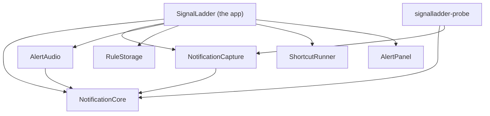
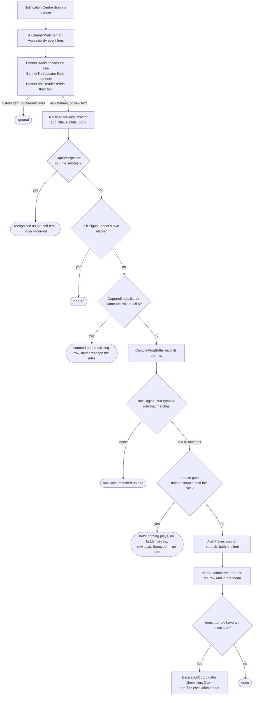

# How SignalLadder works

This page is for people who want to change SignalLadder, review it, or understand why it behaves as it does. It describes the code as it is on `main`, names the types you will meet, and says why the awkward parts are awkward. It does not describe planned work as if it were built. Where something is not implemented, it says so.

If you only want to use the app, start with [getting started](getting-started.md) and the [rules format](rules-format.md). If you want to contribute, read [CONTRIBUTING.md](../CONTRIBUTING.md) first; this page is the map it points to.

- [Principles that shape the code](#principles-that-shape-the-code)
- [Module map](#module-map)
- [From banner to sound](#from-banner-to-sound)
- [The escalation ladder](#the-escalation-ladder)
- [Knowing it still works](#knowing-it-still-works)
- [On-call mode](#on-call-mode)
- [Snooze](#snooze)
- [Launch at login and Settings](#launch-at-login-and-settings)
- [Rules](#rules)
- [Audio](#audio)
- [Testing](#testing)
- [Tools](#tools)
- [Where to read more](#where-to-read-more)

## Principles that shape the code

Six ideas explain most of the design. Each has a reason, and the reason is usually an incident.

### Decisions live in pure, tested code; the app is glue

Everything that decides something is in `NotificationCore`: what a banner says, whether it is a repeat, which rule matches, when an escalation's next tier is due, what health is, what the menu says about it. That module imports Foundation and CryptoKit and nothing else. It cannot touch Accessibility, notifications, audio, the file system or the network, so every decision can be tested without a permission, a speaker or a real notification.

The app target, `SignalLadder`, connects those decisions to the operating system and has no tests of its own. So it holds as little as possible. Its own comments say what each piece is for: `CaptureController` "connects the Accessibility observer to the capture pipeline, and nothing more", and `RuleStore` "only connects" the decoder and the file layer.

_Why._ The capture pipeline used to be a closure inside the app target. Two reviews in a row named it the riskiest untested path in the app, and it is where the rule engine attaches. It moved into `CapturePipeline` so it could be tested before anything more was added to it. The same reasoning put the rules file in its own target, `RuleStorage`: it is the one place a bug destroys the user's rules. The same reasoning put the Shortcut's input file in `ShortcutRunner` and the escalation panel in `AlertPanel`, so that each is tested outside the app target.

`PurityTests` enforces the boundary for `NotificationCore` only. It is a plain text search of that module's source files for forbidden imports (`ApplicationServices`, `AppKit`, `Cocoa`, `Carbon`, `UserNotifications`, `AVFoundation`, `Speech`, `ServiceManagement`, `SwiftUI`, `Combine`) and for `FileManager`, `FileHandle`, `URLSession`, `Data(contentsOf` and `write(to`. `ViewLiteralsTests` holds one more part of the split, for the app target. It reads that target's sources with a small lexer, itself tested on canned source, and fails when a sentence is typed into a view or a menu. A new view file may hold no string literal but the empty string and the names of symbols. A new controller or coordinator may hold none at the places that show words: a title, an alert's message, a tooltip. The files that show words today are held to a list of the literals they already hold, and the list can only shrink, so a new sentence goes into a text enum in `NotificationCore`, where it is tested. `HarnessConstantsTests` does the same for `Scripts/verify-live.sh`: see [`Scripts/verify-live.sh`](#scriptsverify-livesh). Nothing else enforces the split. That a decision stays out of the app target is convention, kept by review.

### Notification content is never logged, and reaches disk in one place

Notification text is held in memory, in the last 50 captures, until newer ones replace it or you quit. There is no time-based expiry and no clear-history command; quitting is the only way to drop it. SignalLadder does not write it to logs. Apart from text you choose to save in a rule, it writes it to disk in one case only: the input file of a Shortcut, below.

Three things do reach disk, and all are deliberate:

- Text you put into a rule condition is saved in `rules.json`, and in the backups made when you save. The rule editor says so where you add it.
- The mute checklist stores a SHA-256 hash of each app name you confirmed in the app's preferences. It stores hashes, not names, because a name comes from a banner and a badly parsed banner can hand it a fragment of a message.
- A Shortcut's input file. When the last tier of an escalation runs a Shortcut, `ShortcutRunner` writes four fields of the notification to `input.json`: `appNameGuess`, `title`, `subtitle` and `body`, never the raw text, the time or the subrole. It sits in a folder of its own (mode `0700`) inside `com.jamiewhite.signalladder.shortcut-input` in the system temporary directory, and the file itself is `0600`. It is deleted the moment the Shortcut's process ends, however long that takes. The app reports what happened within a second at most and does not wait for the end, so the file can outlive that report. Anything a crash or a quit left behind is removed at launch and at quit. This is the one place the app writes notification text you did not put there yourself, and only for a rule that names a Shortcut. **Test Shortcut** in the rule editor writes the same file, through the same `ShortcutRunner`, with the four fields of a made-up test notification that each say it is a test, so it writes no captured text. What the Shortcut then does with the text is up to the Shortcut you wrote.

A few short-lived copies sit beside that buffer: the deduplicator's keys, the last alert outcome (which includes a spoken line) and the copies the Inspector and rule editor display. A live escalation keeps a copy of its notification too, for spoken repeats and for a Shortcut's four fields, and the row it began from holds the outcome of its latest repeat and of its final alert, either of which can include a spoken line. The escalation keeps its copy until it is finished with: acknowledged, and any Shortcut it started has reported. That can be longer than its row stays among the last 50, because a busy channel can push the row out while the ladder still runs. All of these are in memory, and quitting drops them.

Four more values are saved, and none is from a notification. The first is `onCallSince`, in the app's preferences, the time on-call mode was switched on. It is the whole of what on-call mode saves. `OnCallStore` reads it once, when the app starts, and writes it when you switch the mode on or off. `OnCallState` reads whatever the preferences hand back, which may be anything. Absent is off, a finite number that is not negative is on since that time and never since a time after now, and anything else is on with the time not known, because the app fails towards alerting. The second is `launchAtLoginWanted`, a Boolean: what the user last asked of the Launch at login switch. It is the whole of what Settings saves. `SettingsModel` reads it when it is made and writes it in one place, at the user's own press. `LaunchAtLogin.wanted(stored:)` reads whatever the preferences hand back and answers true only for a Boolean true, so a number, a string or an absent key reads as not wanted. Turning the switch off saves false and does not remove the key. It records what was asked and not what macOS did, and the login item itself is macOS's. The last two are the snooze's, and `SnoozeStore` is the only code that reads or writes them. `snoozeUntil` is the end of a snooze, as seconds since 1970 in a real number, and absent is no snooze. `snoozeHeld` is what snoozes held and the user has not dismissed, as one dictionary of numbers: `counts`, a rule's id as the text a `UUID` writes to a whole number of matches of 1 or more, `since`, the time of the first hold in seconds since 1970, `unannounced`, a whole number of matches held and not yet announced, and `unreadable`, the whole number 1, written only when an earlier record could not be read. An empty summary saves nothing and takes the key out. Neither holds a name, an app or any text, because a rule's name is looked up from the current rules by id when a line is shown. `SnoozeController` and `HeldSummary` read whatever the preferences hand back, which may be anything, and say so when a record was there and could not be read: see [Snooze](#snooze).

The app has five loggers. The speech logger records how long a spoken alert took to start, and two fixed lines when speech produced no audio or did not finish in time. None of its messages has a parameter a sentence could pass through. The watcher's logs a process id, a subrole, an error code or a count. Its function takes a free-form message, so the rule that it is never given a notification's text is held by convention. The hotkey's logs a status code when the hotkey could not be installed or registered, and nothing else. The quit logger, `AppDelegate.quitLog` in category `quit`, logs one line for each quit the app is asked about: the quit's four-character reason code, or none, and the age of any power-off notice, or none (`QuitPolicy.logLine`). It is marked public and logged at the default level so that a log out or a restart can be read after it has finished, and it holds nothing a notification said. The login item's, in `LoginItem` under category `loginitem`, logs the domain and the code of an error when a request to register or unregister fails, marked public and at the error level, and never the error's description, which can hold a name or a path.

_Why._ The app reads other people's messages. Nothing about reading them requires keeping them, so it does not. The one exception is there so that a Shortcut you wrote can act on what arrived. It is kept as small as it can be: four fields, an owner-only folder and file, gone when the Shortcut's process ends.

Where this is enforced by a test, and where it is not:

| Claim | Enforced by |
| ----- | ----------- |
| `NotificationCore` opens no file and no URL, and imports no permission-bearing framework | `PurityTests` |
| Only `LoginItem.swift` names the system's login item, and nothing registers or unregisters but a press of Settings' switch or of a button | `PurityTests` keeps `ServiceManagement` out of the core, and `SettingsWiringTests` reads the app target's sources as text. They show that the text is there, not that it runs |
| What a snooze saves is a date and whole numbers keyed by a rule's id, with no name, app or text, and only `SnoozeStore` touches its two keys | `SnoozeControllerTests` walks every value handed to `save` and allows only numbers, the four field names and rule ids, with a rule named with a canary string held several times. `SnoozeGateTests` feeds a notification whose words are a canary through the pipeline with a snooze on, shows first that the words do reach the row and what is said, and finds none of them in what is saved, the summary line, the menu's lines or the row's. `SnoozeWiringTests` reads the app target's sources as text and holds that no other file names either key. They show that the text is there, not that it runs |
| Nothing logs notification text, and the only notification text the app writes for itself is a Shortcut's input file | Convention. The comment on the watcher's log function says the `%{public}` format is safe only because no text ever passes through it |
| A Shortcut's input file holds those four fields and no more, is owner-only, and is deleted when the Shortcut's process ends, whether that is inside the one-second launch check or long after | `ShortcutRunnerTests`, against real folders: the exact fields, both modes read back from the file system, and deletion when the process ends after a success, after a failure, and after that second has already passed |
| Whatever a crash or a quit left in that folder is removed at launch and at quit | `ShortcutRunnerTests` for `sweep()`, including that it leaves anything outside its own folder alone. Calling it at launch and at quit is in `AppDelegate`, which has no tests |
| A Shortcut's own output is never logged, kept or shown | Partly. `ShortcutRunnerTests` show that a failure is worded from the exit code and never from the output. That the real process's standard output goes nowhere, and that its standard error is read only to tell "not installed" from any other failure, is in code no test starts a process to exercise |
| The panel and the menu never show what a notification said, and the Inspector's escalation line never repeats what a spoken alert said | `EscalationPanelTextTests` and `EscalationWiringTests` test the wording. `AlertPanel` also has no dependency that could name a notification, so it is only ever given finished lines |
| The app has no networking | Not test-enforced. A search of `Sources/` finds no networking API |
| The only other program the app runs is `/usr/bin/shortcuts`, and only for a Shortcut a rule names: to list them, to run one as a last step, and to run one when you press Test Shortcut | Not test-enforced. A search of `Sources/` finds `Process` only in `ShortcutRunner`. That Shortcuts are listed only when a rule names one, and once per load, is tested in `EscalationFormatTests` |

The developer tool `signalladder-probe` prints text only when you pass `--show-content`. See [privacy](privacy.md) for the user-facing statement of all this.

### Say no more than was established

The app is an on-call tool, so the worst thing it can do is reassure you falsely. Wording is held to what was actually observed:

- _Played_ is not _heard_. An alert outcome records what the app did. When the Mac's output reported itself muted or at zero volume, the outcome says that too. When the output state cannot be read, it is not called silent.
- _Verified_ carries its age. The menu says _Working — verified 3 min ago_, and once the evidence is stale it says _Unverified — last verified 34 min ago_, which it does after 31 minutes, or after 6 while on call. A success from half an hour ago is not a statement about now.
- Muting is your word. Nothing can read another app's notification settings, so the walkthrough says _confirmed muted_, never _muted_.
- A preview is not a match. Re-checking old rows against new rules never rewrites what happened when they arrived, and never plays anything.
- _No rules loaded_ is not _matched no rule_. A row that was never evaluated is not shown as one that was.
- The filter for the app's own banners requires our name and our wording. Name alone would silently drop a real notification from any app that shares it.
- On-call mode lists only what the app can read. A Focus cannot be read, so no line says one is on. A sleeping Mac needs no reading, since it is what sleep is, and its line says what sleep does and claims that none happened. Muting is your word, so it says _not confirmed_ and counts the apps and never names one. The heading _Nothing urgent_ has a bell and no tick, because nothing urgent is not all is well for an app that checks only what it can read. And no page, line or comment says that a saved on-call date keeps anyone covered, since none does while the app is not running.
- Launch at login is _on_ only where macOS reports the login item as enabled, and the one sentence that says so is macOS's word (_macOS reports that…_). Every other status says what the status says and no more, and no sentence names a state that was not read, an entry the user added by hand, a temporary location or the user's own wish unless that is what was read. The on-call finding says SignalLadder _may_ not start again, and not that it will not, because what it has read is only that macOS does not report the item as enabled.
- A snooze counts matches, never messages. The app has read that a rule matched, and not what the notification was, so a snooze's lines name the rules the user wrote and count what they held, and say nothing of what a notification said or which app sent it. What was held is not called this snooze's, since the summary outlives a snooze and a new one adds to it. A record of what was held that could not be read is said to have existed, and is never dropped.

_Why._ Each of these was a real bug. On 2026-09-25 capture went blind about 80 seconds after a self-test passed, and health went on saying _verified_, with nothing to show it had aged, for up to half an hour.

### Failures are surfaced, never silent

A rule that should have made a noise and did not is the failure this app exists to prevent, so every path that can produce one reports it:

- One bad rule never silences the others. The rules file is decoded one rule at a time. A rule that cannot be used is left out and listed by position and name; the rest run.
- Problems are found when the rules load, not at the incident. A sound that is missing, unreadable, silent or too long, and a voice that is not installed, refuse the rule and are reported by rule name when the file loads. A Shortcut the Shortcuts app does not list is a warning and not a refusal. The rule stays in effect whole, and the menu, the icon and the editor say the name was not found. A Shortcut's name is free text, and a typo, or a Shortcut renamed weeks later, must not switch off a rule that also sounds and repeats. A wrong name then fails when tier 4 fires and is held as a Shortcut that did not run. If the Shortcuts cannot be listed within a second, that one check is skipped, and the name is found out by running it.
- A failed alert never throws at the moment it matters. `AlertPlayer` returns an outcome (_Could not play: …_), which is recorded on the row and held in the menu until a later sound plays. Reloading rules does not clear it. A repeat or a final alert that fails is held the same way. A Shortcut that did not run is held on its own, and goes only when that Shortcut launches again under the same name: folded in with the sounds, the next repeat playing would clear it, and a launch of another Shortcut says nothing about the one that failed. It may have been the alert meant to reach someone away from the Mac. The failure carries the name it failed with, taken from the escalation's outcome and not from the rule, which a reload can change. Reloading the rules clears nothing, so a fixed rule leaves the failure standing until that name launches or the app quits. It is not keyed on the rule's id, since a rule with no `id` in the file gets a new one at every load, and a reload would then announce a fix nobody made.
- Unknown keys are errors. A misspelt `"alrt"` would otherwise leave a rule quietly silent.
- Nothing can forget to connect playback. The playback closures of the pipeline and of the escalation coordinator have no default values, and neither does the sound, voice and Shortcut check the loader runs.
- A rules problem, an alert that could not sound, a Shortcut that did not run or a Shortcut name that was not found changes the menu-bar icon to the same warning state as a capture fault. `StatusGlyph` decides that, as one pure function, and three more things join them while the app is on call: see [On-call mode](#on-call-mode). A tool whose rules did not load is as silent as one that cannot see banners.
- A snooze silences nothing by default, and what it silences is kept until the user has seen it. A match is held only when its rule has the box ticked, the rule makes a sound or speaks, and its last step is not a Shortcut, so the alert that reaches someone away from the Mac is never held. What a snooze held is counted in the menu until the user dismisses it, and one that runs out having held something beeps once, because a menu that must be opened to be seen is where a missed page hides. A snooze never touches an escalation already running or the app's own health alarm. A snooze that fails to quiet something is visible and fixable, and one that swallowed a page would be neither. See [Snooze](#snooze).
- A sleep does not turn into stale alarms, or into silence. An escalation the Mac slept through is not resumed on waking. It ends as _missed while asleep_ and stays on the menu until you acknowledge it. This rests on the awake time stopping while the Mac sleeps, which Apple documents and which has not yet been measured on a Mac that sleeps. See [The escalation ladder](#the-escalation-ladder).

### Event-driven, near-zero idle cost

The Accessibility observer, the watcher on the Notification Centre process and the audio engine all do nothing until something happens. The audio engine runs only while an alert plays, because a running engine keeps the output device awake.

The one deliberate polling exception is the health self-test, on a timer armed at 30 minutes, or at 5 while on call. Silence proves nothing, so health has to be asked for. The timer is armed with zero tolerance as a precaution: the documentation lets the system add slack whatever the property says, and a late fire could turn a verified read into _Unverified_ against the one-minute grace. A test program that armed a timer this way saw none added. A few one-shot timers hang off it: a follow-up two minutes after a self-test at launch, at a wake while on call and when on-call mode is switched on, retries after a failure, and a one-minute recheck while a self-test is blocked. See [Knowing it still works](#knowing-it-still-works).

The escalation ladder is event-driven, and nothing polls for a tier that is due. A match starts it, and each tier still to come has one one-shot timer, counted from the match. `RunLoopEscalationScheduler` adds each `Timer` to `RunLoop.main` in `.common` mode, so a tier still fires while the menu is open. Each timer has zero tolerance, so macOS adds no slack to when it fires. While anything is escalating, one more timer repeats every 0.8 seconds to alternate the menu-bar icon, and it goes the moment nothing is. While a tier is still to fire, the app also holds an activity assertion that asks macOS not to let the Mac idle-sleep, and it lets go as soon as no tier is. While on call it holds a second assertion of its own for as long as the mode is on. A snooze has one more one-shot timer, set for its end and on the same `RunLoopEscalationScheduler`, which exists only while a snooze runs and only asks for a redraw and settles what is owed. Nothing relies on it, since every read of the snooze compares times: see [Snooze](#snooze). There is no countdown, and so no repeating timer for one. With nothing escalating, no snooze and the app off call, none of these exists. See [The escalation ladder](#the-escalation-ladder).

Idle cost was last measured during milestone M2: 0.00% CPU over ten seconds and about 60 MB resident, and 0.00% over fifteen seconds and about 77 MB with the Inspector open, before alerts, speech, the rule editor and escalation existed. It has not been re-measured since. `Scripts/verify-live.sh` samples idle CPU over ten seconds and fails above 2%.

### No third-party dependencies

`Package.swift` has no `dependencies` at all. Every framework the code imports is Apple's.

_Why._ The app holds an Accessibility grant and reads other people's notifications. Everything it links runs with that access, so the code that does so should be the code in this repository, small enough to read.

## Module map

`Package.swift` declares thirteen targets: eight for the app, its libraries and its tool, and five for tests. It has no third-party dependencies, and its platform floor is macOS 14. SignalLadder supports Apple silicon only, but a package manifest cannot say so, and the package does not enforce it: `make-app.sh` builds for whichever Mac runs it, and [`release.sh`](#scriptsreleasesh) refuses anything but arm64.

| Target | Kind | Depends on | What it is for |
| ------ | ---- | ---------- | -------------- |
| `NotificationCore` | library | nothing | Every decision, as pure code. Banner location and text reading (`BannerTreeLocator`, `BannerTextReader`, `BannerTracker`), parsing (`NotificationFieldExtractor`), `CapturePipeline`, `CaptureDeduplicator`, the 50-row `CaptureRingBuffer`, the rule model, engine, glob and codec (`Rule`, `RuleEngine`, `Glob`, `RuleSetCodec`), the escalation ladder (`Escalation`, `EscalationCoordinator`, `EscalationScheduler`, and `AlertActionRunner`, the one path every tier's alert takes), health (`HealthEvaluator`, `SelfTestPlan`), on-call mode (`OnCallState`, `OnCallSwitch`, `OnCallCheck`, `OnCallWatch`, `HealthAlarmPlan`, `QuitPolicy`, `BeepAudibility` and `PowerHold`), the login item (`LoginItemStatus`, `LaunchAtLogin` and `AppLocation`) and which build is running (`BuildInfo`), snooze (`SnoozeController`, `HeldSummary`, `SnoozeDuration`, and `Rule.snoozeMayHold`, the rule's own decision about being held), the status icon and when the status menu may be rebuilt (`StatusGlyph`, which decides the icon's state and whether it says problem, and `MenuRebuildGate`), the rule editor's decisions (`RulesDocument`, `AlertEditing`, `EscalationEditing`, `ShortcutTest` and the dry-run), what the loader warns of (`RuleWarnings`), the mute checklist, and the wording the app shows (`HealthTitle`, `AlertMenuText`, `InspectorRowText`, `EscalationPanelText`, `EditorText`, `MuteWalkthroughText`, `OnCallText`, `PowerHoldText`, `LaunchAtLoginText`, `SettingsText`, `SnoozeText`, `StatusGlyphText` and `WindowTitles`) |
| `NotificationCapture` | library | `NotificationCore` | The parts that touch Accessibility and notifications. `AXBannerWatcher` (the only `AXObserver`, whose run-loop source is in every mode), `AXElementNode` (adapts `AXUIElement` to Core's `AccessibilityNode`), `CanaryService` (the self-test), `DeliveryStatusProbe` |
| `AlertAudio` | library | `NotificationCore` | Playback. `AlertPlayer` (the audio graph, gain, speech), `SoundLibrary`, `OutputState`, `SpeechConverter` |
| `RuleStorage` | library | nothing | `RulesFile`: fingerprinted reads and safe writes of `rules.json`. It handles bytes; what they mean is `NotificationCore`'s job |
| `ShortcutRunner` | library | nothing | `ShortcutRunner`: runs a Shortcut for an escalation's last tier or for the editor's Test Shortcut, and lists the ones installed. It writes the Shortcut's input file, launches `/usr/bin/shortcuts` without waiting for it, deletes the file when the process ends, and sweeps what a crash or a quit left. Its own target because it is the one place notification text reaches disk, so it is tested against real folders, outside the app target, which has no tests. It has no dependencies, so it cannot take a `CapturedNotification`: the app hands it four strings (`ShortcutRunner.Fields`) |
| `AlertPanel` | library (AppKit) | nothing | `AlertPanelController`: the borderless panel that stays over every app and every Space until each escalation on it is acknowledged. Its own target, on `AlertAudio`'s precedent, so that the window it builds is tested. It has no dependencies, and is given rows already written as text, so it has no way to name what a notification said |
| `SignalLadder` | executable (the app) | all six libraries | Thin glue. `AppDelegate`, `CaptureController`, `RuleStore`, the rule editor's model, SwiftUI views hosted in AppKit windows, `HealthAlarm`, the menus. For escalation, the real parts the tested core may not hold: `RunLoopEscalationScheduler` (the real timers and clocks), `HotKeyController` (the global hotkey, through Carbon) and `PowerAssertion`, of which the app makes two, one for an escalation and one for on-call mode. For on-call mode, the stores and windows: `OnCallStore` and `MuteChecklistStore` (each reads and writes one preference key), `QuitSignals` (reads the quit's reason and the system's power-off notice) and the on-call check's window and view. For Launch at login, `LoginItem`, the one file that imports `ServiceManagement`, and the Settings window: `SettingsModel` (which reads and writes the preference key `launchAtLoginWanted`), `SettingsView` and `SettingsWindowController`. For snooze, `SnoozeStore` (which reads and writes the preference keys `snoozeUntil` and `snoozeHeld`, and holds no key, word or rule of its own). No tests |
| `signalladder-probe` | executable | `NotificationCore`, `NotificationCapture` | A developer tool that prints banners as they are captured. Not part of the app bundle |
| `NotificationCoreTests` | tests | `NotificationCore` | Pure unit tests. The largest suite |
| `AlertAudioTests` | tests | `AlertAudio` | Renders the real audio graph offline and measures it |
| `RuleStorageTests` | tests | `RuleStorage` | Real temporary folders, symlinks, injected write failures |
| `ShortcutRunnerTests` | tests | `ShortcutRunner` | Real temporary folders, with a fake launcher and a fake grace timer, so no test starts `/usr/bin/shortcuts` or waits on a clock |
| `AlertPanelTests` | tests | `AlertPanel` | Builds the real `NSPanel` and reads its properties and what it draws back. Showing and hiding are checked on a panel that records being ordered in and out. Never puts a window on screen |



An arrow means "depends on". `NotificationCore`, `RuleStorage`, `ShortcutRunner` and `AlertPanel` depend on nothing in the package, which is why each can be tested on its own.

## From banner to sound

macOS gives no interface for reading other apps' notifications. SignalLadder reads the banner Notification Centre draws, through the Accessibility API. That is an observation of another process's interface, not a contract, so the code is built to notice when it stops working.



The steps, in order:

1. **A banner appears.** Notification Centre (`com.apple.notificationcenterui`) draws it. `AXBannerWatcher` owns the only `AXObserver` in the program. It is attached to that process's id, because the system-wide element cannot observe notifications. It registers for window created and window moved (required), and for element destroyed and layout changed (optional, and both matter; see below). If a required registration fails, it discards the observer and retries rather than run half-deaf. The observer's run-loop source is on the main run loop in every mode, so capture runs while a menu is open or an alert is up. See [Run-loop modes](#run-loop-modes).
2. **The watcher follows the process.** Notification Centre restarts. The watcher watches its process id directly and re-attaches with a capped, doubling delay (at most 30 seconds). Each successful attach asks for a self-test, because a fresh process is exactly when capture most needs proving again.
3. **The windows are read.** The event carries no payload, and events come in bursts, twenty or so as Notification Centre opens. So the watcher reads once per burst: 50 milliseconds after the first event, it reads every window Notification Centre has, whole, and passes each to `BannerTracker.scan`. It reads whole windows because only the whole window shows whether it is Notification Centre's list. The scan works through the `AccessibilityNode` protocol; in the app, `AXElementNode` adapts `AXUIElement` to it, with a 0.2 second timeout on every read. `BannerTreeLocator` finds banners by subrole (`AXNotificationCenterBanner`, `AXNotificationCenterBannerStack`, `AXNotificationCenterAlert`, `AXNotificationCenterAlertStack`, `AlertStack`), never by position. The search goes at most 12 levels deep and visits at most 256 nodes. It is depth-first and the deepest match wins, so a stack that holds banners yields them, not itself. `BannerTextReader` reads the banner's direct children, whose values hold the title, subtitle and body separately.
4. **The tracker decides what is new.** See [When a banner replaces another](#when-a-banner-replaces-another) and [When Notification Centre is opened](#when-notification-centre-is-opened). New banners leave the watcher as a `RawCapture` plus their text children. A banner with neither description nor children is logged by subrole, as possible partial blindness, and not remembered.
5. **`CaptureController` hands it on.** It forwards each banner to `CapturePipeline.process`, and calls back to the app to rebuild the menu when the outcome changes what you can see. While the status menu is open its items are not rebuilt, and the rebuild is made once when it closes. See [Run-loop modes](#run-loop-modes).
6. **`NotificationFieldExtractor` parses it** into a `CapturedNotification`. The app name is the first comma-separated segment of the banner's description, a heuristic, which is why the rules guide calls it "recovered heuristically". Title, subtitle and body come from the text children (one child is a title, two are title and body, three are title, subtitle and body, and from the third onwards any more are joined into the body). With no children it falls back to splitting the description at commas, which is lossy: a comma inside a field looks like a boundary.
7. **The pipeline filters, in this order:**
   1. The self-test. `CanaryService.noteCapture` recognises its own marker. This comes before deduplication, so the self-test's text never enters the dedupe window and cannot suppress a real notification that happens to match it.
   2. The app's own notifications. `SelfNotification.isOwnNotification` requires our app name and one of three titles (_SignalLadder is not capturing_, _SignalLadder cannot verify itself_, _SignalLadder self-test_). It is a backstop for our alarms, and for a self-test whose marker match failed.
   3. `CaptureDeduplicator`. macOS fires several events as one banner animates. A repeat within 1.5 seconds of the first sighting is counted on the row it duplicates and never reaches the rules, or one banner could sound its alert several times. The window is anchored to the first sighting and is not refreshed by a hit, so a fast-repeating source cannot suppress itself indefinitely. Suppressed repeats are shown in the Inspector, not dropped silently.
8. **`CaptureRingBuffer` records the row.** It keeps the last 50, with a `ContextSnapshot` of the time and how many notifications from the same app the buffer holds from the last hour.
9. **`RuleEngine.firstMatch` picks the rule.** Rules are tried in file order and the first enabled match wins, so a notification matches at most one rule. The result is stored as the row's annotation. With no rules loaded there is no annotation, which is different from _matched no rule_.
10. **`CapturePipeline` asks the snooze, then acts.** It is the only place a rule's first alert is set off, and it is reached only from a live match on a newly recorded row: never from a preview, a repeat or the app's own traffic. Between the match and the alert sits the snooze gate. Once the row is annotated _Matched …_ and the app is noted for the mute walkthrough, the pipeline asks `holdForSnooze`, a closure with no default, once, which the app gives as `SnoozeController.holds`. Whether a snooze may hold a rule is `Rule.snoozeMayHold` and is not decided a second time here. When it says yes the outcome is `AlertOutcome.snoozed`: nothing is played or said, no ladder is begun and none is joined, and the match is counted, annotated and returned as recorded all the same. When it says no, the pipeline calls a playback closure the app injected, and `AppDelegate` connects those closures to `AlertPlayer`. The gate sits after the match, and not before the rule engine as the spec's §5.18 and its diagram draw it, so a held match is shown on its row as a match and is counted and kept, and the mute walkthrough still knows the source app's own sound is in question. Later tiers are set off by `EscalationCoordinator`, which the pipeline starts and nothing else does. See [The escalation ladder](#the-escalation-ladder) and [Snooze](#snooze).
11. **`AlertPlayer` plays.** It looks up the sound, gets it decoded and level-matched, and schedules it on the audio graph. Speech is rendered through the same graph. See [Audio](#audio).
12. **The outcome is recorded.** `AlertPlayer` returns an `AlertOutcome`: _Played_, _Spoke_, _Silent by rule_, _Could not play: …_ and so on. The pipeline writes it on the row and keeps it as the last match. A failure is also held as unresolved until a later sound plays. A match a snooze held has the outcome _Snoozed — no alert_, which sets the last match and leaves the failure alone, so it neither sets an unresolved failure nor says one is fixed. If the rule has an escalation and the match was not held, the pipeline then calls `beginEscalation`, so the row, the last match and the menu icon are complete before the ladder starts.

Everything from the observer callback to the sound runs on the main thread. `CapturePipeline`, `EscalationCoordinator`, `CanaryService`, `AlertPlayer` and the app's delegate are `@MainActor`, and the compiler holds callers to it, so there are no locks to reason about.

Saving or reloading rules re-checks every row still in the buffer against the new rules. `CapturePipeline.setRules` writes each result as a preview on the row, never as its annotation, and never plays a sound or starts an escalation. That preview is what the blue line in the Inspector and the rule editor's dry-run show.

### When a banner replaces another

Measured on macOS 26.7 on 2026-09-29: banners do not stack. A second banner that arrives while the first is on screen replaces it inside the same window. It fires layout-changed events and the destruction of the old banner's elements. It fires no window-created and no window-moved. Capture used to listen only for the window events, so every such banner was missed, and a burst of alerts sounded only the first.

The fix has two halves. The watcher also registers for layout changes. Then `BannerTracker` makes sure a banner is not captured twice, because layout changes also fire again for a banner already read, at 1.6 and 2.2 seconds in the measured run, past the dedupe window. So the tracker keys on the element, not the text:

- A banner element it has not read before is new. A replacement is a new element.
- An element it has read is new again only if a re-read finds text it did not have before. A poorer re-read, where a timeout lost a child or the description, is not new and does not replace what was remembered.
- It remembers hashes of each banner's text, never the text, and forgets an element once macOS reports it destroyed. A failed or timed-out read proves nothing, so it does not forget on one. At most 16 elements are held, apart from any still on screen.

A banner from one app replacing a banner from another was not tested. The measurements used test banners that all came from one app.

Persistent alerts behave differently, measured the same day with Script Editor set to persistent alerts. A second persistent alert from the same app, arriving while the first is still up, joins it in an `AXNotificationCenterAlertStack` that carries the newest alert's text. That subrole was missing from the allowlist, so every alert after the first in a stack was missed. Teams alerts are persistent when Teams is set to Alert, so the second of any two Teams alerts on screen together would have been missed. Now each alert that joins a stack is captured once.

Clicking a stack expands it into its alerts, and its **Show Less** button collapses it again. Both keep the same elements, and the alerts' text children do not change, but a stack's description ends with ", stacked", which goes on expanding and comes back on collapsing. This was measured on macOS 26.7 on 2026-10-02, with a test app's alerts set to persistent and carrying action buttons. The tracker took the changed description for new text, so every click captured the alerts in the stack again, at the time of the click, and a rule that matched them sounded again. Now a read is compared with the last capture of its element. Its text children come first. Its description counts as new text when it is the first description read, because it is where the app's name is, or when it has a field the last capture's description did not and the read has fewer text children than that capture, or none, so that the description is the only place new text can show. A read with every text child the last capture had takes nothing new from its description. Alerts from one app in different conversations, posted with different thread identifiers, did not stack in the same test: they sat side by side, and each was captured once.

### When Notification Centre is opened

Opening Notification Centre shows its history in the same window, under the same subroles, as a live banner. It opens either as a new window, or by turning the window of a banner still on screen into its list. A notification that arrives while it is open appears at the top of the same list. Before this was handled, every opening captured the history again, and a rule that matched an old notification sounded again.

Nothing about a row reliably says it is old. A row under a minute old shows no time at all, and older rows' time labels (_1m ago_, _10m ago_) come and go between reads. So the window decides. This was measured on macOS 26.7 on 2026-09-29:

- **`NotificationCentreHistory.isPanel` recognises the list.** The window has keyboard focus, and its scroll area holds the list's own menu button as a direct child. A window showing only banners had neither. Focus alone is not enough, because it was seen to stay on after the list closed.
- **When a window becomes the list, everything in it is history,** remembered by element. Its text is not read.
- **A row that appears after that is history** if it ends with a time label, as a row scrolled into view does, or if it replaces a captured banner with the same text destroyed in the last 2 seconds, which is a stack laid out again. That text match is used once, so a genuine repeat, such as a second _Build failed_, is still captured, unless it arrives within those 2 seconds.
- **Any other new row has arrived while the list is open.** It is captured once a second read, at least 250 milliseconds after the first, still finds no sign that it is old. The gap is past a measured 220 ms flicker of the time label.
- **Outside the list nothing is set aside.** A live calendar reminder can end in something that looks like a time.

When it is unsure, it captures: a replay is the lesser error, and the other would miss an alert. Known gaps:

- A notification that arrives at the very moment the list opens is part of what the list holds when it opens, so it is taken for history and not captured while the list is open. Whether it is captured once the list closes, if its banner is still on screen, has not been checked.
- A genuine repeat that arrives while the list is open, within 2 seconds of a captured banner with the same text going, is taken for a stack laid out again and missed.
- A notification that arrives while the list is open is taken for history if its last line reads like a time label that its description does not hold.
- Once, during a test run on 2026-09-29, a persistent Outlook alert was not captured, and nothing was logged. One read on screen the next day arrived as an `AXNotificationCenterAlertStack`, alone, in a window that had keyboard focus, and the current build captured it. The builds of 29 September before #17's fixes could lose exactly that shape, by not recognising the stack or by taking a focused window with a button in it for the list. Which build was running was not recorded, so that is the likely cause, not a proven one.
- Once, not reproduced, a stack of seven persistent alerts from one app was laid out again as new elements when another alert arrived while the list was open, and three old alerts were captured again. A stack of two did not do this.
- The list's structure was measured on macOS 26.7 only. On a macOS where it differs, the list is not recognised, and its history is captured again when it opens.
- The time wording it recognises, such as _1m ago_ or _yesterday_, is English only. Numeric times such as _12:04_ are recognised in any language. Labels matter only for rows that appear after the list opens.

### Run-loop modes

Capture runs while a menu is open or an alert is up, and the menu is not rebuilt under the pointer. Both follow from what the main run loop does while it is busy.

Measured on macOS 26.7.1 on 2026-09-30, in a test program that touched nothing in the tree: while a popup menu was tracked the main loop ran in `NSEventTrackingRunLoopMode`, and during a modal session, and while a quit answered with `.terminateLater` was pending, in `NSModalPanelRunLoopMode`. A source added in the default mode alone received nothing in either. A mach-port source, the kind an `AXObserver`'s is, handled 10 messages in the default mode and 0 and 0 in the other two when added to the default mode alone, and 10, 10 and 10 when added to the common modes. A GCD main-queue block and a main-actor task kept running in all three, as a timer in the common modes did, when the quit began from a timer or from a quit Apple event. When `terminate(_:)` was called from inside a main-queue block, the block and the task did not run until its reply returned, and only the timer did. The app's Quit reaches it from a menu action and is not known to meet that. A popup menu stood in for the status item's own menu, which has the same tracking mode but has not itself been measured.

- **The observer's source is in the common modes.** `AXBannerWatcher` adds its source with `CFRunLoopMode.commonModes` and removes it the same way, two arguments. Added to the common modes and removed from the default mode alone, it was still serviced while a menu was tracked, which is why both calls changed. Before this, capture was paused while the status menu was open, while the quit prompt was up and while the unsaved-draft prompt was pending. Nothing else in `Sources` adds a source in the default mode alone, and every timer the app owns was already in the common modes. The watcher has no run-loop timer of its own: its delays are main-queue blocks. There is no unit test for this, since `NotificationCapture` has no test target and an Accessibility observer needs a real banner. What has not been seen, in the app itself, is that a banner captured while a menu is open or the quit prompt is up is played and spoken: only the source and the timers were measured, and not the audio path or the speech callbacks in those modes.
- **The menu is not rebuilt while it is open.** With capture running behind an open menu, each change ends in a rebuild that empties and refills the one `NSMenu`, and a banner that arrives as you reach for a row could put an Acknowledge section above it and move every row under the pointer, so that your click lands on Acknowledge All, which silences a page you have not seen, or on Quit. A tier's repeat and a health refresh could do the same before. `MenuRebuildGate` answers each request with the steps to take, in order. The Inspector's sync, the icon's pulse and the icon come on every request, open menu or not, since none is under the pointer and a page that arrives mid-menu must show on the icon and the panel at once. The rebuild of the items comes only while the menu is closed. While it is open the items are left out and one is owed, and closing says to make it once, however many were asked for. `menuNeedsUpdate` tells the gate the menu is closed, so the rebuild it makes as the menu opens goes ahead, and then that it is open straight after that build, before it asks the on-call watch, and again on every path out. The watch can open the check window, which activates the app and can make the window key at once, and its coming to the front asks for a rebuild. With the gate still shut, that rebuild would empty the menu about to be shown and fill it again with no login item status. That the gate holds it then is read from the code and held by tests that read the app's sources, and has not been seen. `menuDidClose` tells it closed, and the owed rebuild is made on the next main-queue turn and asks the gate again. In the test program's popup menu AppKit reported the close and the chosen item's action in the same instant, and emptying the menu inside the close could take that item away before its action ran. The status item's own menu has not been measured. The close too is read from the code and held by `MenuRebuildWiringTests`, which with `OnCallWiringTests` holds that `menuNeedsUpdate` is the only other place that tells the gate the menu is closed. A gate left open by a missed close costs nothing lasting: the next `menuNeedsUpdate` resets it. The cost is that a re-probe's result shows at the next open and not in the menu in front of you, while the health line, the icon and the alarm carry it meanwhile.
- **A held menu acts only on what it showed.** The Acknowledge item carries, as its represented object, the escalation ids it listed when the menu was built, and calls `EscalationCoordinator.acknowledge(ids:)`. An escalation that began later is untouched: it keeps its timers and its sound, since a silent first tier may not even have sounded. `silenceIfIdle` runs only when one of those that ended was still escalating and none is left live. `acknowledgeAll()` is unchanged, and the hotkey uses it, so it acts on everything listed, an escalation that began while the menu was open included. The panel is not held, and each of its rows calls `acknowledge(id)` for its own escalation.
- **The quit prompt asks again.** The prompt counts what is listed before it is shown, and capture now runs behind it, so an escalation can begin while it is up. `QuitPolicy.mayQuit` reads what stands again after each answer of Quit, and asks again, naming the new counts, while either count has grown.

In a test program on a real tracked popup menu, with `MenuRebuildGate` compiled in from the repository and the delegate's logic copied from `AppDelegate`: two changes made while it was open emptied nothing, the first item stayed the same object, the chosen item's action ran with the ids it had listed, and the owed rebuild was made once on the next turn. With the rebuild made on every change, as before, the first change emptied the menu and it closed within a moment, and no action ran. That is a test program and not the app. The live checks in the app itself are still to do: a banner posted while the status menu is held open, and another while the quit prompt is up, each captured and each played and spoken; one that adds a line to the held menu leaving the item under the pointer unchanged; Acknowledge (N) clicked after an escalation began under the held menu, leaving it live and sounding; and the items chosen from a menu with an owed rebuild each running their action.

## The escalation ladder

A rule's alert is tier 1. A rule can also carry an `escalation`: up to three more tiers, each optional, that you stop by acknowledging. Tier 2 shows a panel, tier 3 repeats an alert, and tier 4 plays a last alert or runs a Shortcut. The [rules format](rules-format.md) says how to write one, and [The ladder editor](#the-ladder-editor) is how the rule editor sets one up. This section is about how the code climbs it.

Nothing polls for it. A match starts a ladder, and everything after that runs on timers.

### How a match starts it

`CapturePipeline.process` plays tier 1 as it always did and records the outcome on the row, unless a snooze holds the match, in which case it plays nothing and begins nothing: see [Snooze](#snooze). Then, if the rule has an escalation, it calls the `beginEscalation` closure the app gave it, with the rule, the notification and the row's id, and `AppDelegate` connects that to `EscalationCoordinator.begin`. The order matters: the row, the last match and the menu icon are complete before the ladder starts, and the ladder records and redraws as it begins. A preview, a suppressed repeat and the app's own notifications return before that call, so none of them can start one (`EscalationWiringTests`).

Capture errs towards reading a notification twice, and a second read that the deduplicator lets through and a rule matches climbs its own ladder. So one alert can start two escalations. That is why each row on the panel says when it began.

Two calls come back the other way:

- `CapturePipeline.recordEscalation` is called on every change. It writes the escalation's summary onto the Inspector row (`CaptureRingBuffer.setEscalation`, the one record of what the app did that is rewritten as it goes: `alertOutcome` is still written once). It also folds a later tier's failure into the failures that tier 1's already follow. A failed repeat or final alert is held until a sound plays. A failed Shortcut is held on its own, until that Shortcut launches again. Each repeat and the final outcome are folded once, because a summary is recorded again on a cap or an acknowledgement, and would otherwise set a failure that a later repeat had cleared.
- `CapturePipeline.escalationRetired` is called when the coordinator forgets an escalation, so what was folded from its row is forgotten too.

### What runs it

`EscalationCoordinator` runs every escalation's tiers 2 to 4. It is a `@MainActor` class, not an actor. Everything else that touches alerts is main-actor isolated, and the timers fire on the main run loop, so there is one queue and no race for an actor to guard. It lives in `NotificationCore`, so it touches nothing real: it gets its clocks and timers from an injected `EscalationScheduler` (`RunLoopEscalationScheduler` in the app), and its sounds, panel, Shortcut, recording and power through closures with no defaults. The tests give it a `ManualScheduler`, which advances both clocks by hand, so twenty repeats over ten minutes are proven without waiting for any of them.

- **Tiers are independent.** Tier 2, tier 3's first repeat and tier 4 each get their own timer, all counted from the match and not from each other. Tier 4 does not wait for tier 3 to finish, and an uncapped tier 3 cannot hold it back. Each repeat arms the next. An escalation keeps the ladder it began with, so saving or reloading rules changes later matches, not one already running.
- **Caps are decided by the schedule.** Repeats stop at whichever of `maxRepeats` and `maxDurationSeconds` is reached first. Whether repeat _n_ fits is worked out from the interval, not from the time measured, because real timers are a little late, and comparing the time measured gave nineteen of the default twenty repeats in ten minutes. A capped escalation is not finished: it stays listed until acknowledged, and tier 4 still fires if it has not.
- **Timers are ticketed.** Each carries a ticket, and its work does nothing unless its escalation is still going and it is the timer that escalation is waiting on. A timer already on its way when you acknowledge, or delivered twice, does nothing.
- **It can be called back into.** Playing a sound, recording a summary or reporting a Shortcut can lead to an acknowledgement. So the coordinator writes every change back before it calls out, and reads its state again after. An acknowledgement made inside a repeat's own sound sticks.
- **Sleep is measured, not guessed.** The code does not assume its timers are reliable across a sleep. The coordinator works out how long the Mac slept as the wall-clock time since its last check, minus the awake time since then (`ProcessInfo.systemUptime`, in the app). It checks when an escalation begins, before any tier acts, and when the system wakes (`NSWorkspace.didWakeNotification`, not the display waking: a display can sleep and wake while the system stays up). If the Mac slept for more than 300 seconds, every escalation still going ends as _missed while asleep_. Its timers are cancelled, nothing stale fires, and it stays on the menu until you acknowledge it, and on the panel too if its tier 2 had already shown. A shorter sleep resumes the ladder where it was. A stalled main thread moves both clocks together, so it converts nothing. Apple documents that `systemUptime` stops while the Mac sleeps. That has not yet been measured on a Mac that sleeps, so this rule is proven with injected clocks, whose `sleep(for:)` moves the wall clock alone, and has not been observed across a real sleep.
- **An escalation holds power only while a tier is pending.** While any escalation has a tier still to fire, the coordinator asks the app to hold a `ProcessInfo.beginActivity` user-initiated activity (`PowerAssertion`), which is there to keep the Mac from idle-sleeping, and to let go as soon as none has. A capped escalation that is still listed but has nothing left to fire does not hold it. It does not ask for the display to be kept awake. Whether it keeps a Mac that can sleep awake mid-escalation has not been checked on one. On-call mode holds the Mac awake too, with a second `PowerAssertion` of its own, so an escalation ending never releases it: see [On-call mode](#on-call-mode).
- **An escalation retires** once nobody can see or act on it: it has been acknowledged (or, if it was missed, seen), and any Shortcut it started has reported. Until then the coordinator holds its own copy of the notification, for spoken repeats and for the Shortcut's fields. A Shortcut that reports after its escalation was acknowledged is still recorded on the row.

**Every tier's alert takes one path.** `AlertActionRunner.run` turns an alert into a sound, speech or both through the three playback closures, and returns an `AlertOutcome`. Tier 1 (through `CapturePipeline`), a tier 3 repeat and a tier 4 final alert all call it, and the closures all reach the one `AlertPlayer`. So a new alert cutting off the last, described under [Audio](#audio), holds across escalations with nothing new, and the coordinator tracks nothing about who is playing. Several escalations due at once are heard as one sound cutting off the next, never mixed, and nothing staggers them. A Shortcut is not an alert. Tier 4 is either an alert or a Shortcut (`FinalAction`), and `.shortcut` is deliberately not a case of `AlertAction`, so it can never reach `AlertPlayer` or tier 1.

### The Shortcut, the panel and the hotkey

**The Shortcut.** `ShortcutRunner` runs `/usr/bin/shortcuts run --input-path <file> -- <name>`. The name is one argument after `--`, never passed through a shell, so a name that starts with a dash is not read as an option. It writes the input file first, and if it cannot, the Shortcut is not run and the failure is reported: running it bare would quietly do something else. It never waits for the Shortcut. It reports once, whichever comes first: the process exits, or one second passes with it still running. A missing Shortcut exits well inside that second (about 0.06 to 0.15 seconds in the measurements), so it is reported as failed, in the app's own words (not installed, or an exit code) and never the Shortcut's output, which can echo its input. One still running after a second counts as launched, and a failure after that is not reported again. The file is deleted when the process ends, not when the report is made. The launcher and the timer are injected, so the tests never start a real process.

**The panel.** `AlertPanelController` is one borderless `NSPanel` over every app and every Space, full-screen apps included, that does not take focus. It has one row per escalation, newest first, each with its own Acknowledge button. It lists only escalations whose tier 2 has shown, so a rule with no tier 2 is on the menu and never on the panel. `EscalationPanelText` writes every line (the rule's name, when it began, and where the ladder is) before the panel sees it, and the panel is given only identifiers and finished strings. It shows at most six rows and counts the rest on a last line, so the oldest never sit below the screen's edge. A row that stays listed keeps its views, and an update changes its words in place, so a button is never rebuilt under a press. The order of two settings matters: setting `isFloatingPanel` resets the level, so it comes first, and `AlertPanelTests` reads both back so that a reordering fails. That the panel shows over a full-screen app was measured in a spike, on macOS 26.7, and has not yet been checked in the app itself.

**The hotkey.** `HotKeyController` registers Control-Option-Command-A once at launch, through Carbon's `RegisterEventHotKey`, which is why the app imports Carbon. Pressing it calls `acknowledgeAll()`, which acts on everything listed, unlike the menu's item: see [Acknowledging](#acknowledging). Carbon calls back through a C function with no actor of its own, on the main thread, so the controller takes the main actor with `MainActor.assumeIsolated` and not through a hop that an acknowledgement could arrive behind. It is best effort and never the only way: a failed registration logs its status code and is otherwise ignored, and the menu and the panel's buttons need no permission. On macOS 26.7 it needed no permission prompt. Whether other versions differ is not known.

### Acknowledging

A panel row's button calls `acknowledge(id)`. The hotkey calls `acknowledgeAll()`, which does nothing when nothing is listed. The menu's Acknowledge item calls `acknowledge(ids:)` with the escalations it listed when the menu was built, so one that began while the menu was open is left alone: see [Run-loop modes](#run-loop-modes). Each cancels every tier the escalation still has to come, and marks it acknowledged. A missed escalation is only marked seen.

Sound already playing is harder, because `AlertPlayer` knows that something is playing and not whose it is. So acknowledging one of several live escalations stops no sound: the one in flight plays out. Acknowledging the last live one, or every one, calls `silenceIfIdle`, which the app wires to `AlertPlayer.silence()`. The app's closure calls `silence()` only if the latest alert to reach the player was an escalation's: a tier 3 or tier 4 alert, or the tier 1 of a rule that has a ladder. `PlayerOwnership`, in `NotificationCore`, decides that from each alert's outcome, not from what it asked for: a repeat whose sound could not be found never reached the player, so it leaves an ordinary alert that is still playing as the thing acknowledging must not stop. A rule with no ladder plays through the same player without the coordinator seeing it, and acknowledging must never cut off its alert. For the same reason, a stray press of the hotkey with nothing listed cuts off nothing.

### What you see

While anything is listed, the status menu opens with an Acknowledge item ("Acknowledge" for one, "Acknowledge All (N)" for more), which acts on the escalations it listed when the menu was built and on none that began while the menu was open (see [Run-loop modes](#run-loop-modes)), then a line for a Shortcut that did not run, how many alerts are escalating and how many were missed while asleep. The Shortcut's line stays until that same Shortcut launches again, from an escalation or from Test Shortcut, even when nothing else is listed. `AlertMenuText` writes them, and none carries what arrived. The menu-bar icon alternates between `bell.and.waves.left.and.right` and its filled form while anything is escalating, capped escalations included. `bell.slash.fill`, the warning state, takes precedence, and a live ladder is never counted as a fault, so a working ladder cannot look like a broken pipeline. `StatusGlyph` decides which of the six states shows: see [On-call mode](#on-call-mode) and [Snooze](#snooze). A snooze does not stop a ladder that is already climbing, and acknowledging is still the only way to. Quitting while anything is listed asks first, because quitting ends every escalation, and a Shortcut not yet run is never run. A log out, a restart and a shut down are not asked about, and quitting while on call asks too: `QuitPolicy` decides, as [On-call mode](#on-call-mode) says. An Inspector row whose rule escalated gains a line for where its ladder got to (`InspectorRowText.escalation`), which never repeats what a spoken alert said.

### What is not built

`Scripts/verify-live.sh` has no `--escalation` check, and does not yet check on-call mode, its window, Settings or a snooze. One escalation for a burst of matches and a guided first run are not built. On-call mode is built, and [On-call mode](#on-call-mode) says what has and has not been seen. Snooze is built, and [Snooze](#snooze) says what has and has not been seen and what of it is not built. Launch at login is built, and [Launch at login and Settings](#launch-at-login-and-settings) says what has and has not been seen and what of it is not built. The ladder editor's views and model, in the app target, were drawn and driven in a test program built from copies of their sources, with the Shortcuts list and the launcher faked, so no Shortcut was run and no sound played. They have since been seen in the app itself, and their live checks are still to do.

## Knowing it still works

Absence of notifications proves nothing. A quiet Mac and a blind app look identical. Capture stopped working on the maintainer's Mac twice (2026-09-11 and 2026-09-25) while banners were still being drawn. The second time the health line still said _verified_, and a plain relaunch cleared it. The cause is not settled; the findings are in [docs/dev/notes](dev/notes). So the app does not treat silence as good news. It sends itself a notification and checks that it arrives.

### Health states

`CaptureHealth` has four states, and the menu's health line, which is its top line unless an alert is waiting, shows one of them through `HealthTitle`:

| State | Menu line | Means |
| ----- | --------- | ----- |
| `verified` | _Working — verified 3 min ago_ | A self-test round-tripped recently. The only state that is positive evidence |
| `unknown`, never verified | _Checking…_ | Nothing is known yet: at launch, before the first self-test |
| `unknown`, evidence is stale | _Unverified — last verified 34 min ago_ | A self-test should have run and has not. This is missing evidence, not a fault, so it never sounds the alarm |
| `degraded` | _Cannot verify itself_ | Capture may be fine, but something stops the app proving it |
| `blind` | _NOT capturing notifications_ | Nothing can be captured, or repeated self-tests failed |

Each `degraded` and `blind` state carries causes, most likely first, and each cause has advice that says what to do, not only what is wrong.

### Evaluation order

`HealthEvaluator.evaluate` is a pure function of a handful of plain values, so every combination is testable. It answers in this order:

1. Accessibility is not granted: `blind`. Nothing can be read, whatever a self-test says.
2. The observer is not attached: `blind`. It is usually restarting and recovers within seconds.
3. Notifications are not permitted, or the app's own banners would not be drawn: `degraded`. Delivery is judged before a failed self-test is blamed on capture. If the banner never appeared, capture was never exercised, and calling the app blind would send you to re-grant Accessibility for nothing.
4. A self-test failed, and it is read carefully:
   - If real notifications have been captured since, capture demonstrably works, so the fault is that the app's own alerts are not being shown: `degraded`.
   - If no banner activity at all was seen during the self-test, the result is deliberately ambiguous: `degraded`, naming both possibilities. Either the banner was never drawn (Do Not Disturb, a Focus, banners switched off) or it was drawn and the app did not see it. The evidence for both is the same, nothing. An earlier version guessed "suppressed", and told a user their notifications were muted when the app was in fact blind.
5. Otherwise it counts failures. None yet is `unknown`. Zero failures is `verified`, or `unknown` if the last success is older than the self-test interval plus a 60 second grace. The interval is the one for the state the app is in, 30 minutes or, while on call, 5, so evidence goes stale after 31 minutes off call and 6 on call. One failure is `degraded`. Two or more is `blind`.

The menu re-evaluates health synchronously each time you open it, from the last delivery status it read, so a fixed problem stops being reported at once. It then re-reads delivery settings in the background without spending a self-test.

### The self-test

`CanaryService` posts a real notification through `UNUserNotificationCenter`, titled _SignalLadder self-test_, with a random marker in its body. It sets no sound, so it is silent. The app's delegate asks for it to be shown as a banner. Then it waits up to five seconds for the marker to arrive through the capture pipeline, and removes the notification. The result is yes if the marker arrived and no if it did not.

A self-test that could not run is not a failure. If one is already in progress, or posting failed, the result is "did not run", and it never moves health toward `blind`.

`DeliveryStatusProbe` answers a separate question first: would the app's own banner actually appear? It reads notification authorisation, the alert style, whether Notification Centre delivery is enabled and whether Scheduled Summary is holding notifications back. This is why a Desktop-banners-off setting is reported as a delivery problem, not a capture one.

`SelfTestPlan` decides whether a self-test can run at all. It needs Accessibility, an attached observer, and the app's own banners to be displayable. When blocked, it looks again every 60 seconds, and runs one as soon as it sees the block clear. Nothing waits for the next scheduled self-test.

| When | What runs |
| ---- | --------- |
| At launch, and after every attach to Notification Centre | A self-test |
| Two minutes after a passing self-test at launch, at attach or when capture starts | A follow-up self-test. Both recorded outages began within minutes of a relaunch |
| Every 30 minutes, or every 5 while on call | A self-test. The one polling timer in the app. It is armed with no tolerance, and armed again when on-call mode is switched on or off |
| After a failed self-test | A retry after 60 seconds, doubling up to 30 minutes, or up to 5 while on call |
| While a self-test is blocked | A recheck every 60 seconds, running one as soon as the block clears |
| When on-call mode is switched on | A self-test at once, and, once it passes, the follow-up two minutes later. A pending retry is dropped, since the self-test takes its place |
| When the Mac wakes while on call | A self-test, and, once it passes, the follow-up two minutes later. Off call a wake runs no self-test: it checks whether an escalation slept through and settles the snooze, as it does on call |
| **Check Now** in the on-call check window | One self-test, and no follow-up |

The interval is one pure function read everywhere, and forgetting a place is a compile error. `HealthEvaluator.selfTestInterval(onCall:)` answers 1800 seconds off call and 300 on call, and `HealthInputs` has no default for its interval, so a construction that does not say how often self-tests run does not compile. The timer, the retry's cap and both constructions of `HealthInputs` read it for the state the app is in. `SelfTestPlan.nextRetryDelay(after:onCall:)` is the retry's rule: the delay doubled, never below 60 seconds and never past the interval, so off call it is 60, 120, 240, 480, 960 and then 1800, as it has always been, and on call 60, 120, 240 and then 300. Switching on drops a pending retry, because it runs a self-test at once that takes the retry's place. Switching off runs none and keeps the retry, because cancelling one with no self-test run in its place would leave a standing degraded state waiting up to 30 minutes under words that promise a retry in a minute. Two costs are accepted. The window in which real traffic can attribute a failure (`capturesSinceLastCanary`) shrinks from 30 minutes to 5, so more failures read as the ambiguous _self-test alert was never seen_ and fewer as _own alerts not shown_. And the self-test banner appears about 12 times an hour on whatever a screen share shows. A cadence that skips a self-test when traffic was just seen was refused: traffic is only used to attribute a failure and never counts as a pass.

### The three alarm channels

When health becomes `degraded` or `blind`, `HealthAlarm` reports it through three independent channels:

1. **The menu-bar icon.** It changes from `bell.badge` to `bell.slash.fill`. This is pure AppKit, and always visible. A rules problem, an alert that could not sound or a Shortcut that did not run changes it too. A live escalation gives it a different symbol, but never in place of this one, and so do a snooze, what a snooze held and being on call, which use `moon.zzz.fill`, `tray.full.fill` and `bell.badge.fill`.
2. **A beep** (`NSSound.beep()`). Also pure AppKit. It is reported to play at the Mac's Alert volume, which is a setting of its own and apart from the output's mute and volume. That has not yet been tested: see [On-call mode](#on-call-mode).
3. **A notification banner**, but only when delivery is confirmed working.

_Why three._ The self-test posts through `UNUserNotificationCenter`. If the alarm did too, revoking notification permission would break the self-test and silence the alarm about it in one step. Channels 1 and 2 depend on neither the notification system nor Accessibility, so a fault in either cannot silence them. Channel 3 is richer and clickable, but useless when delivery is the fault, so it is skipped then. Off call the alarm fires only when health changes, so it does not nag. On call it does go on, on a schedule, for as long as a fault stands: see [On-call mode](#on-call-mode). The app's own alarm banners are recognised on their way back through capture and never counted.

## On-call mode

On-call mode is a switch in the status menu for the hours when someone must be reached. It changes how often the app checks itself, how long its health beep goes on, what the icon and the menu say, what the app holds against sleep and what quitting asks, and it adds a window that lists what the app can and cannot see. Switching it on also ends a snooze: see [Snooze](#snooze). It changes nothing a rule can read, and it is not the editor's **On call** preset, which is a ladder that applies whenever its rule matches. The editor says so beside the preset (`EditorText.onCallPresetNote`).

Every decision is in `NotificationCore` and tested. The app target reads facts, hands them over and carries out the answer. The pieces:

| Piece | What it decides |
| ----- | --------------- |
| `OnCallState` | Whether the mode is on and since when, restored from a saved value that may be anything, and what saving a state does to the key. See [Notification content is never logged](#notification-content-is-never-logged-and-reaches-disk-in-one-place) |
| `OnCallSwitch` | What switching does, as an ordered list of effects, which includes ending a snooze when the mode is switched on. `AppDelegate.switchOnCall` carries it out |
| `HealthAlarmPlan` | When the health beep sounds and whether the banner is posted, and when capture that stays unverified is a fault |
| `SelfTestPlan` | The retry's delays and what a wake does (`wakeSteps(onCall:)`) |
| `OnCallCheck` | The findings, their order, which are urgent, what the menu keeps and what the window shows |
| `OnCallWatch` | When the check window opens and one beep sounds for a finding the health alarm cannot see |
| `StatusGlyph` | Which of six icon states shows, and its symbol, description and tooltip |
| `QuitPolicy` | Whether a quit is asked about, and what it says |
| `BeepAudibility` | Whether Alert volume makes the app's own beeps silent |
| `PowerHold` | What each of the app's two holds against idle sleep is called and holds against |

**Switching.** `OnCallSwitch.effects(turningOn:snoozeActive:)` is the list, and `effectsUntilSelfTestReturns` and `effectsAfterSelfTestReturns` take the same input, with no default, so the two halves stay one list. `AppDelegate.switchOnCall` reads whether a snooze runs once, as it begins, and hands it to both. Turning on: save the state, end the snooze if one is running, arm the self-test timer at 5 minutes, drop a pending retry, reset the health alarm and the watch, hold the Mac awake, draw the menu and the icon, run a self-test now and, when it returns, and only if the mode is still on, open the check window if a finding is urgent and let the watch look at the findings. The step that ends a snooze, `endSnooze`, comes straight after the save, before the menu and the icon are drawn and before the awaited self-test, since ending a snooze makes the app louder and never quieter. It keeps what the snooze held and announces nothing, because the user has just acted and is looking at the menu, which says _Snooze ended — you are on call_, and no effect dismisses a summary or announces one. Turning on with no snooze running, and every turning off, are the lists they were: a snooze is never touched by turning the mode off. Turning off: save, arm the timer at 30 minutes, let go of the hold, clear the watch and draw the menu and the icon. A pending retry is kept and the alarm's state is left alone. The list has no step that touches an escalation, so leaving running ones alone is a property of the type, which a test cannot express and so does not try to. The self-test is the one effect that is awaited, and it takes seconds, so the list is split there, and what waits for it is empty unless the mode is still on when it returns: a user who switches the mode off in those seconds gets no window and no watch. `OnCallSwitch.launchEffects(restored:)` is what launch does with the state it restored: a state that is on, one whose time could not be read included, holds the Mac awake before capture starts, and off holds nothing. `OnCallStore` reads the key when it is made, before capture starts, so the first schedule of self-tests is the right one.

**The health alarm.** `HealthAlarmPlan.decide` takes the health, whether delivery is healthy, whether the app is on call, the time and what the alarm remembered, and answers whether to beep, whether to post the banner and what to remember. `HealthAlarm` in the app keeps what the plan hands back, and beeps and posts when told.

- Off call it is the rule the app has always had: one beep for each change into an alarming state, and the banner with it when delivery is healthy.
- On call a change still sounds at once and begins its own count, and the beep then comes again after the on-call interval less a slack of 15 seconds, six times, so seven beeps in the first half hour, at 0, 5, 10, 15, 20, 25 and 30 minutes, and then every 30 minutes for as long as the fault stands, so the beep never stops while the fault does. Reading the plan's "every 5 minutes for the first six" as six repeats and not six beeps in all is a choice: it is the reading that sounds once more, and where a choice is between one alert too many and one too few it is one too many. The slack is three times the self-test's 5-second timeout. Asks come from a 300-second timer and from retry timers that each wait for a self-test, so two can fall 299.99 seconds apart, and an exact comparison would skip a beep and wait a whole cycle.
- The banner is still once per change and only with healthy delivery. Under a Focus it is swallowed while delivery reads healthy, so repeating it would repeat nothing anyone sees.
- **Capture that stays unverified is a fault on call.** `.unknown` is not an alarming health, `HealthAlarm` returned silently for it, and a self-test that could not post records no failure, so capture left unverified for hours would have been told by the menu line alone. On call it is a fault once it has stood for two on-call intervals, 10 minutes, or for 2 minutes when the Mac has woken since health last read verified. The 2 minutes count from the later of the first unknown read and the wake, so capture left unverified before a long sleep does not beep the moment the Mac wakes, before the self-test it runs could answer. It sounds on the same schedule and posts no banner, since there is no cause to put in one. Off call it never sounds. `HealthAlarmPlan.isUnverifiedFault` is the one function that says so, and `StatusGlyph` asks it too, so the icon and the beep cannot disagree.
- Every time the alarm remembers is taken back to the time of the read when it is later, so a clock set back cannot leave the alarm waiting for the clock to catch up before it sounds again.

**Waking.** `SelfTestPlan.wakeSteps(onCall:)` is the list the wake observer carries out, and it has no default arm: each step is carried out in its own. Off call it is the check for an escalation that slept through, as it has always been, and then settling the snooze (`settleSnooze`). On call it is the check, then settling the snooze, then telling the alarm the Mac woke, then a self-test with the ordinary follow-up two minutes later, in that order. The snooze is settled on every wake whether or not the mode is on, since a snooze may be started while on call and one that ran out in a sleep owes what it held: its own timer is not relied on across a sleep, so a Mac with the lid closed through the end of a meeting says so as it wakes and the icon loses the moon then, and not at the next banner or the next opening of the menu. The step carries out `SnoozeController.settle()` and nothing else, and the redraw is the controller's, asked for through its own change callback only when the settling found the snooze over, so a wake in the middle of a snooze leaves it running and draws nothing. A self-test right after a sleep can fail once on a healthy app, so a healthy app may give the one _did not complete_ beep, which the retry a minute later clears. That `NSWorkspace.didWakeNotification` reaches the app after a real sleep has not been seen.

**The beeps and Alert volume.** Every cue the app gives when a rule cannot speak for it is `NSSound.beep()`: the health alarm's, the watch's and the snooze's announcement, once, when a snooze that held something runs out. It is reported to play at the Mac's Alert volume in System Settings › Sound, a setting of its own and apart from the output's mute and volume that `OutputState` reads. That has not yet been tested. `BeepAudibility` takes the value as the app target reads it from the global preference `com.apple.sound.beep.volume`, a number or nothing, and is silent only below 0.02, the threshold `OutputState` uses for a silent output. A value that could not be read is not silent, since the app has then read nothing and claims nothing. That the slider writes the preference was not seen, and the value is read and never written.

**The check.** `OnCallCheck.findings` turns what the app has read into findings, in order: capture not verified yet or the first cause of a degraded or blind health, a muted output only when a rule sounds, Alert volume at zero, rules not in effect counted or no rules in effect, no rule enabled, rules that sound nothing and run no Shortcut, Shortcut names not found counted, the login item, apps not confirmed muted counted, and last the two standing notes, a Focus and a sleeping Mac. Each is a sentence or a count. None names a rule, an app or a Shortcut, and none holds what a notification said: a test gives the inputs that carry names a canary string and asserts that no line holds it. The login finding appears when `OnCallCheck.Inputs.startsAtLogin` is false and for nothing else, so a status that was not read says nothing. It is worded from the state Settings would show (`OnCallText.loginItemOff(for:)`) and carries the button that state allows (`LaunchAtLogin.findingAction(for:)`), the only finding with a button: see [Launch at login and Settings](#launch-at-login-and-settings). A finding is urgent when a page may not arrive, or the check is asking whether the app is ready and it is not. The advisories, the no-sound note, a Focus and sleep, are never urgent. `menuLines` drops what the menu's standard lines already say, and `windowLines` keeps everything with the urgent ones first. Each finding has a short `menuText` where its sentence is long, since the Focus note is 1,420 points wide in the menu's font and the menu's other lines are 450 at most. A test measures the short forms in that font. `hasUrgent` is the one answer to whether anything is urgent, which `shouldOpenWindow` gives and the window's heading is drawn from.

**The watch.** The health alarm cannot see that a rule was refused, that no rule is enabled, that a Shortcut name was not found, or that macOS does not report the login item as enabled. `OnCallWatch.decide` takes the findings and what stood at the last look, as kinds and counts and never a name. A finding that is new, or whose count has risen, opens the window and sounds one beep, once. One that goes or falls is recorded and silent, so its return sounds again. A muted output and an Alert volume of zero open the window and sound nothing, since a beep could not be heard through either. Off call it returns nothing and forgets everything. The app asks it at launch when the mode was restored, after every reload and every save, at every health refresh and at the switch, so a Mac that comes up at 3am with a rule refused is not told by the slashed bell alone. It is asked again with each read of the login item's status: when the menu opens, when the app becomes active, when Settings is shown, after each request Settings makes (the finding's button makes one) and when the check window comes to the front or is opened from the menu. A change made in System Settings is then sounded for when the user comes back, and does not wait for the next health refresh. Asking is idempotent: the answer is a function of the findings and of what the last answer left standing, so a menu opening beside the health refresh it starts asks twice and sounds at most once.

**The icon.** `StatusGlyph` chooses among problem, escalating, snoozed, held summary, on call and normal, in that order of precedence, and gives each its symbol, description and tooltip: `bell.slash.fill`, the two pulsing `bell.and.waves.left.and.right` glyphs, `moon.zzz.fill`, `tray.full.fill`, `bell.badge.fill` and `bell.badge`. The snoozed and held states are the snooze's, and [Snooze](#snooze) says what each shows. It replaces `StatusProblem` and absorbs its test. A problem is any of eight things: five whenever (health alarming, a rule the user wrote not in effect, a rule in effect with a Shortcut name not found, the last alert could not play and none has since, a Shortcut did not run and has not started since) and three only while on call (capture unverified past the bound `HealthAlarmPlan` sounds for, a muted or zero-volume output while an enabled rule sounds, and Alert volume at zero). A live escalation is never folded into a problem, and neither is a snooze, which is never shown with the slashed bell, since that means a fault. The description of the on-call state adds _self-test every 5 minutes_ only while self-tests are running, since while one is blocked none is. When the system does not know the symbol an appearance names, `NSImage(systemSymbolName:)` answers nil and the status item would be blank, so the app uses the normal symbol. Whether `bell.badge.fill` is told apart from `bell.badge` at menu-bar size has not been judged on a real menu bar, and the menu and the tooltip carry the state either way.

**The menu and the window.** Beneath the health line and its cause the menu has the **On Call** item, ticked while on, and, while on, the since-line (`AlertMenuText.onCallSinceLine`), the awake line while the hold is held, the findings the standard lines do not carry (`OnCallCheck.menuLines`) and **Show On-Call Check…**. After the last of those lines, on or off call, and above the separator that comes ahead of the capture count, come the **Snooze** item and its lines: see [Snooze](#snooze). The window, `OnCallCheckWindowController` and `OnCallCheckView`, is an ordinary window titled `WindowTitles.onCallCheck`, never a modal. It lists every finding, and has one button of its own, **Check Now**, which runs one self-test and arms no follow-up and is not the window's default, so a Return meant for what the user was typing cannot post a banner. The login finding's button sits beneath that finding's row as an element of its own, which VoiceOver does not read as part of the row, with the message of a press that failed or changed nothing beneath it. It is activated as the Inspector is, brings its list up to date when it comes to the front from what can be read at once with no self-test, and names no app and holds no notification text. The view and the controller hold no word of their own and no symbol name, and take each from `OnCallCheck`: they are on `ViewLiteralsTests`' strict list.

**Quitting.** `applicationShouldTerminate` is what a log out, a restart, a shut down and an update's restart also call. A prompt there blocks them until it is answered, and cancelling it aborts them. On-call state never expires, so a prompt for being on call would meet every shutdown. So `QuitPolicy` decides from two signals that `QuitSignals` reads: the quit's own reason, a four-character code the system sends with the quit event (`kAEQuitReason`), and the age of the last `NSWorkspace.willPowerOffNotification`, counted in awake time from the moment it arrived. `QuitPolicy.reason(fromCode:)` maps `'logo'` and `'rlgo'` to a log out, `'rrst'` and `'rest'` to a restart and `'rsdn'` and `'shut'` to a shut down, and an absent, zero or unknown code to the user. `QuitPolicy.prompt` is nil for a log out, a restart or a shut down, and while a notice is no older than `noticeLifetime`, 120 seconds, whatever the quit's reason says. Otherwise it is the escalation prompt while anything is listed, one line longer while on call, the on-call words alone when on call with nothing listed, and nil when nothing stands. A quit nobody can classify is asked about. The notice has a lifetime because nothing else would end it: a log out aborted by Cancel on the unsaved-draft sheet, or by another app, would leave a flag standing and every later quit would skip the prompt. The app forgets the notice whenever a quit is answered with Cancel. A cancel made in the system's own dialog is expected to reach the app as nothing, so for up to two minutes after one a menu Quit or ⌘Q would skip the prompt and end on-call alerting without a word. That has not been seen.

AppKit answers a quit that arrives while another is being answered as handled, and does not call `applicationShouldTerminate` again, so a log out that began while the prompt was up would be held by it, with only the notice able to reach the app. A notice that arrives while the prompt is showing answers it as Quit (`QuitPolicy.noticeAnswersShowingPrompt`), and only the notice does: more beginning to escalate, or an alert acknowledged behind the prompt, never answers it for the user. `QuitPolicy.mayQuit` is the whole question, as a loop in the core and not in `AppDelegate`: it shows the prompt, reads what stands again after each answer of Quit, and asks again, naming the new counts, while `askAgain` says that more now stands, since capture runs behind the alert. Cancel ends it at once. The one line `QuitPolicy.logLine` makes is logged for every quit, which is how the live check learns which signal arrives. The unsaved-draft sheet that follows is unchanged and still holds a log out until it is answered.

**Holding the Mac awake.** `PowerAssertion` takes its reason and options from a `PowerHold`, so the app makes two of them, each holding its own `ProcessInfo.beginActivity` activity, and one being let go of never lets go of the other. The escalation's is `.userInitiated`, with the reason _An alert is still escalating_. On-call mode's is `.idleSystemSleepDisabled` and nothing else, with the reason _On-call mode is on_. It stops a Mac idle-sleeping and nothing more: a closed lid or a sleep chosen by hand still sleeps it, and the display is not held. It is taken at launch when the restored state is on and at a switch, and let go of at a switch alone. `PowerHoldTests` hold which reason goes with which options, and `PowerHoldWiringTests` read the app's sources as text to hold what the core cannot: that the app makes two holds and no third, that the coordinator's closures begin and end the escalation's and nothing else, that on-call mode's is begun at launch and at a switch and ended at a switch alone, and that nothing but `PowerAssertion` begins an activity. They show that the text is there and not that it runs.

**What has been seen and what has not.** The decisions above are tested. Several of the system calls were also checked in test programs outside the repository, each built from the app's own files and not the app: the two holds listed by `pmset -g assertions` for the program's own process, as a PreventUserIdleSystemSleep named _On-call mode is on_ and not twice, with no display assertion beside it, on a Mac that has system sleep disabled; `OnCallStore` over a preferences file, read back by a second process; the health alarm with its beep and banner replaced by counters; `QuitSignals` and the text of `applicationShouldTerminate` in a delegate of a real `NSApplication`, driven by quit events the program sent itself, in which AppKit posted the power-off notice for every event that carried a reason and for none that carried none, and a notice posted while the real alert was up ended it as Quit; and the check window, drawn in light and dark in three states, and the icon's five states, drawn on a menu bar. The app itself has not been run with any of this, so none of the plan's live checks of on-call mode has been made. Three were named by the commits that built it: the menu held still and capture running while a menu or the quit prompt is up; a real log out and a real restart, to see which signal the system sends and that neither is held up; and a Mac with default power settings left idle while on call, which the Mac the hold was tried on is not, since its system sleep is disabled. The plan's list is longer, and all of it is unseen: the **On Call** item chosen from a real menu, with a self-test at once and others about 2, 5, 10 and 15 minutes later; quitting and relaunching on call, and the quit's code and the notice's age in the log; a real reload, save and relaunch sounding one beep and opening the window for a refused rule, and a fix sounding nothing; the mode turned off and on with an escalation running, which should leave it running; a Focus turned on while on call turning the health line and sounding the repeating beep; the check window opening over the app in front and not taking a keystroke meant for something else, and opening for an unconfirmed muted app and a muted output; a muted output turning the icon at the next health refresh; Alert volume at zero silencing `NSSound.beep()`, which needs a beep to be heard, and a beep heard at the restored volume; the Mac asleep for more than 10 minutes on call, and the self-test on waking; the 5-minute banner judged on a shared screen; the icon at menu-bar size; and the mode switched off while the self-test that switching on started is still running, which should open no window.

## Snooze

A snooze quiets some rules for a while, for a meeting, and it is built so that it cannot quietly swallow a real page. It holds nothing by default. A rule is held only when the user ticked **Stay quiet while I have snoozed** on it, it makes a sound or speaks, and its last step is not a Shortcut. What it held is kept and counted in the menu until the user dismisses it. It runs for 15 minutes, 30 minutes, 1 hour or 2 hours, and never longer. It never touches an escalation already running, the self-test, the app's own notifications or the health alarm. A snooze that runs out having held something beeps once.

Every decision is in `NotificationCore` and tested. The app target reads facts, hands them over and carries out the answer. The pieces:

| Piece | What it decides |
| ----- | --------------- |
| `Rule.quietWhenSnoozed`, `Rule.snoozeMayHold` | The user's box, and the rule's own answer to whether a snooze may hold its matches |
| `SnoozeDuration` | The four lengths, and `longest`, 2 hours |
| `SnoozeController` | Whether a snooze is on and when it ends (`endsAt`, `isActive`), the pipeline's verdict on a rule (`holds`), starting, ending and dismissing, what is owed (`settle`), and what is saved |
| `HeldSummary` | What was held, by rule id, when the first was held, how many matches are not yet announced, and whether a saved record could not be read. How it is read back and what is saved |
| `SnoozeText` | Every title, stem and sentence, and `menu(...)`, the one value that says which lines the status menu has, in what order |
| `CapturePipeline`, `AlertOutcome.snoozed` | The gate between a match and its alert, and what a held match records |
| `StatusGlyph` | The snoozed and the held-summary icon states and their words |
| `OnCallSwitch` | Ending a snooze when on-call mode is switched on |
| `SelfTestPlan` | Settling the snooze on every wake (`settleSnooze`) |
| `EditorText` | The caption beneath the box in the rule editor |

**Which rules.** A match is held only when all of these hold: a snooze is running, the rule's box is ticked, the rule alerts aloud, and its last step is not a Shortcut. The last three are one pure `Rule.snoozeMayHold`. `Rule.alertsAloud` is true for an enabled rule with a sound or speech on tier 1 or on any later tier. A rule that makes no sound is not held and not counted, because a snooze is for quieting sound and holding a rule that makes none would swallow a silent panel for no gain. A rule whose last step is a Shortcut is never held, whatever its box says, because the phone page is the alert that reaches someone away from the Mac. The box is not cleared: it is ignored while tier 4 is a Shortcut, and counts again when the Shortcut is taken away. A Shortcut with a blank name is still a Shortcut to a snooze, which is the safe direction. A rule is held whole, its ladder included. The flag is written as `"quietWhenSnoozed": true` and only when true, and no preset sets it, since a rule that is opted in to being silenced must have been opted in on purpose.

**The gate.** `CapturePipeline.init` takes `holdForSnooze: (Rule) -> Bool`, with no default, so no caller can forget to connect one, and the app gives `SnoozeController.holds`. `process` asks it once for each live match on a new row, after the row is annotated _Matched …_, after `appsThatAlerted` is set (so the mute walkthrough still knows the source app's own sound is in question) and before tier 1. The self-test, the app's own notifications and a suppressed repeat return above it, and a preview never comes through `process`, so none of them reaches it. The pipeline takes the closure's answer as it stands: the controller refuses a rule `snoozeMayHold` does not allow and does not count it, so the decision is made once. There is one path for a held and an unheld match, in which the outcome is `AlertOutcome.snoozed` or the result of tier 1, and only a ladder is skipped. A held match plays and says nothing, begins no ladder, is annotated and counted, sets the last match and leaves the failure state alone. `AlertOutcome.snoozed` has an arm at every exhaustive switch over the outcome: `needsAttention` is false, `spokenText` is none, `InspectorRowText.alert` says _Snoozed — no alert_, `InspectorRowText.symbol` is `moon.zzz`, `tookThePlayer` is false (a held match neither takes the player from an escalation nor gives it one) and the fold of failures leaves it alone. The menu's last-match line says _Last match: On-call mentions at 10:10 — held while snoozed_, in `SnoozeText.heldStem`, because the row's own words would put a second dash in a line that has one. That line is not marked with the warning sign, and a held match does not push an older failure out of the menu, which still comes first. An escalation already running is untouched: a snooze started mid-ladder leaves that ladder repeating, and its tier 4 still fires. A match of a ticked rule that begins during the snooze is held and starts no ladder. A rule with no tick, no sound or a Shortcut last is asked about, is not held, climbs as it always did and is not counted.

**Time.** `endsAt` and `isActive` compare times each time they are asked, and are not read from a flag a timer sets. `endsAt` is the smallest of the saved wall end, 2 hours from now, and an awake-time deadline (`EscalationScheduler.awakeTime()` plus the duration, set when the snooze started, kept in memory and never saved), and is nil once that is not after now. So a timer that never fired, in a sleep or an App Nap, cannot leave the app quiet, a wall clock set back an hour cannot stretch a 15-minute snooze to 75 minutes or a 2-hour one past 2 hours from now, and a sleep, which stops awake time, is governed by the wall end. After a relaunch only the saved end and the 2-hour cap apply. A saved end that is in the past, is not finite or is not a number gives no snooze and is taken out of the preferences. One further off than 2 hours gives 2 hours and is saved as that, since left as it was it would give 2 hours from every read and every relaunch. The one timer only asks for a redraw and settles what is owed. One that fires with the clocks not yet at the end is set again for what is left, and one that was cancelled and is still on its way, or is delivered twice, does nothing, since each carries a ticket as the escalations' do. The controller runs on the escalations' `RunLoopEscalationScheduler`, the one instance, and not on one of its own: the scheduler keeps each timer under its own token and cancels only the token it is given, so a second holder would neither see nor stop the first's, and one instance is one definition of now and of awake time for the ladders, the quit notice and the snooze.

**What is kept.** `HeldSummary` is the counts by rule id, the time of the first hold and the number of matches held and not yet announced. It survives the end of a snooze, a relaunch and a new snooze, which adds to it, and only `dismissSummary(shown:)` clears it. Matches held at 10:10 of a 10:00 to 10:30 snooze are still counted after a second snooze starts at 10:45 without the menu being opened. `dismissSummary` takes the summary the Dismiss line was made from, and takes out what that line counted, rule by rule, and what was still owed for it, and leaves the rest. The status menu is not rebuilt while it is open (see [Run-loop modes](#run-loop-modes)), so a match held in those seconds is counted and saved and is not on the line in front of the user, and a Dismiss that cleared everything would take it out unseen, with its count, its place in the icon's state and the announcement it is owed. The app keeps the summary from when it built the menu and hands it back, as the Acknowledge item keeps the escalations it listed. The time of the first hold is then not known and is left out, not made up. A record that is there and cannot be read is never dropped. What can be read of it is kept, the summary says that some could not be, a new hold does not wipe that, and only Dismiss clears it. A rule's name is looked up from the current rules by its id when a line is shown, and a count whose id is not among them reads _a rule that cannot be found by its id_. A rule written with no `id` gets a new one at every load, not only at a relaunch, so after any Reload Rules or editor Save its held count reads that way. The count is kept and shown, and only the name cannot be. A stable id was considered and not built, because two such rules with one name would share it. The names are in alphabetical order without regard to case, those not found last, three and then _and N more_, and the count at the front of the line is every match counted, those of the rules not named included.

**Saying so.** A menu that must be opened to be seen is where a missed page hides, and a snooze that ends at the end of a meeting is the moment the user looks up. So a snooze that runs out having held something says so aloud, once. The announcement is owed while no snooze is active and the unannounced number is above zero. `settle()` makes one call of the announce closure, which the app makes `NSSound.beep()`, and zeroes the number first, so an announcement that reads the snooze again does not make a second. It is called when the timer fires, at every read that finds the snooze over, when a snooze starts (so what an earlier one held is announced and not folded into the new one), on every wake and once at launch. A Mac that slept through the end announces at the first read on waking, and a relaunch after an end that nobody heard announces once at launch and not again. `end()` zeroes the number without announcing, since the user ending it is looking at it, and the summary stays. A snooze that held nothing never beeps. An announcement count that cannot be read is taken to be everything that could be counted, so the user is told once more and not never. The beep is the health alarm's own channel, which needs neither the notification system nor a rule's sound file, and it is reported to follow Alert volume, which has not yet been heard: see [On-call mode](#on-call-mode). If it does follow Alert volume, it is silent with that at zero, and the tray icon and the summary line, which do not depend on it, are what still say something was held. It is the one sound a snooze makes: showing a line or Dismiss makes none.

**The menu.** `SnoozeText.menu(rules:onCall:snoozeEndsAt:summary:endedByOnCallAt:now:time:)` returns one value, a `SnoozeMenu` of items in order, and the app adds each as it is given. No title, order, condition or length is the app's. Every item is top-level except the durations, the on-call line and **End Snooze**, which are the Snooze item's submenu, because a submenu that must be opened inside a menu is the same hiding place and the harness reads top-level items. The menu as a whole, top to bottom, is the escalation section, the health line and its cause, a separator, **On Call** and its lines, then these, a separator, the capture count, **Show Inspector…**, the rules section, a separator, **Settings…** and **Quit SignalLadder**. The snooze's items are, in order:

1. **Snooze**, whose submenu holds, while on call, _You are on call. A snooze quiets only the rules you ticked that make a sound and do not run a Shortcut._, then _For 15 minutes_, _For 30 minutes_, _For 1 hour_ and _For 2 hours_, then **End Snooze** while one runs. Choosing a length replaces the snooze that runs, from now. The on-call line does not say a snooze quiets every rule you ticked, because a ticked rule that makes no sound, or whose last step is a Shortcut, is never held, and a user on call told otherwise could believe their phone page is quiet.
2. While a snooze runs, _Snoozed until 15:30 — quiets 3 of 5 rules_, and then _Still alerting: On-call mentions_, with three names and then _and N more_, and no line when none still alert. Both count the enabled rules that alert aloud, the quieted ones being those `snoozeMayHold` allows, so a ticked rule whose last step is a Shortcut is among those still alerting, and a rule that was never going to sound, because it is silent, off, has no alert or has only a Shortcut, is in neither. It reads _1 of 1 rule_ for one. The time is the menu's own HH:mm.
3. Or, while none runs, _Snooze ended — you are on call_, after switching on-call mode on ended one. It stands for `SnoozeText.endedNoticeLifetime`, 2 hours, counted from the moment it ended, and only while on call, while no snooze runs and in the run of the mode that ended it: the moment must not be before the mode's since, a since that could not be read ties it to nothing so the line is not shown, and a moment later than now, a clock set back, shows nothing. The app notes the moment in memory as it carries out `endSnooze`, does not save it, so a relaunch has no line, and clears it where it starts a snooze, since the core is not told of a snooze that starts and ends after the moment.
4. Whenever no rule may be held, _Snooze quiets no rules yet — tick “Stay quiet while I have snoozed” on a rule that makes a sound and does not run a Shortcut_. It stands during a snooze too, after the lines above, since it says what to do about it.
5. While an undismissed summary exists, its line, such as _6 matches held while snoozed: On-call mentions ×2, Team chatter ×4_, or _1 match held while snoozed: On-call mentions ×1_, and **Dismiss**, before, during and after a snooze. A record that could not be read is its own sentence, _Some matches were held while snoozed and their record could not be read_, or an ending on the counted line, _— and some other matches were held and their record could not be read_.

`SnoozeText` holds each title and stem as a constant, on one line in the shape the harness reads, and `HarnessConstantsTests` holds `menuTitle`, `endTitle`, `dismissTitle`, `activeStem`, `heldStem` and `heldOneMatchStem` to that shape and out of every script's typed text. `Scripts/verify-live.sh` does not read them yet.

**The icon.** `StatusGlyph` has six states in the order problem, escalating, snoozed, held summary, on call, normal, so a snooze is outranked by a problem and by a live escalation and outranks the held summary and on call. Snoozed is `moon.zzz.fill`, described _SignalLadder — snoozed until 15:30, 3 matches held_, or _no matches held_ for a snooze that has held nothing. Held is `tray.full.fill` while no snooze runs and a summary stands, described _SignalLadder — 3 matches were held while snoozed. Open the menu._ Each adds _, and you are on call_ to its description and its tooltip while the mode is on, before the full stop in the held one, and the tooltip is the description in both. A summary whose record could not be read counts as a summary, since it is a page that may have been held, and its description says some matches could not be counted. The snoozed description counts what the summary holds, which a new snooze adds to, and does not call it this snooze's. A snooze is never shown with the slashed bell, which means a fault, and a problem found during one is still a problem. No description changes as time passes and there is no countdown. `StatusGlyph.Facts` takes `snoozeEndsAt` and `heldSummary` with no defaults, and `appearance(for:pulse:time:)` takes the closure that formats the end. The app gives it the controller's `endsAt` and `summary`.

**On-call mode.** Switching on-call mode on ends a snooze, and the menu says so (item 3 above): see [On-call mode](#on-call-mode). Starting a snooze while on call is allowed, and the submenu says what it quiets. Switching the mode off never touches a snooze.

**The editor.** Beneath the ladder and its **Customise…** disclosure the rule editor has the switch **Stay quiet while I have snoozed**, off for every rule that has not been ticked, and a caption in small grey type. `EditorText.snoozeCaption(for:)` is the one function that chooses what the caption says. It asks `Rule.snoozeMayHold` itself, on a copy of the rule that is ticked and switched on, so the editor cannot say a rule is held that the pipeline would not hold, and it does not ask whether the rule is switched on, which the editor's own line says. For a rule that may be held it says what the box holds, in the form that fits the box: _While snoozed, nothing this rule does will start: no sound, no panel and no escalation._ for a ticked box, and _If you tick this, then while snoozed nothing this rule does will start: …_ for one not yet ticked, since nothing is held until it is, and then _A snooze never touches an alert that is already escalating._ For a rule that makes no sound it says the box does nothing to it. For a rule whose last step is a Shortcut it names the Shortcut, says the box does nothing while tier 4 is one, and, while the box is ticked, that the tick is kept if the Shortcut is taken away. A rule that is both is told both. The box is never disabled. Every sentence is an `EditorText` constant or function, and the only word of the rule's that any quotes is a Shortcut's name, which the user typed. The box's label for a screen reader is `EditorText.label(.snoozeSwitch)`, which says `SnoozeText.ruleSwitchLabel`, the words of the menu's line that asks for the tick, so the two cannot differ. `Control` gains a case for it, and it is no tier. The view writes the flag in one place and no other file of the app target names it, so no control of the ladder reaches it, and a preset is an `Escalation` and a `SetAside` and carries nothing of the rule's. Duplicating a rule copies the flag with the rest of the rule.

**The app target.** `SnoozeStore` reads the two values when the controller is made and writes what the controller hands it under the controller's own two keys, with the defaults injected as `OnCallStore`'s are, and holds no key, word or rule of its own. `AppDelegate` makes the controller once, from the store, calls `settle()` first thing at launch, which is also what restores it, so what a snooze that ran out unheard owes is announced before the menu is drawn or capture can ask, and gives `CaptureController` `holdForSnooze: snooze.holds`, with no default. The controller's `changed` asks for a redraw on the next turn of the main queue, as `menuDidClose` does, and never on the spot, and the redraw is `rebuildMenu()`, so it goes through the gate and an open menu holds still. It cannot be on the spot, because the controller calls `changed` from inside a read that finds the snooze over and from inside the pipeline while a match is being recorded, and a redraw made there would empty the menu it was in the middle of filling and draw a match that is not recorded yet. It converges, since the state is changed before `changed` is called and the redraw's own reads find nothing more to say. `settle()` is called in two places, at launch and in the arm of the wake's step, and nowhere else. Each menu item carries what the core handed it: a duration item the length it starts, and Dismiss the summary its line was made from. `SnoozeWiringTests` reads the app's sources as text, as `OnCallWiringTests` does, and holds each of this, and that no word of a snooze is typed into a file of the target. They show that the text is there, not that it runs.

**What is not built.** Per-app snooze, which would need names stored that could not be shown back. A link to a calendar, since "until the meeting ends" would need a new permission. A per-rule end time, and a snooze with no end. A snooze that also quiets the sound of a running ladder, which would need a rule id in the coordinator and a check at every sound tier. A way to let a snooze hold a rule whose last step is a Shortcut, which is the owner's opt-in and is not offered. A confirmation panel and a countdown, which would need a timer that ticks. Any clause that names a rule that applies only while on call, since that condition is not built. The harness reading the menu's constants, and a snooze check in `Scripts/verify-live.sh`. A snooze is for what has not yet begun, so an escalation already climbing is still stopped by acknowledging it, which leaves open the gap that [M4's Ruling 3](dev/plans/2026-09-25-m4-escalation.md) named.

**What has been seen and what has not.** The decisions above are tested, with an injected clock, injected closures for saving, redrawing and announcing, and a property list round trip in place of the real preferences, which is the shape the defaults keep. Nothing of the snooze has been run in the app. No menu was opened, no icon was seen, no item was chosen, no Dismiss was pressed with a match held while the menu was open, no real beep was heard, no real timer ran and no Mac slept through an end, so that `NSWorkspace.didWakeNotification` reaches the app after a real sleep, and that the beep is heard on waking, have not been seen. What `UserDefaults` hands back for these two keys is read as that round trip gives it and was not seen. The moon and the tray were not judged at menu-bar size or in dark mode, and the editor's switch and its caption were not looked at on screen, on macOS 26 or on 14 and 15, and neither was how VoiceOver reads them. Both symbols are in the 2019 set by the availability list in `CoreGlyphs` on a Mac running macOS 26, which is older than the macOS 14 floor, and the system knows both names there. It was built and tested on Xcode 26.6 on macOS 26 only, not on Xcode 16.4 and macOS 15, which CI builds with warnings as errors, and nothing newer than Swift 6.1 is used. The live checks that remain are a banner posted while the menu is held open and Dismiss pressed in those seconds, a snooze across a real sleep, the beep at the Alert volume and the editor and the menu on a real screen.

The tests of this part are `QuietWhenSnoozedTests` (the flag, the format and the rule's own decision), `SnoozeControllerTests` and `HeldSummaryTests` (the clock, the limits, what is held and saved), `SnoozeAnnouncementTests` (the controller as the app builds it, a launch to a launch), `SnoozeGateTests` (the pipeline), `SnoozeTextTests` and `SnoozeMenuTests` (the words and the menu's order), `SnoozeEditorTests` (the caption and the box), `StatusGlyphTests`, `OnCallSwitchTests` and `SelfTestPlanTests` for the icon, the switch and the wake, and `SnoozeWiringTests` for the wiring.

## Launch at login and Settings

Settings is a small window with one group, Launch at login, and at its foot one line that says which build is running. Launch at login is the user's. The app asks macOS to start it at login only when the user presses the switch or a button, never at launch, never when a menu opens and never again after the user switches it off, and it says of the login item no more than the system's status says. There is no Setup, Permissions or About group, so no button does nothing. The window is ordinary, never a modal: nothing the app opens waits on the user.

Every decision is in `NotificationCore` and tested. The app target reads the status, hands it over and carries out what the user pressed. The pieces:

| Piece | What it decides |
| ----- | --------------- |
| `LoginItemStatus` | The system's four statuses (not registered, enabled, needs approval, not found) as the core's own four cases, so the core imports nothing. A status a later macOS adds reads as not found (`whenUnrecognised`), which is never on and is offered a registration only from an Applications folder |
| `AppLocation` | Where the app runs from: `/Applications`, the user's `~/Applications`, translocated (an `AppTranslocation` folder anywhere in the path) or elsewhere (a `.build` folder, a mounted volume, a Downloads folder, a program that is not in a bundle). It is an Applications folder only for a name ending in `.app` that sits directly in the folder, and the home folder is a parameter, so `~/Applications` is tested with no environment |
| `LaunchAtLogin` | What Settings shows for a status, a place and the saved wish (`state`), what a press asks the system (`request`, `Action`), what a failed request comes to (`outcome`, `outcomeAfterReading`), whether the app starts at login (`startsAtLogin`, true only for enabled), whether the menu's one line appears (`reconcile`), what a press saves (`Action.wantedAfterPress`) and the on-call finding's button (`findingAction`) |
| `LaunchAtLoginText`, `SettingsText` | The words: the buttons, why it is not offered, the menu's line, what a request said, the switch's label, a sentence for each state, the menu title and the version line |
| `BuildInfo` | Reads the version, the build number and the three stamp keys from a dictionary of the shape `Bundle.main.infoDictionary` gives, each optional. A value that is not what the script writes reads as not recorded and never fails |
| `WindowTitles.settings` | _SignalLadder Settings_ |

**What Settings shows.** `LaunchAtLogin.state(status:wanted:location:)` gives one of four states, from the status and where the app runs from:

| Status | In an Applications folder | Translocated | Elsewhere |
| ------ | ------------------------- | ------------ | --------- |
| enabled | on | on | on |
| not registered | off, able to be switched on | not offered | off, able to be switched on |
| needs approval | switched off in System Settings | not offered | switched off in System Settings |
| not found | off, able to be switched on | not offered | not offered |

- Enabled is on wherever the app is, since it is what the system read.
- Not found is what a bundle that was never registered reads, in `/Applications` and outside any Applications folder (measured on 2026-10-05, below), and what an unbundled program reads (measured on macOS 26.7.1, twice, before 2026-10-05, and the plan gives no date). It cannot tell a copy that cannot register from one that has not, so it is off and registrable only from an Applications folder and is not offered from anywhere else. Not registered says the system looked, so it is off wherever the copy is, a translocated copy apart.
- A translocated copy is offered no registration whatever it reads, since registering from one is reported to fail or to misread. That was not seen. The reason says to move the app to Applications, after which the copy there reads its own status.
- Needs approval is shown as _switched off in System Settings_, with **Open Login Items…** and **Switch on again**. The first is the way to the place the user decides, and the second asks again. It is not shown from a translocated copy, since one of the two registers.
- What the user wanted changes only what an off item says, that they switched it on and macOS does not show it. It is never a reason to say the item is on.
- The switch can be pressed when it reads on or off, and not where the system has the item switched off, where the buttons are the way, or where the item is not offered.

**What a press asks, and what it comes to.** The switch asks for `register()` when turned on and `unregister()` when turned off, which is `LaunchAtLogin.request(switchTurnedOn:)`, so the app target chooses neither. **Switch on again** and the on-call finding's **Turn on Launch at login** register too, and **Open Login Items…** only opens System Settings. There is no **Turn on** button beside the switch in Settings: the switch is the one click that asks, and a button of that name beside a switch of that name would be two controls for one act. A failed request is read by `LaunchAtLogin.outcome(ofRequest:domain:code:)`:

- 12 when registering and 6 when unregistering are read as already so, a success. That is the safe reading where they occur, since neither was raised by a second request on macOS 26.7.1.
- 11 is needing approval, 3 is a copy whose signature was not accepted, and anything else, or a known code from another domain, is a failure shown with its code. Each code is read only for the request the SDK says raises it.
- The domain is compared as text, `SMAppServiceErrorDomain`, because the system's constant for it is macOS 15 and later and the floor is 14. Its value was read on macOS 26.7.1 on 2026-09-30. That macOS 14 and 15 give the same text was not seen, so another domain is a failure in the app's own words, the safe way to be wrong.
- Whatever a request answers, the status is read again and that is what is shown. `outcomeAfterReading` reads the answer against the new status: a registration that came to what was asked and a status that does not read enabled is said, as needing approval when the status reads so and as still not enabled otherwise, so that a button never leaves no result. A failure, an enabled status and an unregistration are left as they were. What `register()` answers for an item that needs approval was not measured.

**The adapter, the model and the window.**

- `LoginItem` is the one file that imports `ServiceManagement`. It maps the system's four statuses to the core's four, makes the two requests (`unregister()` in its synchronous form, since the asynchronous overload can be ambiguous in an async context), hands the core each error's domain and code, logs those two and nothing else, and opens Login Items in System Settings. It keeps nothing.
- `SettingsModel` reads the status when the window is shown, on every activation of the app and after every request, whatever the request said, and shows what the last read said. The status has no change notification, so it is never cached, and a change made in System Settings is seen when the user comes back. It saves the user's choice under `launchAtLoginWanted` in one place, at the user's own press: the position the switch was turned to, true for a button that registers, nothing for **Open Login Items…**. Nothing registers by itself, and the app delegate, the menu build and every refresh ask neither request. What a press said is `LaunchAtLoginText.message(after:statusAfter:)`'s, which is nil for a read that no request made, so a fault fixed in System Settings does not stand in the window after the user comes back.
- The status menu reads the status in `menuNeedsUpdate`, as the menu is about to be shown, once, and the one value is what the menu's line, the on-call findings and the watch's ask are made from. A rebuild made at any other time is handed none, reads nothing and has no line, since it is never shown: the menu is rebuilt as it opens. A read is a synchronous call that took 10 to 21 ms when reads were spread out and 2 to 3 ms back to back (below), so it stays on the main thread, once for each opening.
- `SettingsWindowController` and `SettingsView` are an AppKit window hosting SwiftUI, as the Inspector's are, with `isReleasedWhenClosed = false` and an explicit activation, so that an accessory app's window does not open behind the user's. It can be resized, with a minimum, so that a long reason is not cut off. The view shows the switch, the sentence, the buttons, the message and the version line, in that order, and holds no word of its own. The switch is named for VoiceOver by its own label, and the version line is secondary text with `.textSelection(.enabled)`, so it is built to be copied into a bug report. Selecting and copying it was not tried.
- **Settings…** is in the status menu after the rules section and before **Quit SignalLadder**, on ⌘,, and once in the main menu's application menu, also on ⌘,, which still has no Quit. Both open the one window of the one model.

**The menu's line and the on-call finding.** `LaunchAtLogin.reconcile(wanted:status:onCall:)` says whether the menu's one line appears: the user switched it on, macOS does not report it as enabled, and the user is not on call. It reads _macOS does not report Launch at login as enabled; see Settings_, sits directly above **Settings…**, changes no icon and gives way to the finding while on call. It is held under the width of the menu's widest line, which was measured on macOS 26.7.1 only. While on call, `OnCallCheck` has an urgent finding when `startsAtLogin` is false: `OnCallText.loginItemOff(for:)` says first what may follow, _SignalLadder may not start again after a restart or log out._, and then what was read, in Settings' own words for the state. It does not mention an entry added by hand, and it does not depend on the user's wish. It says _may_ because what was read is only that macOS does not report the item as enabled, and that a hand-made entry reads enabled was measured on macOS 26.7.1 alone: on macOS 14 and 15, the floor, an entry that the status does not show may start the app all the same. The finding is as urgent, and beeps as often, with a button or without one. `OnCallCheckModel.perform` runs the core's action for the button, and `AppDelegate.performLoginItemAction` hands it to `SettingsModel.perform`, so there is one path that registers. The finding appearing opens the window and sounds one beep, once, and not again while it stands, whatever it then says. It going is silent and its return sounds again. The status is read once for each pass that needs one, and the pass shares it and keeps nothing.

**The version line.** `Scripts/make-app.sh` writes three keys into the staged copy of `Info.plist` after it copies `Resources/Info.plist` and before it signs, since the signature seals the file: `SLBuildCommit` (`git rev-parse --short=7 HEAD`), `SLBuildDate` (the time of the build in UTC) and `SLBuildModified` (true when `git status --porcelain --untracked-files=no` lists anything). `BuildInfo` reads them, and `SettingsText.version(_:date:)` gives the line: _Version 0.1.0 (1), built from d5937c0 on 2 Oct 2026_, with _with local changes_ after the commit when the stamp says so, and _Version 0.1.0 (1). The commit it was built from was not recorded._ when there is no commit. Each part is said only when it was read. A date is read in the one shape the script writes, UTC with a Z, and must come back as the same text when it is written out again, since the system's reader alone takes the 30th of February as the 2nd of March. `SettingsText.dateFormatter(locale:timeZone:)` shows it in the user's locale, _2 Oct 2026_ in British English and _Oct 2, 2026_ in American. The line is there so that a stale copy can be told from a new one when both say 0.1.0. On 2026-10-02 a build from before a capture fix was run in place of a newer one, because both said 0.1.0. The count of changes is of tracked files, so a new file git does not track yet is not counted though the build compiles it, and a line without _with local changes_ is not a claim that the build is exactly that commit. The line is not on the menu, and nothing about it uses the network.

**What is not built.**

- The by-hand word. The plan had Settings tell a user who added SignalLadder to Login Items by hand to say so or to remove that entry first, and had a saved `launchAtLoginByHand` Boolean, a button on the finding, a checkbox in Settings and a quiet menu line for it, all gated on what a hand-made entry reads. It read enabled on macOS 26.7.1, so on that macOS the advice would be false and nothing of it was built. Task 2's `loginItemByHand` input and its finding were removed. Whether a hand-made entry reads enabled on macOS 14 and 15 is not known, and Task 9 of the 1.0 plan lists a human check for it. If an entry added by hand does not read enabled there, the by-hand word is built for that macOS before 1.0 is tagged.
- The Setup group in Settings and the guided first run, which are the plan's Task 8, and a Permissions or an About group.
- A guard against a second copy, which the plan leaves until two copies are seen to occur, and a grace period for capture's _not attached_ at login, which Task 9 looks for.

**Measured, seen and not seen.** Measured on 2026-10-05, on macOS 26.7.1, with the owner's approval, by a scratch probe app with a bundle identifier of its own, signed with the same Developer ID and the Hardened Runtime, that read `SMAppService.mainApp.status` on the main thread. It was a stand-in, not SignalLadder:

- A never-registered copy outside any Applications folder read not found, and so did a never-registered copy in `/Applications`.
- An entry the owner added by hand in System Settings › General › Login Items, with the **+** button, read enabled. `unregister()` against that entry succeeded, the status went to not registered and the entry left Login Items. A second `unregister()` succeeded with no error 6.
- `register()` succeeded and read enabled, with one entry. A second `register()` succeeded with no error 12 and made no second entry.
- A status read took 10 to 21 ms when reads were spread out and 2 to 3 ms back to back, so it is a synchronous read, once for each opening of the menu.

Seen on 2026-10-05, on macOS 26.7.1, on Developer ID builds of this work run from the repository's `build/` folder: the Settings window opened from the status menu's **Settings…**. It showed the Launch at login switch dimmed and off, the sentence _Launch at login is not offered from where this copy of SignalLadder is running. Move SignalLadder to Applications, then open that copy._ and the version line, which named the commit the build was made from and the day, with no "with local changes". The status menu had **Settings…** before **Quit SignalLadder** and no Launch at login line, since Launch at login had never been switched on. Read through the accessibility API, the switch's description is its label, Launch at login, which is what VoiceOver says. Separately, the on-call check's view was drawn offscreen in a scratch program, in light and dark, for an item that can be switched on, one that needs approval and one that is not offered, in an earlier form of the finding. The line that shows what a press said beneath the button was added after and was not drawn.

Not seen:

- SignalLadder registering itself. The probe was a stand-in, and the app's own `register()` and `unregister()` were not called from anything run for this. Nor was macOS then starting SignalLadder at the next log in: nobody logged out and in, and the probe only read a status and made two requests.
- A copy in `~/Applications`, which `AppLocation` counts as an Applications folder by decision. Only `/Applications` was measured.
- The errors 3, 6, 11 and 12, a status of needing approval, a translocated copy, `register()` on top of an entry added by hand, and a replaced bundle, as in an update, staying registered.
- The window in dark mode, the switch showing the status again after a request that changes nothing, pressing ⌘, in the status menu or from the main menu, selecting and copying the version line, the line in the status menu, the on-call finding and its button on screen with the message beneath it, a press of either button, the watch asking on an activation, and the watch opening the check window as the menu opens.
- Anything on macOS 14 or 15, including whether a hand-made entry reads enabled there, whether the same error domain is given there, and whether the same statuses are read.
- The build on Xcode 16.4 and macOS 15, which CI makes.

The tests of this part are `AppLocationTests`, `LaunchAtLoginTests`, `SettingsTextTests`, `BuildInfoTests`, `OnCallCheckTests` and `OnCallWatchTests` for the decisions and the words, and `SettingsWiringTests` and `OnCallWiringTests` for the wiring, which read the app target's sources as text and show that the text is there and not that it runs.

## Rules

The user-facing description is the [rules format](rules-format.md). This section is about how the code holds it.

### The model

A `Rule` is a name, a condition, an enabled flag, an optional alert, an optional escalation, which holds tiers 2 to 4 while tier 1 stays the alert, and a `quietWhenSnoozed` flag that is off unless set, which is the user's opt-in to a snooze holding the rule (`Rule.snoozeMayHold` is the rule's own answer: see [Snooze](#snooze)). A condition (`RuleCondition`) is exactly one of `and`, `or`, `not` or a field comparison. The fields are `app`, `title`, `subtitle`, `body`, `raw` and `subrole`. The operators are `equals`, `notEquals`, `contains` and `matches`. `CapturedNotification.value(of:)` is the one place a field becomes a string, so the Inspector, the engine and the editor cannot disagree about what `app` means.

- **Comparison ignores case and accents.** `equals` and `notEquals` compare with case- and diacritic-insensitive options, and `contains` uses `localizedStandardContains`. A rule written as `microsoft teams` must match _Microsoft Teams_. The alternative is a rule that looks right and never fires.
- **`matches` is a glob**, not a regular expression. `*` is any run of characters and `?` is exactly one. The pattern covers the whole field, and both sides are folded the same way. `Glob` is a linear two-pointer match with a single backtrack point, so the worst case is bounded. _Why glob:_ a rule is evaluated against every notification on the main thread, and a pattern that could hang would hang capture with it. A `regex` operator is not built. It needs a save-time lint, a length cap and a time budget first. A wildcard never splits a character: `?` matches one whole character, so `s?` does not match `ß`, even though `ß` folds to `ss`. Getting that right took three review rounds.
- **First enabled match wins.** `RuleEngine.firstMatch` walks the array in order.
- **An alert is one of four things**, or absent: a sound with a gain, speech, a sound then speech, or `silent`. `nil` means no alert was set and `silent` means the author chose quiet. The Inspector says which.
- **Empty groups keep their mathematical meaning** in the evaluator (`and([])` is true, `or([])` is false), and the loader rejects them, so a half-written rule cannot match everything.

### The codec

`RuleSetCodec` reads and writes the file: `{"version": N, "rules": [...]}`. It is pure, bytes in and rules out.

- **Versions 1 to 5.** Version 2 added alerts, version 3 speech, version 4 escalation and version 5 `quietWhenSnoozed`. A file is written at the lowest version that can hold its rules. A rule with an alert in a version 1 file is refused, and so is a spoken alert in a file below version 3, an escalation in a file below version 4 and a rule with `quietWhenSnoozed` in a file below version 5. A build that predates alerts would read that file and silently drop every alert in it. The version number is what makes an older build refuse the file instead of misreading it. A version newer than the app knows loads nothing, so a build that predates version 5 refuses a whole version 5 file with its newer-version state, which is the loud failure, where without the bump it would refuse one rule with a confusing message about an unknown key. The 0.1.0 release reads versions up to 3, and so refuses any file this build writes at 4 or 5 the same way.
- **`quietWhenSnoozed` is written only when true, and read like every other optional key.** `RuleSetCodec.version(for:)` returns 5 only when some rule has it set, a refused rule included, and otherwise answers as it did, so a file whose rules do not use it is written at the version it always was. Absent, `null` and an explicit `false` all read as off, and none needs version 5. A value that is not a Boolean, such as `"yes"` or `1`, refuses that rule with its location, and the file's other rules still load. The check for a file declared below 5 is the first arm of the chain, newest first, so a rule that also speaks and escalates in a version 1 file gets the one message, which names the key and 5, and not three.
- **The version is read before any rule.** A future format may shape rules differently. Decoding it with today's rules would report a list of misleading per-rule errors instead of the one true fact: the file is newer than the app.
- **Hand-written coding, strict keys.** The default coding would render a field condition as `{"field":{"_0":"title","_1":"contains","_2":"x"}}`, which is unreadable and breaks silently if the enum is reordered. Any key the codec does not expect is an error, not ignored. One thing cannot be caught: a key written twice in one object, because the JSON reader keeps the last one without saying so.
- **A ladder is read as strictly as an alert.** `Escalation` rejects unknown keys at every level, so a tier 2 delay written as `afterSeconds` is caught. A cap left out is the default cap, never no limit: only `null` means no limit. `decodeIfPresent` reads a missing key and `null` alike, so the codec tells them apart itself, and it writes every key back, `null` included, so a file the app writes never leans on a default. A rule with an escalation and no alert of its own, an escalation with no tiers, and a silent tier 3 or tier 4 alert are each reported as problems.
- **One rule at a time.** Each entry is decoded separately. A rule that cannot be decoded, or that decodes and has problems, becomes a `Problem` with its position, its name where recoverable, and a reason. The others load. Only a file that cannot be understood at all (not JSON, the wrong shape, a newer version) loads nothing, and the menu says so.
- **Checked when the file loads.** `SoundCheck` asks whether each named sound exists, decodes, is audible and is at most 30 seconds long, and whether each named voice is installed. It does this for every tier's alert, not only tier 1's, and a failure refuses the rule. For an enabled rule whose tier 4 names a Shortcut, `RuleWarnings` also checks that the Shortcuts app has one of that name, matched exactly, capitals included. A miss is a warning and not a refusal, so `RuleSetCodec.reasons` does not carry it and the rule stays in `rules`. `ShortcutRunner.installedShortcuts` lists them with `/usr/bin/shortcuts list`, only when an enabled rule names one, at most once per load, and bounded to a second. `RuleStore.reload` computes the warnings beside the status with the one `SoundCheck` it already builds. When the list cannot be read there is nothing to warn about, and the list is never logged. A rule that is switched off is not warned about, and a blank name is a refusal from `problems(in:)` and is not warned about as well. The `voices` and `shortcuts` parameters have no default, so no caller can forget them. The loader and the rule editor use one function to judge a rule, and the editor asks `RuleWarnings` whether the rule has a warning, and when it does shows `EditorText.shortcutNotFoundAdvice` beside the name field, advice that makes no claim about whether the rule is in effect. Given the same rules and the same list of Shortcuts they agree on which rules name a Shortcut that is not found, but each reads the list for itself: `RuleStore.warnings` is assigned only in `RuleStore.reload` (Reload Rules, or a save), while the editor lists the Shortcuts again after each **Test Shortcut**. So for a while after a Shortcut is made, the editor can stop warning while the menu still does.
- `RuleStoreStatus` turns the whole outcome into what the menu says. Whether the icon warns is `StatusGlyph.isProblem`, a pure function of the facts the app has read: five that hold whether or not the app is on call (health alarming, a rules problem, a Shortcut warning, an alert that could not play and a Shortcut that did not run) and three that hold only while it is. See [On-call mode](#on-call-mode). The app target calls it and builds no boolean of its own.

### Storage

`RulesFile` in `RuleStorage` is the only code that writes the rules file. The app writes it in exactly two cases: creating an example when there is none and you ask to open it in a text editor, and when you press **Save** in the rule editor. Never on load, never to tidy it, never to replace a file it could not read.

Three guarantees, each tested:

- **Nothing is lost.** Before a write, the bytes on disk are copied to `rules.previous.json`. The original is copied, not moved, and the last step is the only one that touches `rules.json`. A failure at any point leaves the old file whole.
- **Nothing is half-written.** The new file is written atomically: a temporary file, then a rename.
- **Nothing is overwritten unseen.** A read returns a snapshot whose fingerprint is the SHA-256 of the bytes, or "no file" as a state of its own. A save states the fingerprint it was made from, re-reads, and refuses with the file's current contents if it differs. A hand edit made while the editor was open is never replaced silently. The editor then offers **Reload from Disk**, **Save Anyway** or **Cancel**, and says what changed.

Details worth knowing:

- **Save Anyway** keeps the version it replaces as `rules.replaced-yyyy-MM-dd-HHmmss.json`, with a `-2`, `-3` suffix if two fall in the same second. It never uses the rotating `rules.previous.json` slot, where the next ordinary save would overwrite it.
- **Symlinks** are written through to their target, so a synced or versioned copy stays linked. A link whose target cannot be found is refused, not treated as "no file". Otherwise a save would replace the link with a new file holding only the new rules.
- **Creating** the file uses an operating-system guarantee (`.withoutOverwriting`), so a file that appears in between is never replaced.
- **The documented gap.** A write that lands in the milliseconds between the re-read and the rename is not detected. Closing it would need file coordination, which text editors do not take part in.
- **The editor opens read-only** for a file it cannot represent in full: unreadable, from a newer version, or holding entries that do not decode. Saving would have to drop what it could not read. `RulesDocument` decides this, in `NotificationCore`.

A save, **Reload Rules** and **Open Rules File in Text Editor…** all end in the same place, `AppDelegate.reloadRules`. `RuleStore.reload` prepares every sound and voice, `CapturePipeline.setRules` previews the new rules on the rows already held, and the menu is rebuilt.

### The ladder editor

The rule editor shows and edits a rule's ladder, under its first alert. What it decides and says is in `NotificationCore`, with tests, and the views only show it:

- **`EscalationEditing` holds every change a control makes.** Each control changes exactly one field of the ladder. Showing a ladder writes nothing, so a value nobody edited is never rewritten, including one the controls would not write, such as an interval of 0 from a hand-written file.
- **A preset is derived and never stored.** The four presets are literals in `EscalationEditing`, not references to the escalation defaults, so changing a default is a conscious act and not a quiet turning of every On call ladder into Custom. A golden test pins On call to the defaults. A preset is recognised from its numbers, ignoring the repeat's alert and tier 4, and it owns tiers 2 and 3 only. It never adds a Shortcut. The file always holds the explicit ladder.
- **What a control drops is set aside, not discarded.** Tiers 2 to 4, each limit's own number, tier 4's alert and its Shortcut's name, and a custom ladder replaced by a preset are held in `EscalationEditing.SetAside`. The view keeps it above the Customise disclosure and rebuilds it for each rule, so choosing back restores what you had and not a default. It lasts only while the rule is selected and the editor is open.
- **Off over a Shortcut asks first.** `EscalationEditing.choose` returns a question and changes nothing, and the view asks it inline and not as a modal.
- **The words are `EditorText`'s.** The ladder's sentence, the preset names, the hints and the labels for a screen reader are constants and functions there, and `ViewLiteralsTests` fails if `LadderEditorView` holds a sentence of its own.
- **A switch beneath the ladder lets a snooze hold the rule, and no preset touches it.** `quietWhenSnoozed` is not a tier and not part of the ladder, so no control of the ladder reaches it: an `Edit` has an escalation and a `SetAside` and no field for the rule's flag, and choosing a preset never hands it the rule. Its caption, from `EditorText.snoozeCaption(for:)`, says what a snooze does for that rule: see [Snooze](#snooze).
- **Test Shortcut** is `RuleEditorModel.testShortcut(name:)`. It runs the name through the `ShortcutRunner` that tier 4 uses, with `AlertEditing.shortcutTestNotification`, and publishes how it ended with the name it was for. `ShortcutTest` decides when the button is offered and which result is shown beside which name, exactly. A start tells `CapturePipeline.shortcutStartedInTest(named:)`, through `CaptureController`, which clears a held failure of that name and changes nothing else. After any result the model lists the Shortcuts again, so a Shortcut made while the editor is open stops being reported as not found in the editor. The menu's line comes only from `RuleStore.reload`, so it goes on Reload Rules or a save, not on a test.
- **The editor keeps the file's version.** `RulesDocument.load` returns the version the file declares, and the editor judges a rule exactly as the file holds it by that version, as the loader does. A rule the loader refuses must not look clean in the editor, which would be the direction that silences a rule that may page someone. A rule the draft has changed or added is judged by none, since a save writes the version it needs. Save is offered when the draft differs from the file (`RulesDocument.canSave`) and also when the file declares less than its rules need (`fileNeedsRewriting`), because a rule unchanged since load equals itself and could not otherwise be saved. The dry-run reads the draft as a save would write it, so `DryRun.isUnsaved` is also true while a rule that is switched on, the selected one or one above it, is held back by the file's version alone. Its verdicts then say _Not in effect until you save_. The flag follows the same path, since the editor and the loader are both driven by `RuleSetCodec.reasons` and `version(for:)`: a rule with `quietWhenSnoozed` in a file that declares less than 5 is reported in the loader's words and can be saved as it stands, and the bar says _rules.json declares version 4 but holds a rule that needs 5, so that rule is not running — Save writes version 5 and puts it into effect_. Ticking the box on a rule in an older file is judged as a changed rule and written at 5.

## Audio

`AlertPlayer` in `AlertAudio` is one `AVAudioEngine` with a graph that is wired once:

```
sound player  → EQ ────────┐
                           ├→ alert mixer → PeakLimiter → main mixer
speech player → speech EQ ─┘
```

- **One format.** Every sound is converted to 48 kHz stereo float when it is first loaded, so a new sound never re-plumbs the graph mid-alert. Speech is float32, 22.05 kHz, mono, which is what Apple's voices render; Eloquence voices render at 16 kHz and `SpeechConverter` brings them to it.
- **Sounds are prepared when rules load**, not when an alert fires. Each is looked up (`SoundLibrary`: the macOS sounds and your own `Sounds` folder, yours winning on a clash), decoded whole, converted and measured. A file that cannot play is a rule problem reported at load. Decoding then also happens off the capture path. Sounds are refused above 30 seconds before they are decoded, because they are held in memory whole.
- **Level matching is to a peak of −1 dBFS.** At `gainDB` 0 every sound's peak lands at −1 dBFS, however loud or quiet its file. A quiet file is raised by at most 24 dB, so it does not turn into its own hiss, and a file whose peak is below −60 dBFS is refused as silent. Playing it and reporting _Played_ would claim an alert nobody could hear. This is peak normalisation, not loudness normalisation. It removes the largest measured inconsistency, a 10 dB spread between the macOS sounds, and does not claim more.
- **Gain and the limiter.** A rule's `gainDB` runs from −40 to +12 and is checked by the codec, because the EQ stage applies whatever it is given (+40 was measured working despite a documented ceiling), so the bound has to be ours. Sound and speech each keep their own gain and meet ahead of one Apple `PeakLimiter`, so there is one safety net and one place gain can go wrong.
- **One alert at a time.** A new alert cuts off the last, on every node it used, because two alarms at once is noise. A sound-and-speech alert claims the graph once, not once per part; two claims would have the second cut off the first. A generation counter makes the late completion of an interrupted alert harmless: it can neither stop the engine under its replacement nor declare it finished. **Test Sound** and **Test Speech** are refused while a real alert plays, and are never recorded.
- **The engine runs only while an alert plays.** It starts on demand, which costs a few milliseconds, and stops when the last part finishes. A change of output device resets the player to the state between alerts. So does `AlertPlayer.silence()`, which is a stop with no new alert after it: the app calls it only when you acknowledge the last escalation (see [Acknowledging](#acknowledging)).
- **Speech goes through the same graph.** `AVSpeechSynthesizer.write` renders to buffers, which are scheduled on the speech player as they arrive, instead of being spoken directly. So speech shares the gain stage, the level matching and the limiter, and can be rendered offline in tests. The sound never waits for the speech.
- **The synthesiser is held.** One `AVSpeechSynthesizer` lives for the app's lifetime once a rule speaks. Starting one per alert can take seconds. A held one started speaking within about 130 ms in the recorded trials (median 48 ms, after 5 to 30 minutes idle, five trials). Nothing longer than 30 minutes idle was measured. A stall watchdog ends a spoken part after 15 seconds if the synthesiser stops calling back, so the engine is never left running. Lines are capped at 240 characters.
- **Each voice is measured once.** When a rule that uses a voice on any tier loads, a second private synthesiser renders a fixed phrase silently and records the voice's peak, in the background, so an alert never waits behind a measurement. Until it is in, a voice is treated as if it peaked at full scale: quieter than it will be, never louder.
- **The output state is checked.** `OutputState` reads the default output device's mute and volume through CoreAudio, which needs no permission. It reports the output as silent only when the device positively says so: muted, or volume below 0.02. An unknown state is not called silent. It is read when an alert plays and on every menu rebuild, never cached, and it is why the outcome can say _Played Glass — but the Mac's sound output was muted or at zero volume_.

The app does not choose an output device. It plays through the Mac's default output at its volume.

## Testing

`swift test` needs no certificate and no permission prompt. At the time of writing it runs 1692 tests, on a Mac with the en-GB voices the speech tests use installed:

| Target | Tests | What they are |
| ------ | ----- | ------------- |
| `NotificationCoreTests` | 1559 | Pure unit tests over the rule engine, glob (including Unicode folding), codec, health evaluator, pipeline, ring buffer, dry-run, mute walkthrough, the escalation ladder, the ladder editor's presets, typed numbers and words, the Shortcut warnings, the editor's handling of a file's version, on-call mode (its saved state, what switching does, its findings and its watch, the health alarm's schedule, what quitting asks, the icon's states, when the status menu may be rebuilt, whether the beeps can be heard and what each hold against sleep is), Launch at login (every status against every place, the requests and what they come to, the buttons, the user's saved choice, the menu's line and the on-call finding's words and button), where the app runs from, the version line, snooze (the flag and its format, which rules a snooze may hold, the clock and its limits, what is held and saved, when it is announced, the gate in the pipeline, the menu's lines and their order, the caption in the editor and the icon's two states) and the wording. `FakeNode` is an in-memory `AccessibilityNode`, so banner location, tracking and text reading are tested on hand-built trees. `ManualScheduler` is a scheduler whose clocks the test advances by hand, so the ladder's timing, caps and concurrency are proven without waiting, and whose `sleep(for:)` moves the wall clock alone, so a test can put the "Mac" to sleep without sleeping the machine it runs on. `PurityTests` guards the module's boundary, and `ViewLiteralsTests` holds the app target's views and menus to the text enums. Six more suites read files as text and run nothing: `HarnessConstantsTests` reads `Scripts/*.sh`, and `OnCallWiringTests`, `PowerHoldWiringTests`, `SettingsWiringTests`, `MenuRebuildWiringTests` and `SnoozeWiringTests` read the app target's sources to hold the lines that carry a core decision to the screen, to a power assertion, to the system's login item, to the status menu as it closes or to a snooze's store, menu and beep. Four tests of `BuildInfoTests` read `Scripts/make-app.sh` and `Resources/Info.plist` too, and three of `SnoozeEditorTests` read the app target's sources. They show the text is there, not that it runs |
| `AlertAudioTests` | 73 | `AlertPlayer` has an offline mode that renders the real graph into memory, so nothing reaches a speaker. The tests measure the result: every macOS sound peaks at −1 dBFS to within half a decibel at gain 0, and no sample passes full scale at +12 dB |
| `RuleStorageTests` | 19 | Real temporary folders, including symlinks, same-second backups and an injected failing writer to prove what a failed write leaves behind |
| `ShortcutRunnerTests` | 26 | Real temporary folders. A fake launcher stands in for the process and a fake timer for the one-second launch check, so no test starts `/usr/bin/shortcuts` or waits on a clock. They read the folder's and the file's modes back, check the four fields and no more, and check that the file goes when the process ends, however late. Its pipe reader is tested against real pipes |
| `AlertPanelTests` | 15 | Builds the real `NSPanel` and reads back its level, its behaviour across Spaces, the lines its rows draw and its buttons, including that a row which stays keeps its button and that at most six rows are shown. Showing and hiding are checked on a panel that records being ordered in and out, so no window is ever put on screen. Two more tests check that the target imports only AppKit and Foundation and declares no dependencies |

The tests use XCTest only. The `Test run with 0 tests` lines at the end of a run are the newer Swift Testing library reporting that there are none. The XCTest lines above them, `Executed N tests`, are the counts to read.

Three things depend on the Mac they run on. Sixteen of the 20 tests in `SpeechSynthesisTests` skip themselves when the voice they speak with is not installed: `com.apple.voice.compact.en-GB.Daniel` for most, and `com.apple.eloquence.en-GB.Eddy` for two. `AlertPlayerTests` expects at least ten macOS system sounds to exist. And `OutputStateTests` expects the Mac to report a real output device, so it can fail on a machine with none.

Continuous integration (`.github/workflows/ci.yml`) builds with warnings as errors and runs the suite on macOS 15 and macOS 26, for pushes to `main` and for pull requests, except those that change only documentation. Two practices are not automated. The plans gate each change on a passing suite at the expected count; CI checks that the suite passes, but nothing checks the count. And new logic is broken on purpose to check that a test notices. The plans call it mutation-checking, and it is done by hand, with no tooling for it in the repository.

### What is not unit-tested

`NotificationCapture`, the app target and the probe have no test target. That is `AXBannerWatcher`, `AXElementNode`, `CanaryService`, `DeliveryStatusProbe`, `AppDelegate`, `HealthAlarm`, the views and the menus, for escalation `RunLoopEscalationScheduler`, `HotKeyController` and `PowerAssertion`, for the ladder editor `LadderEditorView` and the model's `testShortcut`, whose decisions are `EscalationEditing`'s and `ShortcutTest`'s and are tested there, for on-call mode `OnCallStore`, `MuteChecklistStore`, `QuitSignals` and the check window's controller and view, whose decisions are `OnCallState`'s, `OnCallSwitch`'s, `OnCallCheck`'s and `QuitPolicy`'s and are tested there, for Launch at login `LoginItem`, `SettingsModel`, `SettingsView` and `SettingsWindowController`, whose decisions are `LaunchAtLogin`'s, `LaunchAtLoginText`'s, `SettingsText`'s and `BuildInfo`'s and are tested there, and for snooze `SnoozeStore` and the box in `LadderEditorView`, whose decisions are `SnoozeController`'s, `HeldSummary`'s, `SnoozeText`'s and `EditorText`'s and are tested there. `AppDelegate`'s carrying out of the on-call decisions is read by `OnCallWiringTests` and `PowerHoldWiringTests`, and has not been run. What `AppDelegate` does as the status menu closes is read by `MenuRebuildWiringTests`, and its live checks in the app are still to do: see [Run-loop modes](#run-loop-modes). Settings' wiring is read by `SettingsWiringTests`, and its window was run once, on 2026-10-05: see [Launch at login and Settings](#launch-at-login-and-settings). `AppDelegate`'s carrying out of the snooze is read by `SnoozeWiringTests`, and has not been run: see [Snooze](#snooze). They need a real Notification Centre, a real permission and a real screen, and a unit test cannot supply those. `ShortcutRunner` and `AlertPanel` are tested, but not the parts that need the real thing: a real `/usr/bin/shortcuts` process (`launchProcess` and `installedShortcuts`), and the panel on a real screen.

Two things cover them:

- **`Scripts/verify-live.sh`** runs against a running, signed app. See [Tools](#tools). It does not check the escalation ladder, on-call mode, its window, Settings or a snooze yet.
- **Live checks recorded in [docs/dev/notes](dev/notes).** Findings are logged with a date and what was observed, and a check that failed is recorded as a failure. These are how the replaced-banner and history behaviour above were found.

Every recorded live check was on macOS 26.7, on one Apple silicon Mac. Apple silicon is the only architecture the app supports, so an Intel Mac is not a gap in that record. macOS 14 is the declared minimum. The app has not been checked live on macOS 14 or macOS 15; CI runs only the unit tests on macOS 15, and nothing runs on macOS 14.

## Tools

### `signalladder-probe`

A developer command-line tool that prints each banner as it is captured: the app name, title, subtitle, body, subrole, the number of text children and the raw text. It uses the same `AXBannerWatcher` as the app, so it shows what the app would see. It is how you find out what a new app's banners look like.

```
swift run signalladder-probe
swift run signalladder-probe --show-content
```

Text is hidden unless you pass `--show-content`, and shown only as a character count (`<12 characters>`). _Why:_ a terminal gets scrolled back, pasted into bug reports and redirected to files, so printing every notification by default would make it the one place content routinely left memory without anyone deciding it should. App names and subroles are metadata and are always shown. The terminal you run it from needs Accessibility. It is not in the app bundle, and it does not run rules or self-tests.

### `Scripts/make-app.sh`

Builds the app bundle. There is no Xcode project by design: `Package.swift` is the single source of truth, and this script is the only thing that knows the bundle layout.

```
SIGNALLADDER_IDENTITY=<40-character SHA-1> ./Scripts/make-app.sh [debug|release]
```

It builds, assembles `build/SignalLadder.app` in a staging path, copies `Resources/Info.plist` and `Resources/AppIcon.icns`, stamps the staged copy of `Info.plist`, signs with the Hardened Runtime and the bundle identifier from `Info.plist`, verifies the signature, and only then replaces the old bundle, so a failure never leaves a broken app behind. The app is not sandboxed, which the Accessibility API requires, and there is no entitlements file.

- **Ad-hoc signing is refused on purpose.** The identity must be the 40-character SHA-1 of a code-signing identity, so ad-hoc (`-`) and name-based identities fail at once. Ad-hoc signing drops the fixed identifier and ties the code's identity to a hash of each build, and macOS then forgets the Accessibility grant on every rebuild. A build that fails loudly costs seconds. One signed wrongly costs a re-grant each time until someone works out why. That is the maintainer's measurement.
- **It stamps the build, before it signs.** Three keys go into the staged copy of `Info.plist`: `SLBuildCommit` (`git rev-parse --short=7 HEAD`), `SLBuildDate` (the time in UTC, as `2026-10-05T10:51:08Z`) and `SLBuildModified` (a Boolean, true when `git status --porcelain --untracked-files=no` lists anything). They go in before the signature because the signature seals `Info.plist`: changing one in a copy after signing made `codesign --verify` fail with _invalid Info.plist (plist or signature have been modified)_, which was seen on 2026-10-05, on macOS 26.7.1, on the first form of the script. The check counts changes to the files git tracks, so a new file git does not track yet is not counted, though the build compiles it. With one untracked source file in `Sources` the build was stamped `false` and its object file was in `.build`. `Scripts/release.sh` asks `git status --porcelain` with no such option, so a release is refused for an untracked file that is not ignored, and the stamp's check has no such reach. Whether a new untracked file should count is the owner's to say. `Resources/Info.plist` is not changed, so the repository holds no build's details. `BuildInfo` and `SettingsText.version` read them back: see [Launch at login and Settings](#launch-at-login-and-settings).
- **It stamps nothing, and says why, when it cannot name the commit.** Outside a git checkout it writes none of the keys and still builds. Each of four reasons is its own sentence, printed as _Not stamping the build: …_: there is no git checkout here (with git's own first line, which is how a refusal such as _detected dubious ownership_ shows, where it would otherwise read as no checkout); this folder is inside another repository and is not the top of one, since a folder copied out of its own would be stamped with the outer repository's commit; the checkout has no commit yet; and git status failed, since a build that claims to be clean on no evidence is worse than an unstamped one. The line in Settings then says the commit was not recorded.
- **There is no default identity.** A hash only works on the Mac whose keychain holds it, so a default would send everyone else to a codesign failure after a full build. The script stops before it builds if `SIGNALLADDER_IDENTITY` is not set. List candidates with `security find-identity -v -p codesigning`. [Getting started](getting-started.md) covers this.
- **Debug builds are signed without a secure timestamp.** Apple's timestamp service failed about half the time on 2026-09-25, and only notarisation needs the timestamp. The signing identity and identifier, which decide whether macOS keeps the grant, are unchanged. Release builds ask for a timestamp and fail loudly without one.
- It builds for the architecture of the Mac it runs on, which for the supported Mac is arm64. SignalLadder is Apple silicon only, so it does not make a universal binary or an Intel one. It does not notarise or package anything: [`release.sh`](#scriptsreleasesh) does, and nothing in the repository publishes.

### `Scripts/make-icon.sh`

Regenerates `Resources/AppIcon.icns` from `docs/assets/logo.svg`. The `.icns` is a generated file that is checked in, and `make-app.sh` only copies it, so an ordinary build never runs this. Run it when the logo changes, and commit the result with the logo.

```
./Scripts/make-icon.sh
```

- **It fits the logo to Apple's icon grid.** On a 1024 px canvas the grid's rounded-rectangle body is 824 px and centred. The logo as drawn is 864 px, 84% of the canvas, and 8 px above the centre, so the script changes the SVG's viewBox to bring the body to 824 px, centred. That is a transform of the whole picture, shadow included, and not a change to the design. It reads the body's size from the SVG, so a new logo is fitted the same way.
- **It draws the SVG with WebKit.** No SVG tool is installed, and the two ways macOS has of drawing one each fell short on macOS 26.7. `qlmanage` drew the logo but wrote an opaque white background. `NSImage` drew the shapes but left out the shadow. WebKit drew all of it, on a transparent background. `Scripts/render-svg.swift` does the drawing.
- **It checks what it drew.** The corners must be transparent, the centre opaque and the body 824 px square and centred, and the PNG is read back with `sips` for its size and alpha. A render that has gone blank, opaque or off the grid stops the script before it touches the `.icns`.
- **It builds the ten sizes an iconset holds with `sips`, and packs them with `iconutil`.** The `.icns` is replaced only once everything has succeeded. Three runs on macOS 26.7 gave byte-identical files. WebKit's anti-aliasing may differ on another macOS release, so look at a regenerated icon before committing it.

### `Scripts/release.sh`

Turns a commit into a signed, notarised, stapled DMG on the maintainer's Mac. It is the only thing that packages or notarises, and the maintainer's [releasing guide](dev/releasing.md) covers setting it up and using it.

```
SIGNALLADDER_IDENTITY=<40-character SHA-1> ./Scripts/release.sh [--skip-notarize] [--allow-dirty]
```

It runs `make-app.sh release`, checks the executable and the signature, has Apple notarise the app and staples the ticket to it, wraps the app in a DMG, signs and notarises that, staples it, and writes `build/release/SignalLadder-<version>.dmg` with a checksum. Notarising the app first means the app carries its own ticket, so a first launch works offline.

- **It refuses what cannot be notarised.** The identity must be a `Developer ID Application` certificate of the expected team, a development or distribution certificate is refused before anything is built, and so is a dirty git tree unless `--allow-dirty` is given, so that a release is a commit.
- **It reads the identifier and version from `Info.plist`,** and checks that the signature's designated requirement names that identifier and the team. The requirement is what a user's Accessibility grant is keyed on. It reads nothing from the built `Info.plist`, and it builds through `make-app.sh`, so a release is stamped with no change of its own, and as not modified, since it refuses a modified tree unless `--allow-dirty` is given. A build made with that flag is stamped modified when the changes are to files git tracks.
- **It stops rather than guess.** A submission counts as accepted only if Apple's status reads exactly `Accepted`, and an answer it cannot read stops the run. Every call to Apple's tools that can wait has a time limit.
- **`--skip-notarize` is a dry run,** with `-unnotarized` in the file names. It signs, so it still asks Apple's timestamp service, which failed on 23 of 33 attempts on 2026-09-30, so the script tries up to ten times.
- **It never uploads, tags, publishes, installs or launches anything.**
- **It has been run for real, and its latest run was a dry run.** On 2026-09-30, on macOS 26.7.1, it ran from a clean tree with the `SignalLadder` notary profile. Apple accepted the app and the DMG, both tickets were stapled, and `spctl` said `Notarized Developer ID` for both. The last of those runs, made with a released Xcode, passed every step. [The guide](dev/releasing.md#the-first-real-run) has them. They were a rehearsal and not a release: nothing was tagged, published or installed. The run on 2026-10-05 was a dry run: on macOS 26.7.1, `--skip-notarize` finished with exit 0 in a clean scratch clone of the tree, where `make-app.sh` stamped the build. Apple's timestamp service failed once while the app was signed, so the script ran `make-app.sh` again, and it stamped again. A rejected submission has not been tried. See [what has not been tried](dev/releasing.md#what-has-not-been-tried).

### `Scripts/verify-live.sh`

A live check of a running, signed `build/SignalLadder.app`. The app's state is visible only through its menu, but the menu can be read through Accessibility and notifications can be posted from the shell, so most of a human checklist can be automated. It exits 0 if every check passed, 1 if one failed and 2 if it could not run.

| Group | What it checks |
| ----- | -------------- |
| Process | The app is running. Idle CPU over ten seconds is at or below 2%, with resident memory reported |
| Menu | The health line, found by what it says, is not stale, degraded or blind. **Show Inspector…**, **Reload Rules** and the rules status line are present and the rules are healthy |
| Alerts | No _Could not play_ or _Could not speak_ line. The output is not muted. The mute walkthrough is offered whenever an enabled rule that alerts aloud names an app |
| Delivery | Do Not Disturb, read from the system log, is not suppressing banners |
| Capture | One test banner raises the capture count. Two banners 2 seconds apart are each captured exactly once, compared against what macOS logged as presented. Health does not contradict a capture that demonstrably worked |
| Windows | **Show Inspector…** opens the Inspector. **Edit Rules…** opens the rule editor, and opening and closing it leaves `rules.json` byte-for-byte unchanged |

It cannot grant or revoke Accessibility, switch banners off for the app, or toggle Do Not Disturb. Those are system security settings and stay manual, and the script ends by listing them.

Things to know before you run it:

- The process running it needs Accessibility, because it drives System Events to read the menu.
- It posts three real banners on your screen, titled _SignalLadder Test_.
- It prints no captured text. It reads the menu's health line and capture count, and it reads the rules file only to count rules and compare its hash.
- It matches English menu and health wording. The two window titles it looks for, and the title of the menu's **On Call** item, are not typed in the script: it reads them out of `Sources/NotificationCore/WindowTitles.swift` and `Sources/NotificationCore/OnCall.swift` through one helper, `core_constant FILE NAME`, and hands the rule editor's title to its AppleScript as an argument. The wordings it takes for a health line are typed in the script, and `HarnessConstantsTests` holds them to what `HealthTitle` gives, with no other line of the menu among them. It does not read `SnoozeText`'s menu title and stems yet, and `HarnessConstantsTests` already holds them to the same shape and out of every script's typed text, for the check that will. The same test holds every constant the script reads to one declaration, in the one shape the helper can read, `public static let NAME = "TEXT"`, and fails if the script types a constant's text for itself. Any other English wording it matches, such as the names of menu items, is typed in the script and nothing enforces it, so edit the script when you change that wording.
- It does not check the escalation ladder. The `--escalation` check the M4 plan describes is not built. It finds the health line by what it says and takes the line after it as the cause, so it works while an escalation is listed or a failed Shortcut is reported and their lines head the menu. The **On Call** item comes next whether or not there is a cause, so the script steps over it and never takes it, or the lines beneath it, for one. A menu with no line that says what a health line says fails, and the script says so. It does not check on-call mode, the check window, Settings or a snooze yet, and it does not know the **Snooze** item or its lines. They come after the **On Call** item, which the cause reading stops at, so none is taken for a cause, and none begins with _Rules_. When it decides whether the mute walkthrough should be offered, it counts only a rule's own alert, not a later tier's.

## Where to read more

- **[docs/dev/specs](dev/specs)** is the original design. It predates the code and describes features that are not built: time and frequency conditions and a text rule language. It describes a Settings window too, which is built in a smaller form: Launch at login and a line that says which build is running, and nothing else. It also describes the escalation ladder, which is built, but not always as the spec draws it: the M4 plan records where it departs. It describes a snooze, which is built, but not as the spec draws it: §5.18 and its diagram put the gate before the rule engine, so a snoozed notification would show in the Inspector as matching no rule, and the gate here sits after the match, so a held match is shown with its rule's name and is counted. The snooze has one end time for every rule, as the spec has it, but it holds a rule only when the user opted that rule in, which is configuration and not the per-rule snooze state the spec excludes. There is no per-app snooze, no countdown and no confirmation panel. And it describes an on-call mode, which is built, but not as the spec draws it: the spec's `onCall` rule condition is not built, so on-call state changes what the app checks and never what a rule matches. Code comments cite it by section number, such as `§5.16`. Where the spec and the code disagree, the code is right.
- **[docs/dev/plans](dev/plans)** holds one plan per milestone, from the capture skeleton (M1) to escalation (M4), and the plan for 1.0. The M4 plan, alerts that keep going until acknowledged, is built except for the live harness's `--escalation` check and the live checks the plan lists, such as one on a Mac that really sleeps. Its Task 6, the rule editor's ladder controls, was replaced by Task 1 of the 1.0 plan, which is built and has been seen in the app, with its live checks still to do. Task 2, on-call mode, is built and has not yet been run in the app: see [On-call mode](#on-call-mode). Task 6, launch at login in a Settings window, is built, and its window has been seen in the app: see [Launch at login and Settings](#launch-at-login-and-settings). Task 4, snooze for a meeting, is built and has not yet been run in the app: see [Snooze](#snooze). The rest of the 1.0 plan (burst handling and a guided first run) is not built. See [The escalation ladder](#the-escalation-ladder).
- **[docs/dev/releasing.md](dev/releasing.md)** is the maintainer's guide to a release: the one-time Apple setup, each release step, and what has and has not been tried.
- **[docs/dev/notes](dev/notes)** is the running log of live findings: what was measured, on which macOS, what surprised the author, and what is still open.
- **[docs/dev/spikes](dev/spikes)** holds single-file experiments run before a feature was built, such as audio headroom, speech latency, the alert panel and App Nap timers. They are outside the Swift package and are not built with it.
- **[Rules format](rules-format.md)**, **[privacy](privacy.md)** and **[troubleshooting](troubleshooting.md)** are the user-facing pages that describe the same behaviour from the outside.
