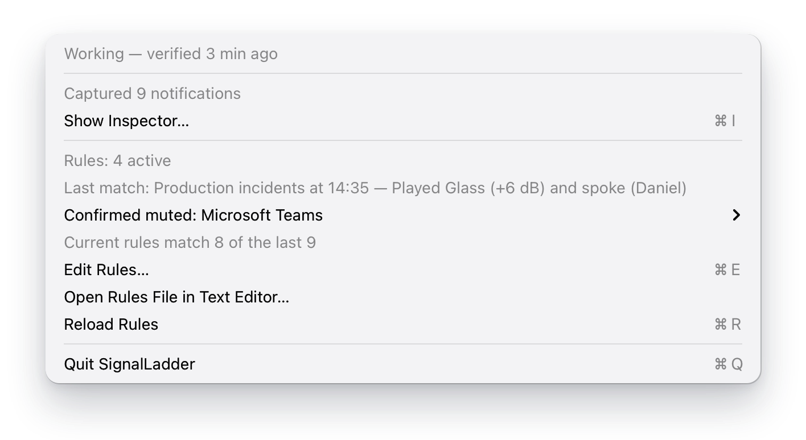
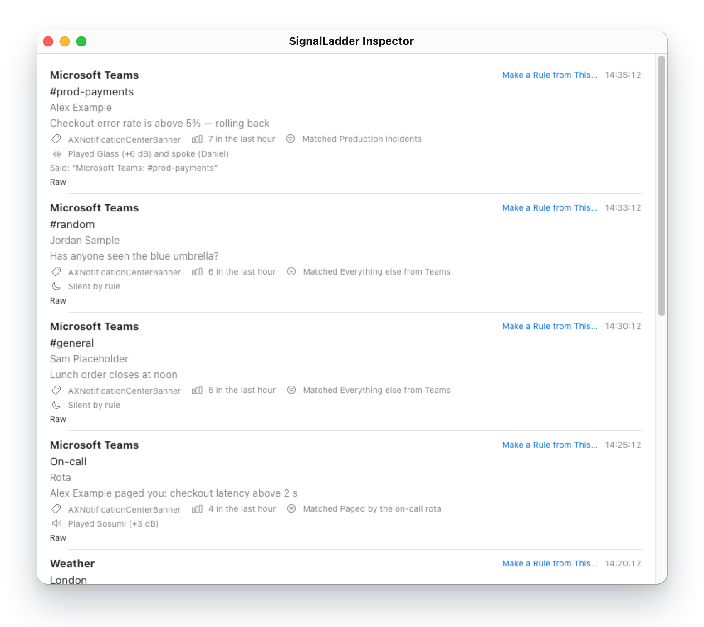

# Troubleshooting

This page is for the moment an alert did not sound, sounded when it should not have, or SignalLadder says it cannot see your notifications. It is organised by what you noticed, not by how SignalLadder works. Text in _italics_ is what the app shows, so you can search this page for what your menu says.

> [!NOTE]
> The System Settings wording here is macOS 26's. SignalLadder declares macOS 14 as its minimum, but every live check so far was run on macOS 26, so treat the wording on earlier versions as approximate. Before macOS 26, banners switched off is an alert style of None rather than the **Desktop** checkbox, and **Read & Speak** was called Spoken Content.

## Start with the menu and the Inspector

SignalLadder has no Dock icon and no main window. Everything is in its icon in the menu bar, and two places there answer most questions.

**The health line.** Click the icon. The health line says whether SignalLadder can read notifications and how recently it proved it. It is the first line, unless an alert is waiting to be acknowledged or a Shortcut did not run: then **Acknowledge** (when something is waiting) and the lines about them come first. When something is wrong, the line beneath the health line says what to do, and clicking that line opens the right pane of System Settings. The icon changes from a bell to a slashed bell whenever SignalLadder has a problem: capture health, rules that did not load, an alert that could not sound, a Shortcut that did not run, or a Shortcut name the Shortcuts app does not list. While an alert is escalating, the icon alternates between a bell with sound waves and a filled one, and a problem's slashed bell takes precedence. While a snooze runs the icon is a moon, and while what a snooze held waits for you and none runs it is a tray, and a problem's slashed bell and an escalation's pulsing bell outrank both.

Beneath the health line and its cause is the **On Call** item, and beneath that, and beneath the lines On Call adds while you are on call, is the **Snooze** item with its own lines. While you are on call, with nothing wrong, nothing escalating, no snooze running and nothing a snooze held waiting, the icon is a bell with a filled badge. While you are on call, three more things count as a problem and show the slashed bell: capture that has stayed unverified, a muted or zero-volume output while a rule sounds, and an Alert volume of zero. See [The On Call switch](#the-on-call-switch) and [A snooze held a match, or did nothing](#a-snooze-held-a-match-or-did-nothing).

The line _Captured 3 notifications_ counts what SignalLadder has read since it started. It does not count SignalLadder's own banners.

**The Inspector.** Choose **Show Inspector…** (⌘I). It lists the last 50 notifications SignalLadder read, newest first, and shows each one as SignalLadder saw it. Under every row are two lines that matter here, and a third when the rule escalated:

- The **match line** says which rule took the notification: _Matched Prod and incident channels_, or _Matched no rule_. If no rules were loaded it says _Not evaluated — no rules loaded_ or _Arrived while no rules were loaded_.
- The **outcome line** says what SignalLadder did about a match: _Played Glass (+6 dB)_, _Silent by rule_, _Snoozed — no alert_, _Joined an escalation that repeats (match 3), no alert of its own_, _Could not play: …_. A notification that matched no rule has none.
- The **escalation line**, on a row whose rule has an escalation, says how far the ladder has got: _Escalating — reached tier 3 — repeated 3 of 20_, or _Acknowledged at 10:45:12 — reached tier 3 — repeated 4 of 20_. Once matches have joined the escalation it says how many, as _Escalating — 7 matches — reached tier 3 — repeated 3 of 20_, and the rows of the matches that joined say which match they were.

The Inspector is held in memory. It is empty after a relaunch, and the 51st notification pushes out the first.



That picture shows on-call mode on, so under **On Call** are the lines the menu adds while you are on call. Off call, **On Call** is unticked and has none of those lines under it. The picture is drawn from SignalLadder's own menu text with made-up values; it was not captured from a running copy. It was drawn before the **Snooze** item was built, so it does not show it: in the app, **Snooze** comes after the last of the On Call lines, above the capture count.



Then find your symptom:

- [Nothing appears in the Inspector](#nothing-appears-in-the-inspector)
- [A notification is in the Inspector, but no sound played](#a-notification-is-in-the-inspector-but-no-sound-played)
- [I hear two sounds for one notification](#i-hear-two-sounds-for-one-notification)
- [An alert sounded again when I opened Notification Centre](#an-alert-sounded-again-when-i-opened-notification-centre)
- [The menu shows a warning about rules](#the-menu-shows-a-warning-about-rules)
- [Accessibility is on, but SignalLadder says it is not capturing](#accessibility-is-on-but-signalladder-says-it-is-not-capturing)
- [The self-test banner keeps appearing](#the-self-test-banner-keeps-appearing)
- [The health line says verified, but capture has stopped](#the-health-line-says-verified-but-capture-has-stopped)
- [A spoken alert is silent or cannot find its voice](#a-spoken-alert-is-silent-or-cannot-find-its-voice)
- [An escalation will not stop](#an-escalation-will-not-stop)
- [A rule's escalation never starts](#a-rules-escalation-never-starts)
- [A burst of matches played one alert, or paged late](#a-burst-of-matches-played-one-alert-or-paged-late)
- [A Shortcut did not run](#a-shortcut-did-not-run)
- [An alert says it was missed while asleep](#an-alert-says-it-was-missed-while-asleep)
- [The acknowledge hotkey does nothing](#the-acknowledge-hotkey-does-nothing)
- [Quitting asks whether to quit anyway](#quitting-asks-whether-to-quit-anyway)
- [The On Call switch](#the-on-call-switch)
- [The On-Call Check window and its findings](#the-on-call-check-window-and-its-findings)
- [The beep keeps repeating](#the-beep-keeps-repeating)
- [The Mac does not sleep, or sleeps anyway](#the-mac-does-not-sleep-or-sleeps-anyway)
- [A snooze held a match, or did nothing](#a-snooze-held-a-match-or-did-nothing)
- [Launch at login, and SignalLadder may not start again](#launch-at-login-and-signalladder-may-not-start-again)
- [A menu shortcut does nothing](#a-menu-shortcut-does-nothing)

## What the health line says

SignalLadder cannot know that capture works from silence: a quiet channel and a blind app look identical. So it sends itself a real notification, the self-test, and reads it back. The health line is the result of that, and how old the result is.

| The line says | What it means | What to do |
| --- | --- | --- |
| _Working — verified just now_, _Working — verified 3 min ago_ | A self-test banner went through the whole path and was read back that long ago. It is the only positive evidence SignalLadder has, and it describes that moment, not this one. | Nothing. If you doubt it, see [the health line says verified, but capture has stopped](#the-health-line-says-verified-but-capture-has-stopped). |
| _Checking…_ | SignalLadder has not finished its first check since it started. This lasts seconds. | Wait a moment. If it stays, a permission prompt is probably waiting for an answer, so look for one, then quit and relaunch. |
| _Unverified — last verified 34 min ago_ | The last successful self-test is more than 31 minutes old (the 30-minute interval plus a minute's grace), so one that should have run has not. While you are on call it is more than 6 minutes old (the 5-minute interval plus the same minute). Nothing has been seen to fail, and it does not sound an alarm off call. After the Mac has been asleep, you can see this until the next self-test runs, and while you are on call a self-test runs when the Mac wakes. On call, capture that stays unverified does sound: see [The beep keeps repeating](#the-beep-keeps-repeating). | Usually nothing: the next self-test corrects it, and quitting and relaunching runs one at once. To check now, see [the symptom below](#the-health-line-says-verified-but-capture-has-stopped). |
| _Cannot verify itself_ | SignalLadder cannot prove it can read notifications, because its own self-test banner was not shown, or was shown and did not come back. Capture may be working. If real notifications are still reaching the Inspector, it is. | Read the advice line beneath it: [the delivery side](#the-delivery-side-cannot-verify-itself). |
| _NOT capturing notifications_ | SignalLadder has no Accessibility permission, is not attached to Notification Centre, or two self-tests in a row failed although banners were drawn. Nothing is being read, so no rule can sound. | Read the advice line beneath it: [the capture side](#the-capture-side-not-capturing-notifications). |

The age reads _just now_, _3 min ago_, _1 hr 5 min ago_ or _2 hr ago_.

When the health line changes to _Cannot verify itself_ or _NOT capturing notifications_, SignalLadder tells you three ways, so that no single fault silences all of them: the icon changes, the Mac beeps, and, if SignalLadder's own banners can still be drawn, a banner appears titled _SignalLadder cannot verify itself_ or _SignalLadder is not capturing_. Off call it alarms once per change, not repeatedly. While you are on call the beep repeats for as long as the fault stands, and the banner still comes once: see [The beep keeps repeating](#the-beep-keeps-repeating). The beep is the Mac's alert sound, which macOS is reported to play at the Alert volume in System Settings › Sound and not at the output volume. That has not yet been tested. Those banners are not counted, listed or matched by rules.

### The advice line under the health line

The menu shows one advice line: the first cause, when several apply. There are two sides to a fault, and the difference matters. If SignalLadder's banner was never drawn, Accessibility had nothing to read, and granting Accessibility again would fix nothing. So a failed self-test is not blamed on capture until delivery has been ruled out, and delivery faults read _Cannot verify itself_, not _NOT capturing notifications_.

#### The capture side: _NOT capturing notifications_

SignalLadder is not reading banners, so one that is drawn goes unseen. Clicking the advice line opens Accessibility in System Settings.

- _Grant Accessibility to SignalLadder in System Settings — without it no notifications can be read._

  The Accessibility permission is missing, or the grant no longer matches this copy of the app. Open System Settings › Privacy & Security › Accessibility and switch SignalLadder on, then open the menu once: capture starts when the menu opens, so no relaunch is needed. If SignalLadder is already switched on there, see [Accessibility is on, but SignalLadder says it is not capturing](#accessibility-is-on-but-signalladder-says-it-is-not-capturing).

- _Not attached to Notification Centre. It may be restarting; this usually recovers within seconds._

  SignalLadder listens to Notification Centre's process and has not made that connection, or has lost it. It reconnects on its own, retrying after 1 second and then at growing intervals up to 30 seconds, and runs a self-test when it succeeds. Wait a minute. If the line stays, quit and relaunch. The [log](#collecting-information-for-a-bug-report) records each attempt.

- _macOS is not exposing notifications to assistive apps. Turning on Full Keyboard Access in System Settings › Keyboard is the known workaround._

  Two self-tests in a row failed although Notification Centre drew something, and no real notification has been read since. Banners appear, but SignalLadder cannot read them. Quit and relaunch first: during development a relaunch cleared this. If it comes back, do what the line says. Full Keyboard Access changes how the Tab key moves between controls across macOS, which is why a relaunch comes first.

#### The delivery side: _Cannot verify itself_

SignalLadder's own self-test banner was not drawn, or was not seen. Capture may be working fine; SignalLadder cannot prove it. Clicking the advice line opens Notifications in System Settings.

- _Allow notifications for SignalLadder in System Settings — without it the app cannot verify it is working._

  SignalLadder's own notification permission is denied, or its prompt was never answered. Open System Settings › Notifications › SignalLadder and allow notifications. SignalLadder asks for alerts only, with no sound and no badge. Capture does not depend on it.

- _Do Not Disturb, a Focus, or SignalLadder's banners being switched off (Desktop, in System Settings › Notifications) is suppressing its own alerts, so it cannot verify itself. Capture is unaffected while banners are still shown for other apps._

  SignalLadder's own notification settings say its banner would not be drawn: banners switched off (**Desktop** on macOS 26), Notification Centre switched off for it, or Scheduled Summary holding its notifications. Switch them back on. A Focus cannot be read from settings, so the next line is how SignalLadder finds one.

- _SignalLadder's self-test alert was never seen. Either it was not shown — Do Not Disturb, a Focus, or its banners switched off (Desktop, in System Settings › Notifications) — or SignalLadder is not seeing banners at all. Rule out Do Not Disturb first; if it is off, turn on Full Keyboard Access in System Settings › Keyboard, the known workaround for macOS not exposing notifications._

  A self-test failed and Notification Centre created no window at all while SignalLadder waited. Two different faults leave exactly that evidence: the banner was never drawn, or it was drawn and not seen. SignalLadder cannot tell them apart, so it names both. Check Control Centre for a Focus first. If none is on, quit and relaunch, and only then try Full Keyboard Access.

- _Capture is working — notifications from other apps are being captured — but SignalLadder's own alerts are not being shown, so it cannot self-test. Check SignalLadder in System Settings › Notifications, including Deliver Quietly._

  Real notifications have been read since the last self-test, so capture works. The fault is with SignalLadder's own banner. Its settings can read as fine while the banner is still not drawn, and Deliver Quietly is one thing to check.

- _A self-test did not complete, and SignalLadder cannot tell whether its alert was shown. It will retry in a minute._

  One self-test failed. One failure is not evidence of blindness: a Focus, a brief system hiccup or waking from sleep can each cause one on a healthy app. SignalLadder retries after a minute, then at growing intervals up to 30 minutes (5 while you are on call) while it keeps failing. Wait. A second failure in a row turns this into one of the lines above.

## Symptoms

### Nothing appears in the Inspector

You expected a notification in the list and it is not there, so SignalLadder did not read it, or was not running when it arrived. The Inspector's empty message says which kind of empty it is:

- _Nothing captured yet. Capture is verified working, so this is simply quiet._ Nothing has arrived, and the health line backs that up.
- _Nothing captured yet — and SignalLadder has no recent confirmation that it can capture anything._ It has not verified capture, or the evidence is stale. The health line and its advice follow.
- _Nothing captured — and SignalLadder cannot confirm it is capturing._ Health is _Cannot verify itself_ or _NOT capturing notifications_. The health line and its advice follow.

Work down this list.

1. **Read the health line.** If it says _NOT capturing notifications_, deal with that first: [the capture side](#the-capture-side-not-capturing-notifications). The usual cause is Accessibility.

2. **Post a test banner.** It separates SignalLadder from the app you were waiting for. In Terminal:

   ```
   osascript -e 'display notification "Placeholder body" with title "Capture test"'
   ```

   It posts as Script Editor, so Script Editor's own notification settings apply. If a row appears in the Inspector, SignalLadder can read banners, and the problem is that the source app's banner was never drawn: read on. If nothing appears, either SignalLadder cannot read banners (steps 1 and 7) or no banner was drawn for anyone, which is what a Focus does (step 3).

3. **Check Do Not Disturb and Focus.** While one is on, macOS draws no banner and sends the notification straight to Notification Centre's history. There is nothing to read, so SignalLadder captures nothing. This is a limit of how SignalLadder reads notifications, not a fault in it, and nothing in SignalLadder can get round it. An app allowed to break through a Focus still draws its banners, so allow the source app to notify you through that Focus. The mute checklist in the menu has **Open Focus Settings…** when a rule needs it, and reminds you to check whether a Focus turns on when your screen locks.

4. **Check the source app's banners.** SignalLadder reads banners drawn on screen. In System Settings › Notifications › the app, banners must be on (the **Desktop** checkbox on macOS 26). Both the Banners and Alerts styles are read. If the notification was set to **Deliver Quietly**, it goes to Notification Centre without a banner. If the app is in **Scheduled Summary**, it is held for later. Neither draws a banner now, so neither is read.

5. **Check that the app posted a notification at all.** Some apps do not raise one when you are already looking at that conversation. A popup an app draws for itself is not a notification banner. SignalLadder reads only Notification Centre.

6. **Think whether you were opening Notification Centre just then.** Whatever Notification Centre's list holds when it opens is taken for old notifications, so one that arrives at the very moment you open it may not be read. If so, it is in Notification Centre, but not in the Inspector. See [An alert sounded again when I opened Notification Centre](#an-alert-sounded-again-when-i-opened-notification-centre) for how the list is recognised.

7. **Quit and relaunch.** A relaunch reattaches to Notification Centre from scratch and clears a stuck observer. Capture has stopped while Notification Centre kept drawing banners during development, and a relaunch cleared it. Try this before [starting over](#starting-over), and see [the health line says verified, but capture has stopped](#the-health-line-says-verified-but-capture-has-stopped) for why the health line may not have warned you.

One missed alert, a persistent Outlook alert during a test on 2026-09-29, was not explained at the time. One read the next day was captured, and its likely cause was fixed before version 0.1.0, but that cause was not proven. If an alert of yours goes missing and nothing above explains it, please report it: see [collecting information for a bug report](#collecting-information-for-a-bug-report).

### A notification is in the Inspector, but no sound played

SignalLadder read it. Now find out what it did. Read the row's match line and outcome line, and find them here.

| The row says | What happened | What to do |
| --- | --- | --- |
| _Matched no rule_ | No rule that can run matched. | [Work through the causes below](#if-the-row-says-matched-no-rule). |
| _Not evaluated — no rules loaded_ or _Arrived while no rules were loaded_ | No rules were loaded when it arrived: none written yet, or the file could not be read. | Look at the menu's Rules line. See [The menu shows a warning about rules](#the-menu-shows-a-warning-about-rules). |
| _Matched …_ naming a rule you did not expect | A rule higher in the list matched first. **The first enabled rule that matches wins**, and a notification only ever sets off one rule. | In **Edit Rules…**, select the rule you expected. Its dry run says _N more are taken first by “Rule”, above it_, with a **Move Above “Rule”** button. Or narrow the higher rule's condition. |
| _Silent by rule_ | The rule that matched has the alert Silent. That is deliberate: a silent rule claims its notifications, so no broader rule below it can sound for them. | If you meant it to sound, change its alert. If a silent rule is claiming what a rule below should sound for, move the narrower rule above it. |
| _Snoozed — no alert_ | A snooze was running and held the match, because the rule has **Stay quiet while I have snoozed** ticked, makes a sound and does not end in a Shortcut. Nothing was played or said, no panel appeared and no ladder began. It is not lost: the menu counts it by rule until you press **Dismiss**, and its last-match line reads _held while snoozed_. It is not played again when the snooze ends. | [A snooze held a match, or did nothing](#a-snooze-held-a-match-or-did-nothing). **End Snooze** if you want rules to sound now. |
| _Joined an escalation that repeats (match 3), no alert of its own_ | The match joined an escalation already running for its rule, and a repeat about to sound stands in for its alert, so nothing was played and no line was spoken for it. | Nothing is wrong. The repeat plays, and acknowledging the escalation stops it. [A burst of matches played one alert, or paged late](#a-burst-of-matches-played-one-alert-or-paged-late) says when a joined match plays and when it does not. |
| _Played Glass — joined an escalation (match 3)_ | The match joined an escalation already running, and played its own alert, whose words come first. | See the same section. |
| _Silent — this rule has no alert_ | The rule that matched has no alert. A rule made with **Make a Rule from This…** starts like this on purpose, switched off and with no alert, so a rule you have not finished is never mistaken for one you meant to be quiet. | In **Edit Rules…**, choose Sound or Speech for the rule, try **Test Sound**, switch the rule on and press **Save**. |
| _Played Glass_ | SignalLadder played it. That means it did the work, not that you heard it. | [Played, but not heard](#played-but-not-heard). |
| _Played Glass — but the Mac's sound output was muted or at zero volume_ | It played, and the Mac reported that nothing could be heard. While the output stays muted, the menu also warns _⚠︎ Sound output is muted or at zero volume — alerts will not be heard_. | Unmute the Mac or raise its volume. |
| _Could not play: …_ | A sound was meant to play and did not, and the text says why. At the moment of an alert this is almost always `was not found`, because the file was removed after the rules loaded, or `the audio engine failed`. | Put the file back and choose **Reload Rules** (⌘R), or check System Settings › Sound and try **Test Sound** in the rule editor. Relaunch if it persists. |
| _Could not speak: …_, _Played Glass, but could not speak: …_ or _Spoke (Daniel), but could not play: …_ | One part of a sound-and-speech alert did not happen. | See [A spoken alert is silent or cannot find its voice](#a-spoken-alert-is-silent-or-cannot-find-its-voice). |

A sound that could not play also puts its own ⚠︎ line in the menu and turns the icon to the slashed bell. Both stay until a later sound plays. A quieter match afterwards does not hide it, and reloading rules does not clear it.

#### If the row says _Matched no rule_

- **The rule is switched off.** The menu's rules line says _Rules: 2 active, 1 off_. In the editor, a rule that is off says _Not in effect: this rule is switched off._ A rule made with **Make a Rule from This…** starts switched off.
- **The rule has problems, so it does not run.** The editor marks it with an orange triangle and says _Not in effect: this rule has problems, and will not run until they are fixed._ The menu's rules line starts with ⚠︎ and lists it. One bad rule never stops the others. See [The menu shows a warning about rules](#the-menu-shows-a-warning-about-rules).
- **The rule is not in effect yet.** The editor's bar says _Unsaved changes — not in effect until you save_ until you press **Save**, which takes effect at once. If you edited `rules.json` by hand, it says _rules.json has changed since it was put into effect — these rules are not running yet_, and **Put into Effect** or **Reload Rules** (⌘R) applies it. A blue line on a row, _Current rules would match …_, means the rules you have now would have taken that notification, but were not in effect when it arrived. It is a preview. Only a match on arrival sounds.
- **The condition does not fit what the notification holds.** Compare the rule with the row in the Inspector, field by field.
  - `app` is recovered heuristically from the banner's description, so it can be wrong or empty (the row then says _(no app name)_).
  - `matches` covers the whole field: `#prod-*` means "starts with `#prod-`", and `*deploy*` means "contains `deploy`".
  - Comparisons ignore case and accents.
  - If you are unsure which field some text lands in, use **Any text**, which is the `raw` field.
  - The rule editor's dry run, _In this draft: matches 3 of the last 50 notifications._, tells you at once whether the condition matches anything. If it says none, the condition is the problem. **Add Condition from This Notification** builds a condition from the row itself.

  The [rules format](rules-format.md#conditions) lists every field and operator.

#### Played, but not heard

- **The output.** Sounds play through the Mac's current output, at its volume. If that is not where you are listening, such as a display or a headset in a bag, it played there. SignalLadder can only tell when the device says it is muted or at zero volume. A device with no volume control, such as some external interfaces, cannot be judged, so no warning appears even if it is turned down on the device.
- **The gain.** _Played Glass (−12 dB)_ means the rule asked for a quiet sound. The range is −40 to +12 dB.
- **A burst.** One alert plays at a time, and a new alert cuts off one still playing, because two alarms at once are noise. In a burst, only the last sound plays in full. An escalation's repeats count as alerts, so one can cut off another rule's alert. Matches for one rule join one escalation, and one that joins while a repeat is about to sound plays nothing of its own: see [A burst of matches played one alert, or paged late](#a-burst-of-matches-played-one-alert-or-paged-late).
- **It plays once.** A rule's own alert sounds once per notification. Only a rule with an escalation goes on, to a panel, repeats or a final alert, and only if you set one up in the rule editor or wrote one in `rules.json`. Without one, nothing repeats and nothing waits for you to acknowledge it. If you wrote one and nothing followed, see [A rule's escalation never starts](#a-rules-escalation-never-starts). With one, a match that joins an escalation already repeating may play no alert of its own, its spoken line included, when a repeat is about to sound for it, and its row says so. A rule with no escalation plays every match's alert, and so does a ladder with no repeat.
- **Try it.** **Test Sound** in the rule editor plays the rule's sound exactly as the alert would, at its gain. If that is silent too, the fault is the Mac's output, not the rules.

### I hear two sounds for one notification

Open the Inspector and read the row's outcome line. _Played Glass_ tells you which sound was SignalLadder's, so the other belongs to something else.

1. **The source app's own sound is still on.** This is the usual cause. SignalLadder is a replacement voice: it does not silence the app, you do. Until the app's own notification sound is off, its ping plays on top of every alert. Whenever an enabled rule has a sound or speaks, the menu lists the apps it reaches, titled with the ones still to do, _⚠︎ Not confirmed muted: Microsoft Teams_. For each app:

   1. Choose **Open Notification Settings for …**. It goes straight to that app in System Settings. If SignalLadder cannot find the app, or finds two with that name, it shows the name to look for and opens the Notifications list instead.
   2. Turn off the app's notification sound there.
   3. Back in the menu, choose **I've Turned Its Sound Off**.

   Nothing can check that last step. macOS keeps notification settings where other apps cannot read them, so the tick records your word, and the menu says _confirmed muted_, not _muted_. If an app is missing from the list, note that the list holds the apps a rule names with `app equals`, plus any app that has set one off since SignalLadder started. An app matched only by a pattern shows up after its first alert. Some apps also have sound settings of their own inside the app, which the Notifications pane does not control. The [rules format](rules-format.md#muting-the-source-app) has the full walkthrough.

2. **The notification is in the Inspector twice.** Then SignalLadder read it twice, and each row that matched a rule set off its own alert. For a rule with an escalation that is still repeating, the second row joined the first's escalation and says which match it was, as _joined an escalation (match 2)_, and it plays its own alert unless a repeat is about to sound for it. Either the app posted two notifications, or SignalLadder read one banner twice, as it can in the cases the next symptom describes. A repeat that arrives within 1.5 seconds is folded into the first row instead, shown as _1 suppressed_, and does not sound again.

3. **You set a sound and a spoken line.** An alert with both plays the sound, then speaks. That is one alert.

4. **Two copies of SignalLadder are running.** Nothing stops a second copy launching, such as an older build in another folder. Each reads banners and plays its own alerts. With Launch at login on, a copy that macOS starts at login is one more that can be running, and whether a copy you then open by hand runs beside it has not been measured. Look for more than one SignalLadder in Activity Monitor and quit the extra.

### An alert sounded again when I opened Notification Centre

It should not. Notification Centre shows its history in the same window, and with the same kind of element, that a live banner uses. SignalLadder recognises Notification Centre's list by how its window is built, and treats everything the list holds when it opens as old, however recent. A notification that arrives while the list is open is still read as new. The list was checked on macOS 26.7. If an alert does sound again, the Inspector shows a second row for it, timed to the moment it was read again. These are the known causes:

- **You are on a macOS other than 26.7, such as 14 or 15.** The list may be built differently there. If SignalLadder does not recognise it, it reads what the list holds as new, and a rule that matched an old notification sounds again. Please report it, with your macOS version: see [collecting information for a bug report](#collecting-information-for-a-bug-report).
- **A large stack of persistent alerts from one app.** Once, with seven alerts from one app stacked, a new alert arriving while the list was open made macOS lay the stack out again, and three old alerts were read again as new, so a rule that matched them would have sounded again. It did not happen with two, and was not seen again.
- **A time label in another language.** A notification that appears in the list after it opens, such as one scrolled into view, is recognised as old by a time label like _1m ago_ or _yesterday_. Only English wording is recognised. A numeric time such as _12:04_ is recognised in any language.

When SignalLadder is unsure it treats a notification as new. That repeats an alert now and then, and the other error would miss one.

The opposite can happen too. A notification that arrives at the very moment you open Notification Centre is taken for an old one, and may not sound.

### The menu shows a warning about rules

One rejected rule never silences the others, and the menu says when a rule was rejected. So does the icon.

| The menu says | What it means | Effect |
| --- | --- | --- |
| _⚠︎ Rules: 2 active — 1 could not be used_ | One or more rules loaded but were rejected. Each is listed beneath by position and name, such as `Rule 3 ("Typo"): …`. | The other rules run. Only the rejected ones do not. |
| _⚠︎ Rules file could not be read — no rules are active_ | The file is not valid JSON, or not the shape of a rules file. The reason is listed beneath, with the line and column. | No rule runs until it is fixed. |
| _⚠︎ Rules file needs a newer SignalLadder (format 6) — no rules are active_ | The file was written by a newer build, or its `"version"` is above 5. The number in the brackets is the one the file declares. | Nothing is loaded rather than misread. No rule runs. |
| _⚠︎ 1 Shortcut name was not found — the rule using it is still in effect_ | A rule's last step names a Shortcut the Shortcuts app does not list. The rule is listed beneath, such as `Rule "On-call mentions": …`. | The rule runs, tier 4 included, and the icon turns to the slashed bell. See [A Shortcut did not run](#a-shortcut-did-not-run). |

The reason listed under a rejected rule is one of the messages in [When something is wrong](rules-format.md#when-something-is-wrong), which lists every one with what it means. A misspelt sound, a voice that is not installed and a `"gainDB"` out of range are all caught when the rules load, not at the incident. Fix the rule in the rule editor, where it shows an orange triangle and its problems, or in a text editor. **Save** in the editor takes effect at once. After a hand edit, choose **Reload Rules** (⌘R).

A rule can be refused only because the file declares an older version than the rule needs, such as a ladder in a file that says `"version": 3`, or `quietWhenSnoozed` in a file that says 4. The editor reports it in the same words, and **Save** is available even though you changed nothing. Its bar reads _rules.json declares version 3 but holds a rule that needs 4, so that rule is not running — Save writes version 4 and puts it into effect_, and for `quietWhenSnoozed` in a version 4 file, _… holds a rule that needs 5 …_ and _Save writes version 5_. A value that is not `true`, `false` or `null` for `quietWhenSnoozed` is refused with its place, such as _… at rules[1].quietWhenSnoozed_, and the file's other rules still run. `null` and a missing key read as off.

**The editor opens read-only.** The editor refuses to open a file it cannot represent in full, because saving would have to drop what it could not read. It says why:

- _The rules file can't be read, so it can't be edited here._ The file is not valid JSON.
- _The rules file was written by a newer SignalLadder (format 6)._
- _1 rule in the file can't be read, so saving here would drop it. Fix it in a text editor._ An entry has a misspelt or unknown key, or an operator that is not one of the four. Every such rule is listed with its reason.

Choose **Open Rules File in Text Editor…**, fix the file, then **Reload Rules** (⌘R). SignalLadder never rewrites a file it cannot fully understand. A rule that reads correctly but has a problem, such as an empty group or a sound that does not exist, does not make the editor read-only. You fix those in the editor.

### Accessibility is on, but SignalLadder says it is not capturing

macOS ties an Accessibility grant to the app's code signature. An entry in the list can look switched on and no longer match the copy of SignalLadder that is running. Try these in order.

1. **Open the menu.** Capture starts when the menu opens and Accessibility is granted. The line should change.
2. **Quit and relaunch** SignalLadder.
3. **Switch its entry off and on** in System Settings › Privacy & Security › Accessibility.
4. **If you rebuilt it with a different signing identity,** the old grant no longer matches. Select the entry and remove it with the **−** button, relaunch SignalLadder, and grant Accessibility again. Rebuilding with the same identity keeps the grant. That is why `Scripts/make-app.sh` refuses ad-hoc signing: an ad-hoc signature changes with every build, and the grant would be lost each time. [Getting started](getting-started.md) covers building.
5. **Reset the permission and grant it afresh.** Quit SignalLadder, then run:

   ```
   tccutil reset Accessibility com.jamiewhite.signalladder
   ```

   Relaunch it. macOS asks again.

### The self-test banner keeps appearing

It is meant to. Every half hour, every 5 minutes while you are on call, and more often around a launch, a banner titled _SignalLadder self-test_ appears for a few seconds, with a body that reads "SignalLadder canary" and a random identifier.

**Why.** Absence of notifications proves nothing. A quiet channel and an app that cannot see banners look the same, and an on-call tool that cannot tell them apart will reassure you at the moment it is blind. The only way to know capture works is to send a real banner through the whole path and read it back. The self-test does that. Without it, the health line would have nothing to be based on.

**When.** A self-test runs at launch, whenever SignalLadder reattaches to Notification Centre, and when capture starts. If it passes, another runs about two minutes later, because capture has failed soon after a launch before. After that, one runs every 30 minutes. While you are on call one runs every 5 minutes instead, one runs at once when you switch on, and again about two minutes later if it passes, one runs when the Mac wakes, and **Check Now** in the on-call check window runs one. After a failure it retries after a minute, then at growing intervals up to 30 minutes, or up to 5 while you are on call. It also runs as soon as SignalLadder notices that whatever blocked it has cleared. Each waits up to 5 seconds for the banner to be read back, then removes it from Notification Centre. It has no sound. It is never listed in the Inspector, counted or matched by a rule.

**What you can change.** Only whether you are on call. There is no setting for its interval or to hide it, and none for the on-call interval, because a setting could hide an outage behind a long one. If you share your screen, it is visible like any other banner, about 12 times an hour while you are on call.

**If you switch SignalLadder's banners off,** the self-test cannot be drawn. The health line becomes _Cannot verify itself_, and the icon and a beep report it. Capture from other apps carries on, but SignalLadder can no longer tell you whether it is working. Switching the banners off trades a few seconds of banner every half hour, or every 5 minutes on call, for an app that cannot say when it is blind.

### The health line says verified, but capture has stopped

_Working — verified 12 min ago_ is a claim about one moment: the last time a self-test banner was read back. That is why the line says how old the evidence is. Capture has stopped without warning during development, shortly after a passing self-test, while Notification Centre carried on drawing banners. The cause is not settled.

An outage that starts between two self-tests reads _Working — verified N min ago_ until the next one, which can be up to about half an hour, or about 5 minutes while you are on call. Past 31 minutes, or 6 on call, the line becomes _Unverified — last verified N min ago_. Opening the menu re-evaluates what SignalLadder can read at that moment, which is the permission, the attachment to Notification Centre and the age of the evidence. It does not run a self-test. There is no setting for a shorter interval. The shorter one is on-call mode's: see [The On Call switch](#the-on-call-switch).

To check now:

- Post a test banner (see [Nothing appears in the Inspector](#nothing-appears-in-the-inspector)). _Captured N notifications_ in the menu goes up, and a row appears in the Inspector.
- Or quit and relaunch. A self-test runs at once, and another about two minutes later, so expect two banners.

If capture has stopped, quit and relaunch: that has cleared it so far. If you are willing to report it, note these before you relaunch, because a relaunch destroys the evidence: whether another copy of SignalLadder was running, whether a banner with the same title was already on screen, and how long SignalLadder had been running.

### A spoken alert is silent or cannot find its voice

- **The voice is not installed.** When the rules load, a rule naming a voice that is not installed is rejected and listed in the menu: _voice "…" is not installed — choose another in the rule editor, or add it in System Settings › Accessibility › Read & Speak (Spoken Content before macOS 26)_. The rule does not run. If a voice is removed after the rules loaded, the row says _Could not speak: voice "…" is not installed_.
- **Add a voice.** In the rule editor, the voice picker lists every installed voice, and **More Voices…** opens the Read & Speak pane of System Settings. After adding one, choose **Reload Rules** (⌘R): the rules are checked against the installed voices again.
- **Siri voices cannot be used.** macOS does not let other apps use them, so SignalLadder never offers them.
- **The row says _Spoke (Daniel)_ and you heard nothing.** "Spoke" means SignalLadder asked for the line, not that you heard it. Check the Mac's output, as in [Played, but not heard](#played-but-not-heard). The log records _spoken line produced no playable audio_ if a line produced nothing to play.
- **The line is not what you expected.** The template defaults to `{app}: {title}` and leaves out `{body}`, because a long recitation is not an alert. A spoken line stops at 240 characters. **Test Speech** in the rule editor says the template filled from a made-up notification, so it never reads a real one aloud.
- **What was said.** The Inspector row shows _Said: “…”_ for a spoken alert. The menu never does.

### An escalation will not stop

A rule with an escalation goes on until someone acknowledges it, so a sound that repeats or a panel that stays up is the rule doing what it was written to do. Acknowledge it, in any of three ways:

- **The panel.** Each row has an **Acknowledge** button. It acknowledges that escalation.
- **The menu.** While anything is listed, the top item is **Acknowledge**, or **Acknowledge All (3)** when there are several. It acknowledges every one the menu listed when you opened it, as it listed it.
- **The hotkey.** ⌃⌥⌘A acknowledges all of them, from any app. If it does nothing, see [The acknowledge hotkey does nothing](#the-acknowledge-hotkey-does-nothing).

Acknowledging stops every tier still to come for that escalation: no more repeats, no final alert, and a Shortcut that had not started will not start, nor will a page owed to a match that joined it. It also closes a burst, so the next match begins a new escalation. A Shortcut already running is not stopped. When you acknowledge the last escalation still going, a sound that is playing stops. It stops only if the last alert to play was an escalation's, so acknowledging never cuts off an ordinary rule's alert. The Inspector row then says _Acknowledged at 10:45:12_.

If it still seems not to stop:

- **The menu has no Acknowledge item.** Then nothing is listed, and what you hear is not an escalation. The source app's own sound is the usual cause: see [I hear two sounds for one notification](#i-hear-two-sounds-for-one-notification).
- **The repeats have stopped, but it is still listed.** When tier 3 reaches its cap, 20 repeats or ten minutes unless the rule says otherwise, it stops repeating. The menu, the panel and the Inspector (_Escalating, no longer repeating_) keep it until you acknowledge it, and tier 4 still runs if its time has not come.
- **The panel has two rows for one alert.** SignalLadder read the notification twice, as it can (see [I hear two sounds for one notification](#i-hear-two-sounds-for-one-notification)). A second read of a rule that is still repeating joins the first's escalation, and a ladder with no repeat is joined by a match within 60 seconds of its last, so one row with a count of 2 is what you should see. A second row means the second read did not join: see [A burst of matches played one alert, or paged late](#a-burst-of-matches-played-one-alert-or-paged-late). The two rows read alike, apart from a start time that may differ by a minute. **Acknowledge All** in the menu ends both.
- **Another escalation is still going.** Acknowledging one leaves the others running, and a sound that is playing carries on until it ends.
- **A snooze is running.** A snooze holds matches that have not begun and never touches an escalation already running, so it does not stop one. Acknowledge it as above.
- **One began while the menu was open, or a match joined one.** The menu does not change while it is open, so an item cannot move under your pointer, and its Acknowledge acts only on what it listed, as it listed it. An escalation that began after that stays live, with its timers and its sound, and is listed the next time you open the menu. So does one whose count of matches grew after the menu was built, because the match that joined it is one you were not shown, may have been silent and may be owed a page. It is listed with its new count, and acknowledging from that menu ends it. The hotkey acts on everything listed, including both, and a panel row's button acts on its own escalation. The menu holding still was tested and tried on a menu in a test program, and has not been seen in the app itself.

### A rule's escalation never starts

A rule with an escalation starts its ladder when it matches, straight after its own alert, unless a snooze holds the match or the match joins an escalation already running for the rule. If you wrote one and nothing follows the alert, work down this list. A row in the Inspector whose ladder started has a line under its alert line, _Escalating — reached tier 1_, which moves on to tier 2, 3 and 4 as each fires.

1. **The rule was refused when the rules loaded.** A rule with a problem does not run at all, its first alert included. The menu's rules line starts with ⚠︎ and lists the rule with the reason, and the rule editor shows the same reasons under it, except for a rule it cannot read at all, which makes the editor open read-only. A rule with an escalation needs an alert of its own, even Silent (_it has an escalation but no alert_), and `"version": 4`. Its tiers have their own checks: at least one tier, every delay and interval more than 0, `maxRepeats` at least 1 and `maxDurationSeconds` more than 0 (or `null` for either), a repeat that sounds or speaks, and in tier 4 exactly one of a final alert that sounds or speaks, or a Shortcut with a name. [When something is wrong](rules-format.md#when-something-is-wrong) lists every message. Fix the rule, then choose **Reload Rules** (⌘R).
2. **The rule did not match.** A ladder starts only from a match. If the row says _Matched no rule_, or names another rule, see [A notification is in the Inspector, but no sound played](#a-notification-is-in-the-inspector-but-no-sound-played). If nothing reached the Inspector at all, see [Nothing appears in the Inspector](#nothing-appears-in-the-inspector): Do Not Disturb and Focus stop a banner being drawn, and a rule cannot start a ladder from a notification that was never read.
3. **A snooze held the match.** The row reads _Matched …_ and, beneath it, _Snoozed — no alert_, and the rule has **Stay quiet while I have snoozed** ticked. A snooze holds the whole rule, its ladder included, so no panel, repeat or Shortcut starts, and the row has no _Escalating_ line. **End Snooze** if you want rules to sound now, or see [A snooze held a match, or did nothing](#a-snooze-held-a-match-or-did-nothing).
4. **The match joined an escalation already running.** The row reads _Joined an escalation that repeats (match 3), no alert of its own_, or its alert and then _— joined an escalation (match 3)_, and the row that began the escalation has the ladder's line and the count. No second ladder begins, because one is already going: see [A burst of matches played one alert, or paged late](#a-burst-of-matches-played-one-alert-or-paged-late).
5. **The alert is Silent.** That is allowed: a rule whose alert is Silent still starts its ladder, and the row reads _Silent by rule_ and then the escalation line.
6. **There is no panel.** The panel comes from tier 2. A ladder without a `tier2` never shows one, and the menu still lists the escalation, with Acknowledge at the top. With one, the panel appears after its delay, 10 seconds unless the rule says otherwise.
7. **A repeat never comes.** The first repeat comes one `intervalSeconds` after the match, not at once. A `maxDurationSeconds` shorter than that interval allows no repeat at all, and the escalation is listed as no longer repeating from the start.
8. **You edited the file and did not reload it.** Choose **Reload Rules** (⌘R).

The rule editor shows the ladder under the rule's first alert, in **If I don't acknowledge**, with a sentence that says in words what it will do. Read that sentence first, since it describes the ladder as the editor holds it. The controls were drawn and driven in a test program and have since been seen in the app, but their live checks are still to do, so if the sentence does not match what you set, please report it. A ladder's problems are listed under the rule, as any rule's are. A ladder it cannot read at all, such as a misspelt key, makes the editor open read-only: see [The menu shows a warning about rules](#the-menu-shows-a-warning-about-rules).

### A burst of matches played one alert, or paged late

Matches for one rule join the escalation already running for it, so a burst is one panel row, one count, one ladder and one Shortcut page. [A burst of matches](getting-started.md#a-burst-of-matches) says what joins and what it does, and that none of it has been run in the app yet, so if what you see differs from what this says, please report it.

- **A match played nothing, and its row says _Joined an escalation that repeats (match 3), no alert of its own_.** It joined an escalation whose repeat was about to sound, and the repeat stands in for its alert. A joined match plays nothing only when a repeat is due within 60 seconds, that repeat is not the last the ladder will make, it makes a sound, and something from the escalation has already been heard without a fault. Its spoken line is not voiced either: the repeat plays the first match's alert, so two different incidents in one burst can sound like one. A ladder with no repeat plays every match's alert, so if you would rather each match sounded, use **Gentle**, or a panel and a Shortcut with no repeat.
- **A match played its own alert, and its row says _Played Glass — joined an escalation (match 3)_.** No repeat was about to sound, or what had sounded last had not been heard cleanly: a repeat that failed, sounded into a muted output or could not speak its line is not proof, so the next match plays its own. The first alert counts before any repeat has sounded.
- **The count is higher than the number of messages.** A count is of matches and never of messages. Capture can read one banner twice, and a banner it reads again after 1.5 seconds is another match. See [I hear two sounds for one notification](#i-hear-two-sounds-for-one-notification).
- **A match began a new escalation and a new panel row, and I expected it to join.** A match joins only an escalation of the same rule that is still going, was begun with the ladder the rule has now, and is still repeating or, for a ladder with no repeat, had a match in the last 60 seconds. So it begins its own when you acknowledged the first, when the first stopped repeating at its caps, when the ladder has no repeat and more than 60 seconds passed, when the Mac slept through the first for more than 5 minutes, when you saved a different ladder for the rule in the meantime (the old one runs on), when the rules were reloaded for a rule that has no `id` in the file, or when it is another rule. **Acknowledge All** in the menu ends both.
- **The Shortcut ran again.** That is meant. A match that joins a long escalation 10 minutes or more after the last run began runs it again with its own four fields, and so does the next match after a run that failed, which does not wait for the 10 minutes. The page owed to a match that came sooner runs when the 10 minutes since the last run are up. There is no setting for the 10 minutes.
- **The Shortcut did not run again for the last incident.** A page is owed only after tier 4 has run, only to a Shortcut and not to a final alert, and only while the escalation is going. It is sent 10 minutes after the last run began, so a match 5 minutes after one is paged 5 minutes later, and a run that is still going puts it back 5 seconds at a time. Acknowledging cancels it, and so does a sleep long enough to end the escalation, and quitting forgets it. The cap on repeats does not.
- **The Shortcut was not given a count.** It holds the four fields of the match that caused the page, and no count of matches, so a page cannot say "7 matches".
- **The menu's Acknowledge left an alert escalating.** Its count grew after you opened the menu, so a match joined it that you were not shown. It is listed with its new count the next time you open the menu, and acknowledging from that menu ends it. The panel's button and ⌃⌥⌘A end it at once.
- **Quit asked a second time.** The total number of matches grew after the first question named it, because one joined an alert it named, so it asks again, saying how many matches the alerts stand for, as _2 alerts (5 matches) are still waiting to be acknowledged. Quit anyway?_ The totals are compared, so acknowledging another alert while the question is up can offset a match that joined, and then **Quit** goes ahead without asking again. See [Quitting asks whether to quit anyway](#quitting-asks-whether-to-quit-anyway).

### A Shortcut did not run

A Shortcut named in a rule's tier 4 can go wrong in two places: when the rules load, and when the Shortcut is needed. **Test Shortcut** in the rule editor finds out before either.

**When the rules load.** A rule that names a Shortcut the Shortcuts app does not list is not refused. It stays in effect, first alert and repeats included, and the menu says so: _⚠︎ 1 Shortcut name was not found — the rule using it is still in effect_, with a line for the rule, such as _Rule "On-call mentions": its final alert's Shortcut "Page me" was not found in the Shortcuts app — …_. The icon turns to the slashed bell, and the rule editor says so beside the name field. The name must match exactly, capitals, spaces and punctuation included: _Page Me_ is not _Page me_. Whether the `shortcuts` command forgives a difference in capitals was not measured, so the warning can appear for a name that would have worked. If you have only just made the Shortcut, choose **Reload Rules** (⌘R), or **Save** in the editor, which puts the rules into effect the same way: either lists the Shortcuts again and updates the menu. **Test Shortcut** lists them again too, but only for the editor. It clears the advice beside the name field, and the menu's line and the slashed bell stay until the rules are reloaded or saved. SignalLadder reads the list of Shortcuts whenever the rules load, and only if a rule names one. If it cannot read the list within a second, it does not check the names, nothing in the menu says so, and a wrong name is found only when the Shortcut runs. A blank name is different: it refuses the whole rule.

**Test Shortcut.** In the editor, tier 4 with **Shortcut** chosen has the name and a **Test Shortcut** button. It really runs the Shortcut, with a test notification whose fields say it is a test, so if the Shortcut pages you, you will be paged. Beside the button it says _Started “Page me”_, or why the Shortcut did not start, in the words of the table below. It tests the name in the field whether or not you have saved it. A failed test is shown there and never held in the menu, since you may still be editing the name.

**When it is needed.** A Shortcut that did not run is reported in up to three places:

- The menu: _⚠︎ On-call mentions at 10:44: the Shortcut "Page me" is not installed_, and the icon turns to the slashed bell. It stays until that same Shortcut starts again. Another Shortcut starting does not clear it, and nor does reloading the rules.
- The panel row, if the rule has a tier 2 and the escalation is still listed: _On-call mentions — since 10:42 — tier 4, its Shortcut failed_.
- The Inspector row: _Shortcut did not run: the Shortcut "Page me" is not installed_.

The reason is one of these, in SignalLadder's own words:

| The reason says | What happened | What to do |
| --- | --- | --- |
| _the Shortcut "Page me" is not installed_ | `shortcuts` could not find a Shortcut of that name. It was renamed or deleted after the rules loaded, the menu already warned that the name was not found, or the name was never checked (see above). | Compare the name in the rule with the one in the Shortcuts app, letter for letter, then press **Test Shortcut** in the rule editor, or choose **Reload Rules** (⌘R). |
| _the Shortcut "Page me" stopped with exit code 1_ | It started and stopped with an error within a second. A missing Shortcut is recognised from the English wording of the `shortcuts` command, so on a Mac set to another language it is reported this way instead of as not installed; the warning when the rules load still catches a misspelt name. SignalLadder never shows or logs what the Shortcut printed, because that can repeat the notification. | Run the Shortcut yourself in the Shortcuts app, with some sample text, to see what fails. |
| _the Shortcut "Page me" could not be started_ | macOS would not start `/usr/bin/shortcuts`. | Relaunch SignalLadder. If it comes back, report it. |
| _its input could not be written, so the Shortcut "Page me" was not run_ | SignalLadder gives a Shortcut the notification's app name, title, subtitle and body in a temporary file, and does not run one without it. | Relaunch SignalLadder. If it comes back, report it. |

**What clears it.** Only a start of the same Shortcut, with the same name to the letter: a later escalation that starts it, the next run in the same burst that starts it, or a **Test Shortcut** of that name that starts. If you fixed the failure by changing the name in the rule, the failure was recorded under the old name, so testing the new name does not clear it. The line and the slashed bell then stay until the old name starts again, or until you quit and relaunch SignalLadder. That is deliberate: a record of a page that did not reach your phone goes only with a start, or with a quit. The failed row in the Inspector stays either way.

SignalLadder counts a Shortcut as started once it has run for a second, so one that fails after that is not reported. Tier 4 runs once and does not try a failure again, but the next match that joins the same escalation does: it runs the Shortcut again at once, as long as no run is still going, so a page that did not go does not wait 10 minutes behind a match. Each failure is held in its turn. With no match after it, nothing tries again, and a failed page stays reported until that Shortcut starts. A repeat in the same ladder carries on, and you can still acknowledge as usual. If a Shortcut started but did the wrong thing, that is up to the Shortcut: what it is given is described under [Shortcuts](rules-format.md#shortcuts).

### An alert says it was missed while asleep

The Mac slept for more than 5 minutes while the alert was escalating. Picking the ladder up on waking would sound hours-old repeats and run a Shortcut long after it mattered, so SignalLadder ends the escalation instead, when the Mac wakes, and says so:

- The menu: **Acknowledge** at the top, and _1 alert missed while asleep_.
- The panel, if the rule's tier 2 had already shown it: _On-call mentions — since 02:15 — missed while asleep_.
- The Inspector row: _Missed while asleep, found on waking at 07:30:12_, and _seen at …_ once you acknowledge it.

Nothing more sounds or runs for it. It stays listed until you acknowledge it. The Inspector row holds the notification for as long as it is among the last 50, so you can see what it said.

A sleep of 5 minutes or less does not end an escalation: the ladder resumes. While any tier is still to fire, or a page is owed to a match that joined a burst, SignalLadder asks macOS not to let the Mac sleep on its own. It lets go once nothing is left to fire, and it does not keep the display awake. While you are on call it makes the same kind of request for as long as the mode is on, a separate one that an escalation ending does not release: see [The Mac does not sleep, or sleeps anyway](#the-mac-does-not-sleep-or-sleeps-anyway).

SignalLadder works out how long the Mac slept as the time that passed on the clock, less the time the Mac was awake. Apple documents that the awake time does not count sleep, but this has not yet been checked on a Mac that sleeps, and neither has the request not to sleep. A clock set forward by more than 5 minutes would look the same.

### The acknowledge hotkey does nothing

⌃⌥⌘A acknowledges every escalation listed, from any app. Check these in order.

1. **Nothing is listed.** It does nothing then, on purpose, so a stray press never cuts off an ordinary alert. The menu's **Acknowledge** item is there whenever it has something to do.
2. **Another app may own the combination.** SignalLadder registers ⌃⌥⌘A once, when it starts. If that failed, it logged the status code, and nothing else about it. To read it:

   ```
   /usr/bin/log show --last 1h --predicate 'subsystem == "com.jamiewhite.signalladder" AND category == "hotkey"'
   ```

   A line saying the hotkey could not be registered, or that its handler could not be installed, means it failed. If another app has the combination, free it there, then quit and relaunch SignalLadder, because it does not try again.
3. **macOS may be asking for a permission.** Registering it needed none on macOS 26.7. Other versions have not been tried.

The menu's **Acknowledge** and each panel row's **Acknowledge** button need no key and no permission. The menu's acts on the escalations it listed when you opened it, and a row's on its own escalation.

### Quitting asks whether to quit anyway

There are two questions, and one alert asks them. Either appears when you choose **Quit SignalLadder** or press ⌘Q.

- _2 alerts are still waiting to be acknowledged. Quit anyway?_ appears while anything is listed. When matches have joined the alerts, it says how many they stand for, as _2 alerts (5 matches) are still waiting to be acknowledged. Quit anyway?_ Its detail reads _Quitting stops every alert still escalating. Nothing more will sound or show, and a Shortcut not yet run will not run._ When only alerts missed while asleep are listed, nothing is left to sound, and it says so instead: quitting forgets them. The count includes alerts missed while asleep that you have not acknowledged.
- _You are on call. Quit anyway?_ appears while you are on call and nothing is listed. Its detail reads _On-call mode is on: quitting ends on-call alerting and the faster self-test, and nothing is captured until SignalLadder is running again._ With alerts listed as well, that line is added to the first question's detail. It does not say that being on call is saved, because a saved date covers nobody while SignalLadder is not running.

Quitting does what the words say: every ladder ends, with no more repeats, no panel and no final alert, a Shortcut not yet run will not run, and on-call alerting stops. **Cancel** is the default, and leaves everything running. **Quit** ends it. Capture keeps running behind the alert, so an alert can begin while it is up. If one has, or the total number of matches has grown because one joined an alert the question named, choosing **Quit** asks again, naming the new count and the matches, rather than quitting it away unseen. A match that joined silently has sounded nothing, and may be owed a Shortcut page that quitting would never send. The totals are compared, so acknowledging another alert while the question is up, from the panel or with the hotkey, can offset a match that joined, and then **Quit** goes ahead without asking again. **Cancel** ends it at once. To quit without being asked, acknowledge what is listed and switch **On Call** off.

**A log out, a restart or a shut down is not asked about.** An alert in the middle of one would hold it until you answered, and cancelling would abort it. SignalLadder reads two signals instead: the reason the quit itself carries, and the system's notice that one of the three was requested. Either one skips the question. A notice counts for 2 minutes. A quit that neither signal classifies is asked about, so ⌘Q and the menu's Quit, which are expected to carry neither, ask. Four things follow:

- If you cancel the system's own log-out, restart or shut-down dialog, SignalLadder is expected to be told nothing, so for up to 2 minutes after that a menu Quit or ⌘Q would skip the question and end on-call alerting without a word. That has not been seen.
- If the system's notice arrives while the question is on screen, it answers the question as **Quit**, and the log out goes on.
- The unsaved-draft sheet is separate. If you have an unsaved rule draft, SignalLadder asks whether to save it before it quits, and that sheet holds a log out until you answer it.
- That the system sends either signal at a real log out or restart has not been seen. A test program saw the notice arrive for a quit event that carried a reason. If a log out ever waits on a SignalLadder question, answer **Quit** and report it with the line from the log, which shows which signal arrived:

  ```
  /usr/bin/log show --last 1h --predicate 'subsystem == "com.jamiewhite.signalladder" AND category == "quit"'
  ```

  Each quit SignalLadder is asked about leaves one line, such as _quit reason code: 'rlgo' (1919706991); power-off notice: 3.2 s old_, where the code or the notice can read _none_. It holds nothing a notification said.

### The On Call switch

**On Call** is in the menu beneath the health line and its cause, and a tick means the mode is on. It is one date saved in SignalLadder's preferences, `onCallSince`, so a relaunch finds it still on and the line beneath says since when: _On call since Mon 09:00 — self-test every 5 min_. It never expires. What it does is in [Getting started](getting-started.md#on-call-mode).

- **It is on and I did not expect it.** SignalLadder switches it on only when you choose the item. If the saved value is there but cannot be read as a time, the mode reads as on with the time not known, and the line says _On call since a time that could not be read_, because a switch that may have been on is not read as off. Choose **On Call** again to switch it off, which removes the value. With SignalLadder quit, `defaults delete com.jamiewhite.signalladder onCallSince` removes it too.
- **The line says _self-tests are paused, see the health line_.** A self-test cannot run now, because Accessibility is not granted, SignalLadder is not attached to Notification Centre, or its own banners cannot be shown. The health line says which. The line names the 5-minute cadence only while self-tests are running, and before the first health check has said, it names neither.
- **A banner appeared when I switched on.** Switching on runs a self-test at once, and, if it passes, another about two minutes later. Each is a real banner, and shows on a shared screen.
- **The icon barely changed.** On call it is a bell with a filled badge, and the ordinary bell already has a badge, so the difference is small. Whether it is easy to see at menu-bar size has not been judged on a real menu bar. The icon's tooltip says _SignalLadder — on call_, and the menu says so as well.
- **I switched it off and an escalation carried on.** Switching off leaves escalations already running alone, since ending one would end a page you did not answer. Acknowledge it.
- **I switched it on and my snooze ended.** Switching on ends a snooze, keeps what it held and makes no sound, and the menu says _Snooze ended — you are on call_. You can start another while you are on call. Switching off never touches a snooze: see [A snooze held a match, or did nothing](#a-snooze-held-a-match-or-did-nothing).
- **I restarted and nothing is watching.** The mode comes back when you start SignalLadder, but nothing starts it for you unless Launch at login is on and macOS reports it as enabled. See [Keep it running](getting-started.md#keep-it-running) and [Launch at login, and SignalLadder may not start again](#launch-at-login-and-signalladder-may-not-start-again).

### The On-Call Check window and its findings

**Show On-Call Check…** in the menu, while you are on call, opens a window titled SignalLadder On-Call Check. It also opens by itself: at switch-on, once the self-test that switching on started has come back, if any finding is urgent; and afterwards when something new turns up that the health alarm cannot see, with one beep. That is a rule that is no longer in effect, no rule enabled, a Shortcut name that was not found, or a login item that macOS does not report as enabled. The first three are shown by a launch, **Reload Rules** or a save, and the last by a read of the login item's status. SignalLadder makes that read whenever it asks what to tell you: when it starts, after each reload of the rules, at each health check (at least every 5 minutes while you are on call), when you switch **On Call** on, when the menu opens, when you come back to SignalLadder, when Settings is shown, after you press the switch or a button that registers, and when the check window comes to the front or is opened from the menu. So it can turn up at a health check with nobody at the Mac. A finding that goes and comes back sounds again. When the output turns muted, or Alert volume reads zero, it opens with no beep, because a beep could not be heard through either. It brings its list up to date whenever it comes to the front, without running a self-test. **Check Now** runs one self-test, which shows a banner, and checks everything again. If it opens over what you are typing and you press Return, that does not press **Check Now**. How it opens over the app in front has not been seen on a real screen.

The heading reads _Nothing urgent_, _1 thing needs your attention_ or _3 things need your attention_. _Nothing urgent_ is not _all is well_: it means nothing SignalLadder can read needs you. A line is a sentence or a count, and never names a rule, an app or a Shortcut.

| The window says | What it means | What to do |
| --- | --- | --- |
| _Capture has not been verified yet_ | No self-test has confirmed capture. Switching on runs one, and it takes seconds. | Wait a moment, then look at the health line. If it stays, see [What the health line says](#what-the-health-line-says). |
| The health line's own advice, such as _Grant Accessibility to SignalLadder in System Settings…_ | Capture is degraded or blind, in the words of its first cause. | See [the advice line under the health line](#the-advice-line-under-the-health-line). |
| _Sound output is muted or at zero volume — alerts will not be heard_ | The Mac's output is muted or at zero volume, and an enabled rule makes a sound or speaks. It is not shown when no rule sounds, since silence is what such a user chose. | Unmute the Mac or raise its volume. The window opens for this with no beep. |
| _SignalLadder's beeps cannot be heard: Alert volume is at zero…_ | The Alert volume setting reads below 0.02. SignalLadder's own beeps are expected to follow it, not the output volume, so each would be silent. Urgent whether or not a rule sounds, since the beeps are SignalLadder's own channel. | Raise **Alert volume** in System Settings › Sound. That a beep follows that setting is what macOS is reported to do, and it has not yet been tested. |
| _2 rules are not in effect, so they will not alert you_ | The loader refused those rules. Typical causes are a sound file removed, a voice uninstalled by an update, a hand edit, or a Shortcut with no name. | [The menu shows a warning about rules](#the-menu-shows-a-warning-about-rules) lists each reason by rule. |
| _No rules are in effect: the rules file could not be read_, or _…was written by a newer SignalLadder_ | The whole file is not in effect. | The same section. |
| _No rule is enabled, so nothing will alert you_ | There is no rules file, it is empty, or every rule is switched off, and nothing was refused. | Make a rule, or switch one on. |
| _1 Shortcut name was not found_ | A rule's last step names a Shortcut the Shortcuts app does not list. The rule is still in effect. | [A Shortcut did not run](#a-shortcut-did-not-run). |
| _SignalLadder may not start again after a restart or log out._ and then _macOS does not report Launch at login as enabled._, or _Launch at login is switched off in System Settings, or is waiting for your approval there._, or, for a copy that cannot register, why and _Move SignalLadder to Applications, then open that copy._ | macOS does not report the login item as enabled, so a restart or a log out may leave nothing watching. It says _may_, because that is all it has read. It is urgent, and does not depend on whether you switched Launch at login on. Beneath it is the button the status allows: **Turn on Launch at login** where it can be registered, and **Open Login Items…** where macOS says it is switched off or is waiting for your approval. A copy that cannot register has no button. A press that failed or changed nothing is said beneath the button. | Press the button, or use **Settings…**. See [Launch at login, and SignalLadder may not start again](#launch-at-login-and-signalladder-may-not-start-again). |
| _2 apps not confirmed muted_ | Apps your sounding rules reach, whose sound you have not ticked as off. Never named here. | The mute walkthrough in the menu. The tick is your word, and nothing can check it. |
| _No enabled rule makes a sound or runs a Shortcut, so a match will only show the panel_ | Not urgent. Rules are enabled, and none has a sound, speech or a Shortcut as a last step. | If you meant that, nothing. Otherwise give a rule an alert. |
| A note that a Focus hides banners | Always shown, never urgent. SignalLadder cannot read whether a Focus is on, so no line says one is. Letting the source app break through keeps its banners showing. | [Check Do Not Disturb and Focus](getting-started.md#check-do-not-disturb-and-focus). |
| A note that a Mac that sleeps captures nothing | Always shown, never urgent. A closed lid or a sleep you chose sleeps the Mac, and SignalLadder cannot wake it. | [The Mac does not sleep, or sleeps anyway](#the-mac-does-not-sleep-or-sleeps-anyway). |

The menu carries only the findings its other lines do not already say. It does not say the health line, the muted output, the rules status or the mute count twice. The menu has a short form of the login finding, _⚠︎ May not start after a restart or log out — see On-Call Check_, and no button, which only the window has. The line the menu has off call, _macOS does not report Launch at login as enabled; see Settings_, is not shown while you are on call, since the finding says the same and more.

### The beep keeps repeating

Off call the health beep sounds once for each change into _Cannot verify itself_ or _NOT capturing notifications_, and then not again. While you are on call it does not stop while the fault stands. It beeps at once, then again each 5 minutes, six times, so seven beeps at 0, 5, 10, 15, 20, 25 and 30 minutes, and then every 30 minutes for as long as the fault stands, so the eighth is at the hour. A change to another state begins its own run and beeps at once. The banner still comes once, and only when SignalLadder's own banners can be shown, because under a Focus it would be swallowed and repeating it would repeat nothing anyone sees.

- **To stop it,** fix the fault the health line's advice names, or switch **On Call** off. Switching off ends the repeats and leaves the beep once per change.
- **The health line reads _Checking…_ or _Unverified_ and it beeps.** While you are on call, capture that stays unverified is a fault. It sounds after 10 minutes, or 2 minutes after the Mac has woken since the last verified self-test, on the same schedule and with no banner. Nothing has failed, but nothing has been shown to work. A self-test that cannot run is the usual cause: see the advice under the health line. **Check Now** in the on-call check window runs one. Off call this never sounds.
- **One _did not complete_ beep right after the Mac woke.** While you are on call a wake runs a self-test, and one right after a sleep can fail once on a healthy app. The retry a minute later clears it. That has not yet been seen on a Mac that sleeps.
- **A beep with the check window.** A new finding that the health alarm cannot see gives one beep and opens the window. It does not repeat. The icon and the menu keep showing the finding.
- **I hear no beep.** The beeps are expected to follow Alert volume in System Settings › Sound and not the output volume, which has not yet been heard. When SignalLadder reads Alert volume as zero it says so, in the menu and the check window. The one beep a snooze makes when it runs out having held something is expected to follow it too: see [A snooze held a match, or did nothing](#a-snooze-held-a-match-or-did-nothing).

### The Mac does not sleep, or sleeps anyway

While you are on call SignalLadder asks macOS not to let the Mac go to sleep on its own, for as long as the mode is on. The menu says _Keeping this Mac awake: costs battery; a closed lid still sleeps it_ while the request is held. It is a request of its own. An escalation takes another while a tier is still to fire or a page is owed, and the two do not release each other. `pmset -g assertions` lists them under SignalLadder, the on-call one as a PreventUserIdleSystemSleep named _On-call mode is on_ and an escalation's as _An alert is still escalating_. That listing was seen for a test program that made the same request. It has not been seen for the app.

- **The Mac stays awake and I want it to sleep.** Switch **On Call** off. The request is let go at once. It costs battery for as long as the mode is on, and SignalLadder is not asked to keep the display awake, so the display can still sleep.
- **The Mac slept anyway.** A closed lid, and a sleep you choose from the Apple menu, still sleep it, and the request does not cover them. While it sleeps nothing is captured and SignalLadder cannot wake it, which the check window says. On waking, a self-test runs.
- **Does it really keep a Mac awake?** Not yet known. The Mac this was tried on has system sleep switched off, so the request could be listed but could not be shown to keep a Mac that can sleep awake. Whether it does is among the live checks still to do.

### A snooze held a match, or did nothing

**Snooze** is in the menu beneath **On Call**. A snooze holds a match only while it runs, and only when the rule has **Stay quiet while I have snoozed** ticked, is switched on, makes a sound or speaks, and does not end in a Shortcut. [Snooze for a meeting](getting-started.md#snooze-for-a-meeting) says what it does, and that none of it has been run in the app yet, so if what you see differs from what this says, please report it.

- **A match played nothing and its row says _Snoozed — no alert_.** A snooze held it, as it was meant to. The row still says which rule matched. The menu counts it by the rule's name, as _3 matches held while snoozed: On-call mentions ×3_, until you press **Dismiss**, and its last-match line reads _held while snoozed_. **End Snooze** in the **Snooze** submenu lets rules sound again at once, and what was held stays on the line. It is counted and shown, and it is not played again when the snooze ends or when you end it.
- **A match sounded during a snooze.** The line _Still alerting: …_ names the enabled rules that make a sound and that a snooze does not hold. The usual causes are these. The box is not ticked on that rule. Its last step is a Shortcut, which a snooze never holds, whatever the box says, since it may be the page that reaches your phone, and the editor's caption says so. The alert was already escalating, which a snooze never touches, so acknowledge it. Or it was SignalLadder's own self-test or health alarm, which a snooze never holds.
- **The menu says _Snooze quiets no rules yet — tick “Stay quiet while I have snoozed” on a rule that makes a sound and does not run a Shortcut_.** No rule can be held at the moment, so a snooze would do nothing. Choose **Edit Rules…**, select a rule, and tick the box beneath its ladder. If the caption beneath it says the box does nothing, the rule makes no sound or ends in a Shortcut. The tick is kept in the file, so it counts again if you give the rule a sound or take the Shortcut away.
- **The Mac beeped once and nothing is wrong.** A snooze that held something ran out. The held line and **Dismiss** are in the menu, and the icon is the tray. The beep is the Mac's alert sound, which macOS is reported to play at the Alert volume in System Settings › Sound and not at the output volume. That has not yet been heard.
- **I heard no beep when a snooze ended.** A snooze that held nothing makes none, and neither does one you ended with **End Snooze** or by switching **On Call** on. With Alert volume at zero a beep is expected to be silent, and the tray and the held line, which do not depend on it, still say something was held. A Mac that slept through the end beeps as it wakes, not at the end.
- **The icon is a moon or a tray.** The moon is a snooze running. The tray is what a snooze held, waiting for you after one has ended, until you press **Dismiss**, and its tooltip says how many matches. A problem's slashed bell and an escalation's pulsing bell outrank both, and a problem found during a snooze still shows the slashed bell. The moon and the tray have not been judged at menu-bar size.
- **The held line is still there after the snooze ended.** It is meant to be: what a snooze held stays until you dismiss it. An ended snooze, a relaunch and a new snooze, which adds to it, do not clear it. **Dismiss** takes out what the line beside it showed, so a match held after you opened the menu is still there the next time you open it.
- **A count reads _a rule that cannot be found by its id_.** The count is kept and its rule's name is looked up from your rules by its id each time the line is drawn. The rule was removed, or it has no `id` in the rules file, and a rule with none gets a new one every time the rules load, so after **Reload Rules** or a save its earlier count cannot be named. Saving from the rule editor writes an `id` for every rule, which later loads keep.
- **The line says _Some matches were held while snoozed and their record could not be read_.** What SignalLadder saved of what was held was there and could not be read as counts, for instance because the preferences were edited. Some matches were held that cannot be counted, so it says so and does not drop it. It stays until you press **Dismiss**.
- **The menu says _Snooze ended — you are on call_.** Switching **On Call** on ended a snooze. Start another if you want one: starting a snooze while on call is allowed. The line stays for up to 2 hours, and not after a relaunch.
- **A snooze ended sooner than I chose, or did not last as long as I expected.** A snooze ends at the earliest of its saved end, 2 hours from now and a deadline counted in the time the Mac is awake. A clock set forward ends it early. A clock set back does not stretch it, and a snooze never runs longer than 2 hours from now. After a relaunch only the saved end and the 2 hours apply.
- **I quit SignalLadder during a snooze.** A snooze adds no question of its own to quitting, which still asks while an alert is listed or while you are on call: see [Quitting asks whether to quit anyway](#quitting-asks-whether-to-quit-anyway). The snooze is saved, so starting SignalLadder again before its saved end restores it. While SignalLadder is not running nothing is captured, as at any other time.

To clear a snooze and what it held, see [Starting over](#starting-over).

### Launch at login, and SignalLadder may not start again

**Settings…** in the menu opens SignalLadder Settings, where **Launch at login** is switched on and off. SignalLadder asks macOS to start it at login only when you press the switch, **Switch on again** or the on-call finding's **Turn on Launch at login**. It never switches it back on after you switch it off. Settings, the menu's line and the check window say what macOS reports and no more. [Keep it running](getting-started.md#keep-it-running) says what each sentence means, and lists what has been seen and what has not: a real registration of SignalLadder itself has not been seen, and neither has macOS then starting it at the next log in.

- **The switch is dimmed and the window says Launch at login is not offered from where this copy of SignalLadder is running.** A copy that has never registered and runs from outside an Applications folder, such as `build/`, is not offered the switch. Move SignalLadder to **/Applications** and open that copy, as the window says. _macOS is running this copy of SignalLadder from a temporary location_ gives the same advice for a copy macOS runs from a place of its own. That has not been seen.
- **The window says Launch at login is switched off in System Settings, or is waiting for your approval there.** Choose **Open Login Items…**, which opens System Settings, and see what is listed and whether it is switched on. **Switch on again** asks macOS to register SignalLadder again. What macOS reports for an item switched off there has not been seen.
- **Settings says _You switched this on, but macOS does not report it as enabled_, and the menu has a line above Settings… saying so.** SignalLadder saved that you switched it on, and macOS does not report the item as enabled now. Look in System Settings › General › Login Items. SignalLadder does not switch it back on by itself, so turn the switch on again if you want it.
- **A press said something went wrong.** The line beneath the switch, or beneath the check window's button, says what macOS gave: that it needs your approval, which you can give in Login Items; that it did not accept this copy's signature; that it still does not report Launch at login as enabled; or an error with its code. The log records the same domain and code and nothing else of the error:

  ```
  /usr/bin/log show --last 1h --predicate 'subsystem == "com.jamiewhite.signalladder" AND category == "loginitem"'
  ```

- **The on-call check says SignalLadder may not start again after a restart or log out.** See [the check window's findings](#the-on-call-check-window-and-its-findings). It says _may_ because what it has read is only that macOS does not report the item as enabled.
- **I added SignalLadder to Login Items by hand.** On macOS 26.7.1 an entry added by hand read as enabled, in a measurement with a stand-in app, so Settings shows Launch at login as on and the on-call finding does not appear. Switching it off in Settings removes the entry. That has not been seen on macOS 14 or 15. If one of them does not report your entry as enabled, Settings shows it as off and the on-call check says SignalLadder may not start again, though your entry may still start it. Please report that, with your macOS version and the version line from Settings: see [collecting information for a bug report](#collecting-information-for-a-bug-report).
- **Two copies are running.** See [I hear two sounds for one notification](#i-hear-two-sounds-for-one-notification). SignalLadder has no guard against a second copy, and whether a copy you open by hand runs beside the one macOS started at login has not been measured.

### A menu shortcut does nothing

⌘I (**Show Inspector…**), ⌘E (**Edit Rules…**), ⌘R (**Reload Rules**), ⌘, (**Settings…**) and ⌘Q (**Quit SignalLadder**) are shortcuts of menu items, so they work while the menu is open. Click the icon first, then press the keys. ⌘, is also on **Settings…** in the application menu of the main menu, which has no Quit. ⌘, was added with Settings, and has not yet been pressed in either menu. SignalLadder has one global keyboard shortcut, ⌃⌥⌘A, which acknowledges escalating alerts from any app. If it does nothing, see [The acknowledge hotkey does nothing](#the-acknowledge-hotkey-does-nothing).

Two more are deliberate:

- ⌘S saves in the rule editor.
- ⌘Q does nothing in the rule editor. Its menu has no Quit, so a keystroke meant for something else cannot end your alerting. Quit from the menu-bar icon, where you choose it on purpose.

## Collecting information for a bug report

A missed alert is the most serious bug SignalLadder can have, and a report that says what the app saw and did is easy to act on. The [bug report form](https://github.com/JWhite212/SignalLadder/issues/new?template=bug_report.yml) asks for these.

1. **The health line**, word for word, from the menu. Include the age, as in _Working — verified 3 min ago_.
2. **What the Inspector says.** Open it (⌘I), find the notification, and copy the match line and the outcome line under it, and the escalation line if it has one. If the notification is not in the Inspector at all, say so. That is the most important detail there is.
3. **The rule involved.** Choose **Open Rules File in Text Editor…** and copy the rule from `rules.json`.
4. **The versions.** Your macOS version, the source app and its version, and SignalLadder's own: the line at the foot of **Settings…**, copied as it reads, such as _Version 0.1.0 (1), built from d5937c0 on 2 Oct 2026_. It names the commit and the date of the build, which Get Info does not, since every build says 0.1.0. If it says _with local changes_, or that the commit was not recorded, say so. A build from before Settings existed has no such line: in Finder, select SignalLadder.app and choose Get Info, which shows a version such as 0.1.0 (1), and give the commit from `git rev-parse --short HEAD`.
5. **The log.** SignalLadder logs under the subsystem `com.jamiewhite.signalladder`. To collect the last hour:

   ```
   /usr/bin/log show --last 1h --predicate 'subsystem == "com.jamiewhite.signalladder"'
   ```

   Use the full path: in zsh, `log` on its own is a different command. Change `1h` to cover the incident. The log holds process ids, error codes, banner kinds, quit reason codes and timings, and SignalLadder does not write notification text to it. A spoken alert never logs what it said: the log records how long it took to start, and a note if the line produced no audio or did not finish. [Privacy](privacy.md#logs) lists what each log category records. Read what you paste before you post it all the same.

> [!IMPORTANT]
> Notifications carry other people's names and messages. Before you post anything, replace every name, channel and message with a placeholder, such as `Alex Example`, `#placeholder-channel` or `Placeholder body text`. Keep app names as they are, because they matter. Check the Inspector's **Raw** text, the _Said: “…”_ line of a spoken alert, and the values in your rules. Text you added to a rule with **Add Condition from This Notification** is saved in `rules.json`, and copies of it are kept in `rules.previous.json` and any `rules.replaced-….json`.

A screenshot of the Inspector shows the same text, so cover it or leave it out. If capture stopped and you relaunched, add the three facts listed under [the health line says verified, but capture has stopped](#the-health-line-says-verified-but-capture-has-stopped).

A security problem does not belong in a public issue. Report it privately through [GitHub's private vulnerability reporting](https://github.com/JWhite212/SignalLadder/security/advisories/new).

## Starting over

When you want a clean slate, take these steps in order. None deletes your rules.

1. **Switch Launch at login off,** if you want SignalLadder out of Login Items. SignalLadder must be running to do it, so this comes first: open **Settings…**, switch Launch at login off, which asks macOS to remove the login item, and look in System Settings › General › Login Items to see that it has gone.

2. **Quit SignalLadder.** Choose **Quit SignalLadder** in the menu.

3. **Move your rules aside.** Rename the file instead of deleting it. Your rules are the one thing SignalLadder cannot rebuild for you.

   ```
   cd "$HOME/Library/Application Support/com.jamiewhite.signalladder"
   mv rules.json rules.aside.json
   ```

   The menu then reads _Rules: none yet_. Any name that is not `rules.json` works. To bring the rules back, quit SignalLadder and rename the file back. **Edit Rules…** starts a new file when you save, and **Open Rules File in Text Editor…** creates a starter file with one example rule, switched off, only if none exists. The backups `rules.previous.json` and any `rules.replaced-….json` stay where they are. Your `Sounds` folder is untouched.

4. **Reset the Accessibility permission**, if the trouble was about permission or a stale grant:

   ```
   tccutil reset Accessibility com.jamiewhite.signalladder
   ```

   SignalLadder cannot read notifications until you grant it again when it asks. Notification permission is separate. Change it in System Settings › Notifications › SignalLadder.

5. **Clear the mute checklist**, if you want every app to read _not confirmed muted_ again. The ticks are stored in the app's preferences, as hashes of app names, not the names:

   ```
   defaults delete com.jamiewhite.signalladder confirmedMutedAppDigests
   ```

6. **Clear on-call mode**, if you want to start off call. It is one date in the same preferences, and SignalLadder must be quit while you remove it:

   ```
   defaults delete com.jamiewhite.signalladder onCallSince
   ```

7. **Clear what SignalLadder saved of your Launch at login choice**, if you want it to read as never switched on. It is one true or false value in the same preferences, and SignalLadder must be quit while you remove it. This does not remove the login item, which step 1 does:

   ```
   defaults delete com.jamiewhite.signalladder launchAtLoginWanted
   ```

8. **Clear a snooze and what it held**, if you want no snooze and an empty summary. These are two values in the same preferences: the end of a snooze, and counts of matches by rule id, with no name or text. SignalLadder must be quit while you remove them, and a snooze that was running is then over:

   ```
   defaults delete com.jamiewhite.signalladder snoozeUntil
   defaults delete com.jamiewhite.signalladder snoozeHeld
   ```

   The second removes what was held, so read the held line in the menu first.

9. **Launch SignalLadder** and check that the health line reads _Working — verified just now_.

[Privacy](privacy.md#removing-everything) lists everything SignalLadder stores on your Mac and how to remove all of it.

## See also

- [Getting started](getting-started.md): building, first run, permissions, your first rule and muting.
- [Writing rules by hand](rules-format.md): every key, operator, alert and error message.
- [Privacy](privacy.md): what SignalLadder reads, holds and stores.
